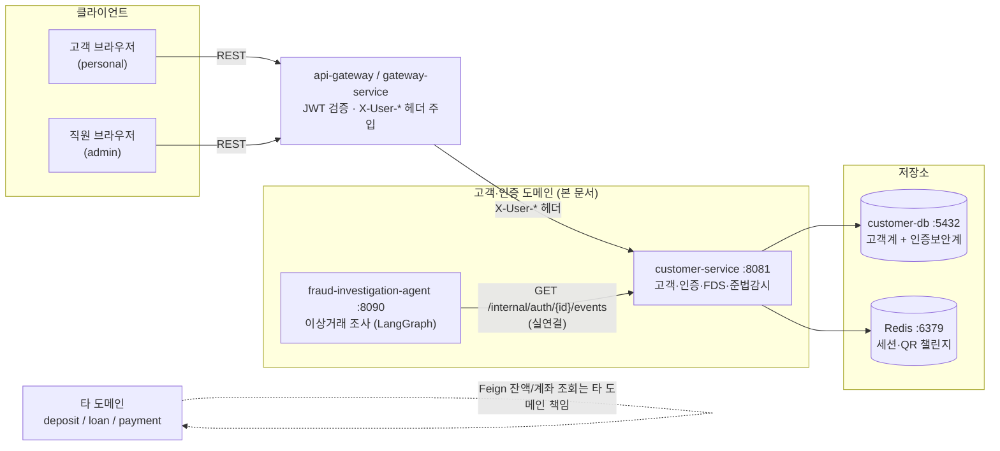
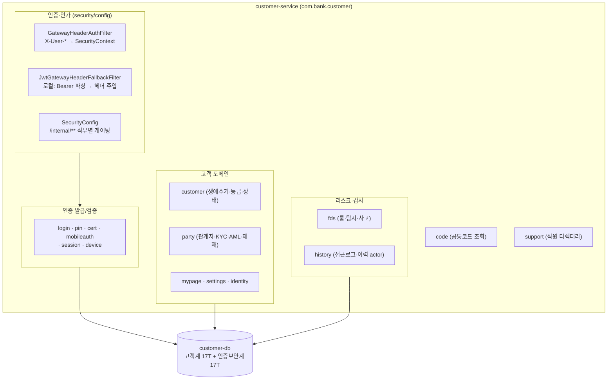
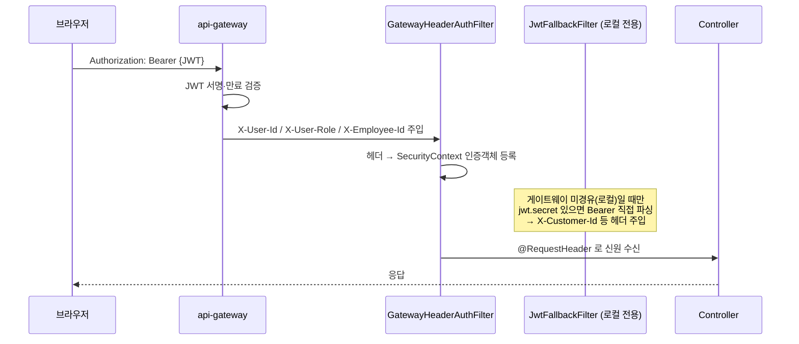
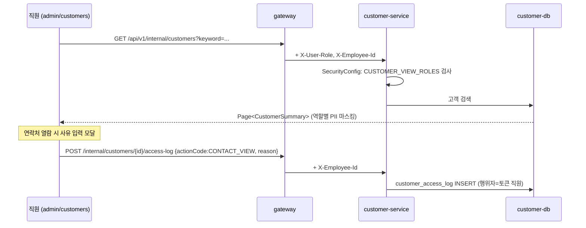
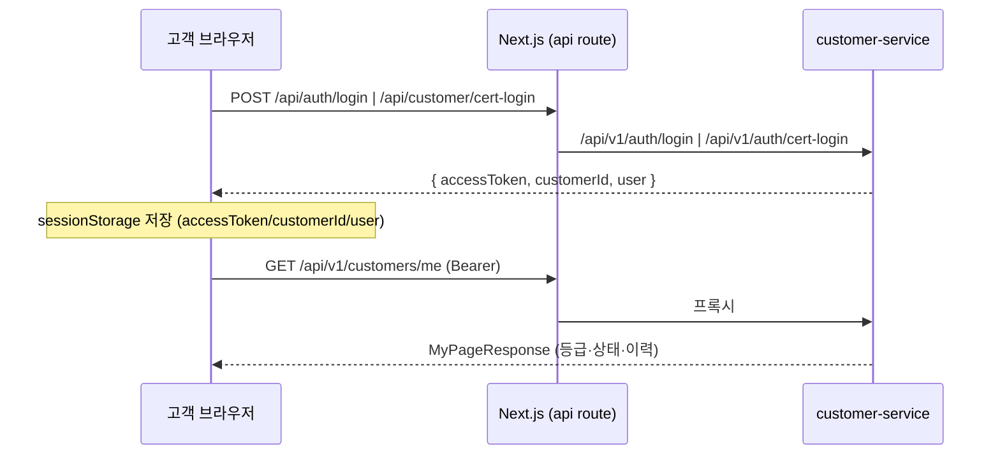
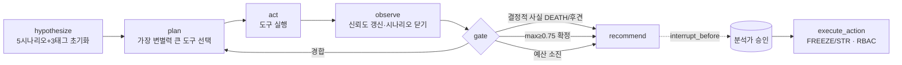

# 고객·인증 도메인 아키텍처 & 기능 명세

> **작성자**: 문수현
> **최종 수정**: 2026-06-12
> **스코프**: 고객·인증(customer/auth) 도메인 — `customer-service` 백엔드 + `fraud-investigation-agent` + web 프론트(로그인·마이페이지·어드민 고객계)
> **정본 기준**: 본 문서는 설계안이 아니라 **현재 브랜치에 실제 구현·적용된 코드**(컨트롤러, `SecurityConfig`, Flyway V1~V27, `BankRole`)를 정본으로 한다.
> **다이어그램**: Mermaid (GitHub·VSCode 미리보기에서 렌더링). 전체 시스템 그림은 [`architecture.svg`](architecture.svg) 참조.
> **스키마 상세**: 본 문서는 테이블 DDL을 중복하지 않는다. [`customer_ddl_design.md`](customer_ddl_design.md) · [`auth_security_ddl_design.md`](auth_security_ddl_design.md) 참조.

---

## 0. 문서 범위

본 문서는 전체 인터넷뱅킹 MSA 중 **고객·인증 도메인**만 다룬다. 수신·여신·결제·상담 도메인은 각 담당자의 문서를 따른다.

| 구성요소 | 스택 | 위치 | 역할 |
|---|---|---|---|
| `customer-service` | Java 17 / Spring Boot 3 | `services/customer-service` | 고객 생애주기·인증·FDS·준법감시 |
| `fraud-investigation-agent` | Python / LangGraph + FastAPI | `fraud-investigation-agent/` | 이상거래 조사 에이전트 (HITL) |
| web (고객·인증·어드민 고객계) | Next.js 15 / TypeScript | `web/app/(personal)`, `web/app/(admin)/admin/customers` | 로그인·마이페이지·직원 고객조회 |

---

## 1. 시스템 위치 (Context)

고객·인증 도메인이 전체 MSA에서 차지하는 위치와 외부 의존 관계.



- **JWT 검증은 게이트웨이 단일 지점**에서 수행하고, 검증된 신원은 `X-User-Id` / `X-User-Role` / `X-User-Branch` / `X-User-Grade` / `X-Employee-Id` 헤더로 내부 전파한다.
- customer-service는 게이트웨이를 신뢰하되, 고영향 직원 API(`/api/v1/internal/**`)는 자체적으로 직무별 재인가한다(§3).
- fraud-investigation-agent는 customer-service의 내부 인증 이벤트 API를 **실연결**로 호출한다(나머지 도구는 목).

---

## 2. customer-service 내부 구성

`com.bank.customer` 하위 서브도메인 패키지 구조. 각 패키지는 컨트롤러 → 서비스 → 리포지토리 계층을 가진다.



| 패키지 | 대표 컨트롤러 | 책임 |
|---|---|---|
| `login` | `LoginController` | ID/PW 로그인, 토큰 refresh |
| `pin` | `PinController` | 간편 PIN 등록·로그인·해제 |
| `cert` | `CertLoginController` · `CertIssueController` · `CertManageController` · `QrLoginController` · `QrCertController` · `AuthMethodController` · `InternalAuthEventsController` | 금융인증서 발급·로그인·관리, QR 로그인/인증서, 인증수단 관리, **내부 인증 이벤트 제공** |
| `mobileauth` | `MobileAuthController` | 휴대폰 인증코드 발송·검증 |
| `session` | (LoginSessionService) | 로그인 세션 기록 |
| `device` | `RegisteredDeviceController` | 등록기기 신뢰·지정·폐기 |
| `customer` | `CustomerLifecycleController` · `CustomerAccessLogController` | 회원 검색·상세·상태/등급 전이, 접근 감사로그 |
| `party` | `PartyController` · `PersonInfoController` | 관계자·대리인, KYC/AML/제재/FATCA, 개인·외국인·납세거주 정보 |
| `mypage` | `MyPageController` · `SettingsController` | 내 정보 조회, 프로필·알림·비번·탈퇴 |
| `identity` | (IdentityVerification) | 신원확인(주민번호 매칭) |
| `fds` | `FdsController` | 이상거래 룰·탐지·사고 |
| `history` | (AccessLog·StatusHistory) | 접근로그·상태/등급 이력 (actor 기록) |
| `code` | `CodeController` | 코드마스터 조회 |
| `banking` | `WithdrawalAccountController` | 출금계좌 관리 |
| `support` | `EmployeeDirectoryService` | 직원 디렉터리 |

---

## 3. 인증·인가 아키텍처

### 3.1 헤더 기반 인증 전파



- **게이트웨이 경유(운영)**: `GatewayHeaderAuthFilter`가 `X-User-*` 헤더를 읽어 SecurityContext에 등록. JWT를 직접 파싱하지 않는다.
- **로컬 직접호출**: `JwtGatewayHeaderFallbackFilter`가 `jwt.secret` 설정 시에만 등록되어 Bearer 토큰을 파싱하고, 토큰에서 복원한 `X-Customer-Id`/`X-User-Id`를 요청에 주입한다(`HeaderInjectingRequestWrapper`). 이미 게이트웨이 헤더가 있으면 아무 동작도 하지 않는다.
- 파일: [`config/SecurityConfig.java`](../services/customer-service/src/main/java/com/bank/customer/config/SecurityConfig.java), `security/GatewayHeaderAuthFilter.java`, `security/JwtGatewayHeaderFallbackFilter.java`

### 3.2 JWT 클레임 구조

`common/security/jwt/JwtClaims.java` (단일 정의):

```java
record JwtClaims(
    Long   customerId,   // 고객 PK
    String email,
    List<String> roles,  // ["ROLE_HQ_RISK", ...]
    TokenType tokenType, // ACCESS / REFRESH
    String branch,       // nullable — 직원이면 지점코드, 고객이면 null
    String grade,        // nullable — 직원이면 직급코드
    Long   employeeId    // nullable — 직원이면 employee_id
)
```

> 고객/직원을 동일 토큰 구조로 표현하고, `roles`·`employeeId`·`branch`·`grade`의 유무로 구분한다. 직원 여부는 로그인 시 `employee` 디렉터리의 `grade_code`로 판정한다.

### 3.3 직무별 인가 (SecurityConfig)

프론트의 메뉴 show/hide는 표시 통제일 뿐 API 직호출로 우회되므로, **고영향 `/api/v1/internal/**` 엔드포인트는 백엔드에서 직무 그룹으로 재게이팅**한다. 매처는 리터럴 경로를 와일드카드보다 먼저 둔다(순서 중요).

| 경로 | 필요 직무 그룹 | 용도 |
|---|---|---|
| `GET /api/v1/internal/customers/access-logs` | `AUDIT_VIEW_ROLES` | 접근 감사로그 조회 |
| `GET /api/v1/internal/customers/join-stats` | `JOIN_STATS_ROLES` | 가입 통계 대시보드 |
| `/api/v1/internal/customers/**` | `CUSTOMER_VIEW_ROLES` | 고객 조회·상세·라이프사이클 |
| `/api/v1/internal/compliance/**`, `/api/v1/internal/party/**` | `COMPLIANCE_DESK_ROLES` | KYC·AML·제재·세무·대리인 심사 |
| `/api/v1/internal/fds/**` | `FDS_ROLES` | FDS 룰·탐지·사고 |
| `/api/v1/internal/**` (그 외) | `EMPLOYEE_ROLES` | 기본 직원 화이트리스트 |
| 그 외 | `permitAll` | 게이트웨이 1차 검증 + 내부망 신뢰 |

**CORS**(로컬 직접호출용): `localhost:3000` · `localhost:3001` · `127.0.0.1:3001`, 메서드 `GET/POST/PUT/PATCH/DELETE/OPTIONS`, credentials 허용. 운영은 게이트웨이가 처리.

---

## 4. BankRole 권한 모델

역할 enum과 직무 그룹은 `common/security/BankRole.java`에 **단일 정의**되어 백엔드 인가와 프론트 메뉴 게이팅이 같은 어휘를 본다.

| 역할 | authority | 구분 |
|---|---|---|
| `CUSTOMER` | `ROLE_CUSTOMER` | 고객 |
| `TELLER` / `DEPUTY_MANAGER` / `BRANCH_MANAGER` | `ROLE_*` | 지점 |
| `HQ_REVIEWER` / `HQ_RISK` / `HQ_MARKETING` | `ROLE_*` | 본사 |
| `COMPLIANCE` / `OPS` / `INTERNAL` | `ROLE_*` | 본사·내부 |
| `ADMIN` | `ROLE_ADMIN` | 시스템(전 직무 통과) |

직무 그룹(검증된 실제 멤버, `ADMIN`은 전 그룹 포함):

| 그룹 | 멤버 |
|---|---|
| `EMPLOYEE_ROLES` | TELLER, DEPUTY_MANAGER, BRANCH_MANAGER, HQ_REVIEWER, HQ_RISK, HQ_MARKETING, COMPLIANCE, OPS, ADMIN |
| `CUSTOMER_VIEW_ROLES` | COMPLIANCE, HQ_REVIEWER, HQ_RISK, BRANCH_MANAGER, DEPUTY_MANAGER, TELLER, ADMIN |
| `AUDIT_VIEW_ROLES` | COMPLIANCE, HQ_REVIEWER, BRANCH_MANAGER, TELLER, ADMIN |
| `COMPLIANCE_DESK_ROLES` | COMPLIANCE, HQ_REVIEWER, HQ_RISK, ADMIN |
| `JOIN_STATS_ROLES` | COMPLIANCE, HQ_RISK, ADMIN |
| `FDS_ROLES` | COMPLIANCE, HQ_RISK, OPS, ADMIN |

> 역할 권한 매트릭스 시각화: [`role-permission-matrix.svg`](role-permission-matrix.svg)

---

## 5. customer-service 기능 명세

서브도메인별 주요 엔드포인트. 경로 접두어는 고객용 `/api/v1/...`, 직원용 `/api/v1/internal/...`.

### 5.1 인증 (login · pin · cert · mobileauth)

| 기능 | 메서드·경로 | 설명 |
|---|---|---|
| ID/PW 로그인 | `POST /api/v1/auth/login` | IP·User-Agent 기록, JWT 발급 |
| 토큰 갱신 | `POST /api/v1/auth/refresh` | refresh rotation |
| 인증서 로그인 | `POST /api/v1/auth/cert-login` | 금융인증서 PIN 기반 |
| 인증서 발급 | `POST /api/v1/auth/cert/issue` · PIN 변경 `PUT /api/v1/auth/cert/pin` | |
| PIN 로그인 | `POST /api/v1/auth/pin-login` / 등록 `POST /api/v1/customers/me/pin` / 해제 `DELETE` | 간편 로그인 |
| QR 로그인 | `POST /api/v1/auth/qr/generate` → `GET /status`(폴링) → `POST /approve`(모바일 승인) | 상태 폴링 시 accessToken 반환 |
| QR 인증서 | `POST /api/v1/auth/qr-cert/generate` → `/status` → `/approve` | 모바일 승인 후 인증서 발급 |
| 인증수단 관리 | `GET /api/v1/customers/me/auth-methods` 외 별칭·기본·비활성 | |
| 인증서 관리 | `GET/DELETE /api/v1/cert/manage/{serial}` | 목록·상세·폐기 |
| 휴대폰 인증 | `POST /api/v1/mobile-auth/send` · `/verify` | 신원확인 시 verificationId 반환 |
| 회원가입 | `POST /api/v1/auth/register` · `/register/corporate` | 개인·법인 |

### 5.2 고객 생애주기 (customer)

| 기능 | 메서드·경로 | 인가 |
|---|---|---|
| 내 상태/등급 이력 | `GET /api/v1/customers/me/status-history` · `/grade-history` | 고객 본인 |
| 고객 검색 | `GET /api/v1/internal/customers` | `CUSTOMER_VIEW_ROLES` |
| 고객 상세 | `GET /api/v1/internal/customers/{id}` | 〃 (조회 시 **자동 접근 감사로그**) |
| 가입 통계 | `GET /api/v1/internal/customers/join-stats` | `JOIN_STATS_ROLES` |
| 등급/신용 변경 | `PATCH .../grade` · `/credit-rating` | `CUSTOMER_VIEW_ROLES` |
| 상태 전이 | `PATCH .../dormant` · `/suspend` · `/close` · `/reactivate` | 〃 |
| 접근 감사로그 | `POST .../{id}/access-log` 기록 · `GET .../access-logs` 조회 | 기록은 `X-Employee-Id`로 행위자 식별 / 조회는 `AUDIT_VIEW_ROLES` |

### 5.3 준법감시·관계자 (party)

`COMPLIANCE_DESK_ROLES`로 보호. EDD 심사, 제재대상 스크리닝 Hit 처리(`clear`/`confirm`), FATCA/CRS, KYC 만료, 미성년, 대리인 위임장 검토(`review-pending` → `approve`/`reject`), 중복고객 케이스(`duplicate`/`distinct`), 관계 등록·종료, AML 위험도·KYC 완료 갱신. 개인·외국인(여권/체류)·납세거주 정보는 `PersonInfoController`(고객 본인).

### 5.4 FDS (fds)

`FDS_ROLES`로 보호. 룰 등록·활성/비활성(`POST/PATCH /rules`), 탐지 확정·오탐(`/detections/{id}/confirm`·`/false-positive`), 사고 등록·종결·금감원 보고(`/incidents/{id}/close`·`/report-fss`).

---

## 6. 주요 흐름

### 6.1 직원 고객조회 + 접근 감사



- 프론트: [`web/app/(admin)/admin/customers/page.tsx`](../web/app/%28admin%29/admin/customers/page.tsx) — `isMaskingRole`·`requiresReason`로 PII 마스킹·사유 강제(표시 통제), 실보안은 백엔드 인가.
- API 클라이언트: `web/lib/admin-customer-api.ts` — 게이트웨이(8080) 경유 `/api/v1/internal/**` 호출.

### 6.2 고객 로그인 → 마이페이지



> 금융인증서 로그인은 브라우저→`customer-service:8081` 직접 호출 시 CORS가 막히므로 Next.js SSR 프록시(`/api/customer/cert-login`)를 경유한다(8초 타임아웃, 미기동 시 503).

---

## 7. fraud-investigation-agent

이상거래 사건을 받아 **5개 공격 시나리오를 동시에 경합**시키며, 증거에 따라 조회 도구를 선택해 가설 신뢰도를 갱신하고 권고를 생성하는 LangGraph 에이전트(Python·FastAPI, 포트 8090).

### 7.1 엔드포인트

| 메서드·경로 | 역할 |
|---|---|
| `GET /api/cases` | 조사 큐(입력 후보) 조회 |
| `POST /api/investigate` | 사건 조사 → 단계별 트레이스 + 권고 (HITL 대기, `hitl_pending=true`) |
| `POST /api/approve` | 분석가 승인(HITL + RBAC) 후 동작 실행 |
| `GET /health` | 헬스체크 |

### 7.2 조사 루프 (LangGraph)



- **시나리오**: H1 보이스피싱 · H2 계정탈취 · H3 자금세탁 · H4 내부자부정 · H5 정상(오탐). 부가 태그(공존): T1 머니뮬 · T2 조직 · T3 신규계좌.
- **안전모드**: 결정적 사실(사망·후견)은 fail-closed로 즉시 종료(LLM 무관, 코드 강제). 예산 소진 시 fail-soft로 부분 결과 인계.
- **HITL + RBAC**: 에이전트는 권고까지만 생성하고, 지급정지(`FREEZE_PAYMENT`)·STR 보고(`FILE_STR`) 등 실제 동작은 분석가 승인 + 역할 확인 후 실행.

### 7.3 조사 도구 — 실연결 vs 목

| 도구 | 상태 | 비고 |
|---|---|---|
| `get_auth_events` | **실연결 가능** | customer-service `GET /api/v1/internal/auth/{id}/events` (인증 실패 횟수·비번 변경) → 계정탈취(H2) 신호 |
| `get_party` · `get_customer` · `get_device_fingerprint` · `get_fds_history` · `get_str_history` · `get_related_accounts` · `get_aml_history` | 목(mock) | 현재 시뮬레이션 데이터 |

> **실연결 활성 조건**: `TRIAGE_REAL_TOOLS`에 `get_auth_events` 포함 + `TRIAGE_BACKEND_URL` 설정. 인증은 `X-User-*` 헤더 또는 `TRIAGE_INTERNAL_TOKEN` Bearer.
>
> **프론트 현황**: 어드민 조사 화면(`web/admin/fraud`)은 **현재 브랜치(main 통합 라인)에는 미반영**이다. fraud 에이전트 백엔드만 구현되어 있으며, 화면은 별도 브랜치에서 관리된다.

설계·상세: [`fraud-investigation-agent/README.md`](../fraud-investigation-agent/README.md)

---

## 8. web 프론트 (고객·인증·어드민 고객계)

| 화면 | 경로 | 호출 API |
|---|---|---|
| 로그인 | `(personal)/login/page.tsx` | `/api/auth/login` · `/api/customer/cert-login` · `/api/auth/qr/*` |
| PIN 로그인 | `(personal)/login/pin/page.tsx` | `/api/v1/auth/pin-login` |
| 마이페이지 | `(personal)/mypage/page.tsx` | `GET /api/v1/customers/me` (+ status/grade 이력), 연락처 마스킹 |
| 어드민 고객조회 | `(admin)/admin/customers/page.tsx` | `GET /api/v1/internal/customers`, 접근로그 `POST .../access-log` |
| 어드민 로그인 | `(admin)/admin/login/page.tsx` | 직원 인증, JWT `roles` → `localStorage['admin_roles']` |
| SSR 프록시 | `api/customer/cert-login/route.ts`, `api/v1/auth/cert-login/route.ts`(구경로 호환) | customer-service 직접 프록시 |

- **세션 저장**: 로그인 성공 시 `sessionStorage`에 `accessToken`·`customerId`·`user` 저장(`persistLoginState()`가 ID·인증서 양 경로 통일). 로그아웃은 `sessionStorage.clear()`.
- **역할 판정**: 어드민은 항상 `localStorage['admin_roles']`(BankRole authority 배열)을 읽는다. 표시용 `admin_user`에는 역할이 없다.

---

## 9. 데이터 스키마 & 마이그레이션

고객계·인증보안계 테이블 상세는 별도 정본 문서를 참조한다(본 문서 중복 없음).

- 고객계 17테이블: [`customer_ddl_design.md`](customer_ddl_design.md) · [`customer_ddl.sql`](customer_ddl.sql)
- 인증보안계 17테이블: [`auth_security_ddl_design.md`](auth_security_ddl_design.md) · [`auth_security_ddl.sql`](auth_security_ddl.sql)

Flyway 마이그레이션 이력(`services/customer-service/src/main/resources/db/migration`):

| 버전 | 내용 |
|---|---|
| V1 / V2 | 고객계 스키마 / 인증보안계 스키마 생성 |
| V3 / V12 | 직원 계정 시드 / 리뷰·운영 직원 계정 |
| V4~V7 | 인증서·QR 로그인, 인증서 PIN 해시, 출금계좌, OTP·보안카드·인증토큰 |
| V8 | FDS 기본 룰 시드 |
| V9 / V10 | 미사용 인증방식 정리·PIN 타입 복구 / 인증서 PIN 초기화 |
| V11 | 직원 디렉터리 + `party_role` 기반 |
| V13~V18 | 고객 정지상태, 대리인 검토상태, 제재 스크리닝 Hit, 중복고객 케이스, `party_person` CI 유니크, 신원확인 RRN |
| V19 | 이력 actor + 접근 감사로그 테이블 |
| V20~V22 | 직원 비번 해시·역할·테스트명 정정, 준법감시 actor |
| V23~V27 | 데모 고객 시드 + 인구통계 보강, compliance/PEP 코드 정정 |

---

## 10. 설계 원칙 요약

1. **JWT 검증 단일화** — 게이트웨이에서만 검증, 내부는 `X-User-*` 헤더 신뢰.
2. **프론트 게이팅은 표시 통제** — 실보안은 customer-service `SecurityConfig`가 `BankRole` 직무 그룹으로 재인가.
3. **역할 어휘 단일 소스** — `common.BankRole` 하나를 백엔드 인가와 프론트 메뉴가 공유.
4. **감사 추적성** — 고객 상세 조회는 자동 접근로그, 상태/등급 전이는 actor 기록.
5. **fraud 에이전트: 결정적 게이트는 코드로** — 사망·후견은 LLM과 무관하게 fail-closed, 실행은 HITL+RBAC 이중 게이팅.

---

## 참고 문서

- 작업공유: [인증서 기술 스택](share/cert-tech-stack.md) · [고객계·인증보안계](share/customer-auth-worknote.md) · [Fraud Investigation Agent](share/fraud-agent-worknote.md)
- 전체 시스템 그림: [`architecture.svg`](architecture.svg)
- 역할·권한 매트릭스: [`role-permission-matrix.svg`](role-permission-matrix.svg)
- 고객계 DDL: [`customer_ddl_design.md`](customer_ddl_design.md)
- 인증보안계 DDL: [`auth_security_ddl_design.md`](auth_security_ddl_design.md)
- fraud 에이전트 설계: [`fraud-investigation-agent/README.md`](../fraud-investigation-agent/README.md)
