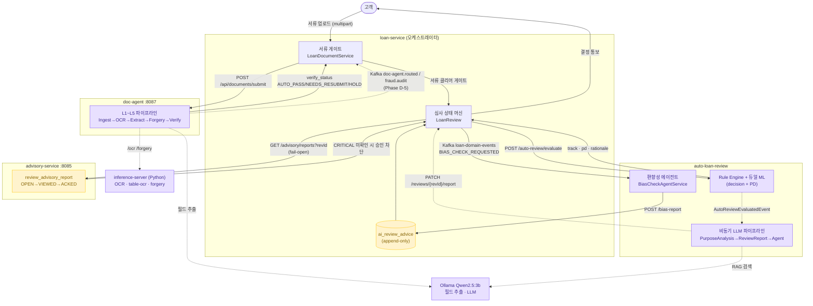
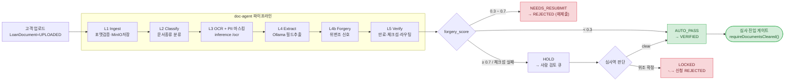
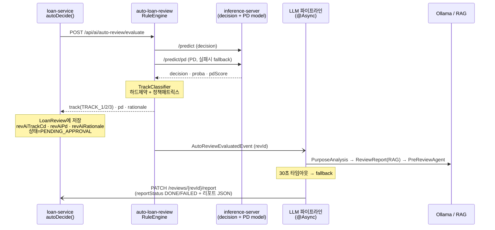
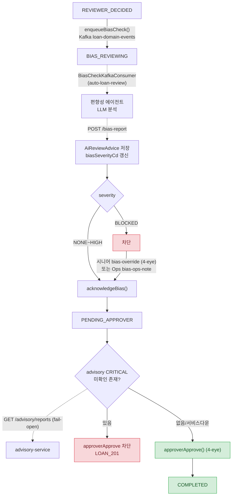

# 대출 심사 AI 에이전트 생태계 플로우

대출 심사를 둘러싼 4개 서비스의 AI 에이전트가 어떻게 유기적으로 맞물리는지 표현합니다.
[기본 심사 라이프사이클](loan-review-flow.md)에 **서류 검증(doc-agent)**, **자동심사 ML(auto-loan-review)**, **자문 리포트(advisory-service)** 가 어떻게 붙는지 보여주는 상위 뷰입니다.

| 서비스 | 역할 | 연동 방식 |
|---|---|---|
| **loan-service** | 심사 오케스트레이터 · 상태 머신 보유 | (허브) |
| **doc-agent** | 제출 서류 OCR·위변조·검증 파이프라인 | REST(동기) + Kafka(비동기, 일부 계획) |
| **auto-loan-review** | ML 자동심사(Track 분기) + LLM 심사리포트 + 편향성 에이전트 | REST + Kafka |
| **advisory-service** | 심사역 자문 리포트(CRITICAL 게이트) | REST (fail-open) |

> 범례: 실선 = 구현됨, 점선 = 계획/부분구현(doc-agent Phase D-5 Kafka 컨슈머 등)

---

## 1. 전체 에이전트 생태계 (서비스 간 데이터 흐름)

---

## 2. doc-agent — 서류 검증 파이프라인 (심사 진입 전 관문)

심사의 전제조건인 "서류 클리어"를 책임지는 5단계 파이프라인. 위변조 점수로 자동 라우팅합니다.

**핵심 포인트**
- PII 마스킹을 LLM 입력 **전**에 수행(주민번호/전화/계좌 정규식) + LLM 출력 후 프롬프트 인젝션 후처리
- Vault Transit 봉투암호화로 원본 저장, `IdentityVerificationPort`로 KMS 교체 가능
- 동기 응답(REST)으로 즉시 상태 반영, Kafka(`doc-agent.routed`/`fraud.audit`)는 Phase D-5 비동기 보강 예정

---

## 3. auto-loan-review — ML 자동심사 + 비동기 LLM 리포트

`autoDecide()`가 룰 결정을 내리면서 동시에 ML 트랙 판정을 받아오고, 별도 비동기로 LLM 심사 리포트를 생성해 콜백합니다.

**Track 의미**: `TRACK_1` 자동승인 후보 · `TRACK_2` 자동거절 후보 · `TRACK_3` 심사역 판단 필요
**Fail-soft**: evaluate 호출 실패 시 경고 로그만 남기고 **룰 결정으로 계속 진행** (AI는 보조, 차단 안 함)

---

## 4. 편향성·자문 — 심사 상태 머신에 박힌 AI 게이트

bias-check와 advisory는 상태 머신 내부에서 **차단형 게이트**로 작동합니다. (auto-loan-review의 fail-soft와 대비)

**AI advice 5종** (`ai_review_advice.advice_type_cd`): `BIAS_CHECK` · `SUMMARY` · `REJECTION_LETTER` · `REVISIT_REASON` · `GAP_REPORT`
**advisory 상태**: `OPEN → VIEWED → ACKED → RESOLVED`(`QUARANTINE`) / 심각도 `INFO·WARN·CRITICAL`

---

## 5. AI 연동 설계 원칙 (포트폴리오 어필 포인트)

| 원칙 | 적용 |
|---|---|
| **Fail-soft (보조형)** | auto-loan-review·advisory 다운 → 경고 후 룰/사람 판단으로 진행 |
| **Fail-closed (차단형)** | bias `BLOCKED`, advisory `CRITICAL` 미확인 → 승인 차단 (4-eye override만 해제) |
| **동기/비동기 분리** | 즉답 필요(track·서류 verify)=REST, 무거운 LLM 리포트=Kafka/@Async 콜백 |
| **멱등성** | bias 재전송은 `isBiasReviewing()`일 때만 반영, doc-agent 재시도 백오프 |
| **PII 보호** | 마스킹 후 LLM 입력, Vault 봉투암호화, KMS 포트 추상화 |
| **감사 추적** | append-only advice/advisory, AutoReview 감사 로그(REQUIRES_NEW) |
