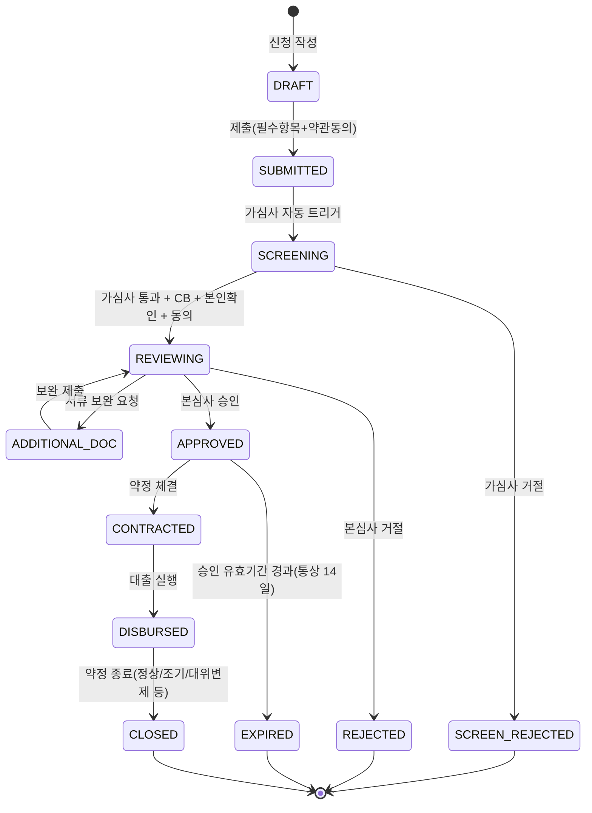

# 🏛 여신계(LON) 가이드

> 여신(대출) 도메인 전체를 한 페이지로 조망하는 **상위 안내서**다.
> 각 주제의 깊은 내용은 [§8 문서 맵](#8-문서-맵)의 전용 문서로 연결된다.
> 신규 입사자·협업자가 여기서 출발해 필요한 문서로 내려가도록 구성했다.

---

## 1. 한눈에

여신계는 **대출 상품 신청 → 심사 → 약정 → 실행 → 상환 → 종료** 의 전 생애주기를 책임지는 도메인이다.
`loan-service` 가 상태 머신을 보유한 **오케스트레이터**이며, 서류 검증·자동심사·자문은 별도 AI 서비스로 위임한다.

| 항목 | 값 |
|---|---|
| 서비스 | `loan-service` (Spring Boot 3, Java 17) |
| 포트 | `8083` |
| 주 DB | `loan_db` (ib-loan-db, 5434) |
| 공통계 DB | `common_db` (ib-common-db, 5438) — 멀티 datasource ([공통계 §5](#5-데이터--공통-규약)) |
| 패키지 root | `com.bank.loan` (+ `com.bank.commonaccount`) |
| 외부 AI 연동 | doc-agent · auto-loan-review · advisory-service |
| 계좌이체 연동 | payment-service |

---

## 2. 라이프사이클

대출신청(`LOAN_APPLICATION.appl_status_cd`)의 상태 전이를 축으로 도메인이 맞물린다.

> 상태별 전이 조건·핵심 시퀀스: [loan_flows.md](loan_flows.md) · 심사 단계 상세 상태머신: [loan-review-flow.md](loan-review-flow.md)

---

## 3. 서브도메인 모듈 지도

`com.bank.loan.*` 패키지를 업무 단위로 묶은 것이다. 각 모듈은 보통 `controller / service / domain / repository / dto` 구조를 따른다.

| 단계 | 모듈(package) | 역할 |
|---|---|---|
| **상품** | `product`, `product.preferential` | 대출 상품·우대금리 정책 |
| **신청·접수** | `application`, `applicationexpiry`, `consent`, `idv`, `document`(+`docagent`), `certificate` | 신청서, 약관/신용 동의, 본인확인, 서류 제출·검증, 전자서명 |
| **가심사** | `prescreening` | 규칙 기반 사전심사(자동 트리거) |
| **신용·한도** | `creditreport`, `creditscore`, `creditevaluation`, `dsr`, `ltv`, `collateral`, `guarantor`, `guaranteeinsurance`(+expiry) | CB 조회, 신용평가, DSR/LTV 산출, 담보·보증인·보증보험 |
| **본심사** | `review`, `advisory`(연동) | 심사 상태머신, 4-eye 결재, 편향성 검증, 자문 리포트 게이트 |
| **약정·실행** | `contract`, `execution`, `repaymentaccount`, `virtualaccount` | 약정 체결, 대출금 실행, 상환계좌/가상계좌 |
| **상환** | `schedule`, `repayment`, `partialrepayment`, `prepayment`, `autodebit`, `reversal`, `ratechange` | 상환스케줄, 회차상환, 중도상환, 자동이체, 취소/정정, 금리변경 |
| **연체·사후** | `delinquency`, `maturity`, `closure` | 연체 관리·신용정보 신고, 만기, 약정 종료(상환완료/대위변제/상각) |
| **회계·리스크** | `accounting`, `accrual`, `ecl` | 여신 회계 요약, 이자발생(미수이자), 기대신용손실(ECL/IFRS9) |
| **공통·인프라** | `batch`, `calendar`, `notification`, `statushistory`, `audit`, `commonsync`, `rag`, `payment.client`, `security`, `config`, `support` | EOD 배치, 영업일, 알림 아웃박스, 상태이력, 접근감사, 공통계 동기화, RAG 시드, 결제 클라이언트 |

---

## 4. 외부 연동

| 대상 | 방식 | 용도 |
|---|---|---|
| **doc-agent** (:8087) | REST(동기) + Kafka(일부) | 제출 서류 OCR·위변조·검증 파이프라인 |
| **auto-loan-review** | REST + Kafka | ML 자동심사(decision+PD), LLM 심사리포트, 편향성 에이전트 |
| **advisory-service** (:8085) | REST (fail-open) | 심사역 자문 리포트(CRITICAL 게이트) |
| **payment-service** | REST/Kafka | 대출 실행 입금·자동이체 출금·상환 정산 (`pi_id` 연계) |
| **customer-service** | Gateway 헤더 | 고객/직원 신원·권한 주입 |
| **common-db (공통계)** | 멀티 datasource + outbox 동기화 | 계좌·상품·약관·거래 공통 모델 |

> AI 서비스 생태계 전체 그림: [loan-ai-agents-flow.md](loan-ai-agents-flow.md) · 결제 연계: [loan-payment-integration-spec.md](loan-payment-integration-spec.md)

---

## 5. 데이터 · 공통 규약

- **멀티 datasource**: 여신 고유 모델은 `loan_db`, 계좌·상품·약관·거래 공통 모델은 `common_db`(`com.bank.commonaccount.*`). 변경은 `commonsync` 아웃박스로 전파.
- **명명·코드 규약**: 모든 논리명·코드는 [data_dictionary.md](data_dictionary.md) 의 `[수식어]+[핵심어]+[도메인]` 규칙과 `CODE_MASTER` FK를 따른다.
- **상태이력**: 주요 상태 전이는 `status_history` 에 적재(누가/언제/사유).
- **접근감사**: 민감 조회·결재는 `access_audit_log` (V31) 에 기록.
- **데이터 모델**: 여신계 ERD [loan_erd.md](loan_erd.md) · 실 스키마 자동추출 ERD [erd/erd-loan.md](erd/erd-loan.md).

---

## 6. 권한(RBAC) 요약

Gateway가 JWT 검증 후 `X-User-*` 헤더를 주입하고, loan-service는 이를 신뢰한다.

| 역할 | 주요 권한 |
|---|---|
| `CUSTOMER` | 신청·조회·약정·중도상환 |
| `DEPUTY_MANAGER` | 심사 실행·확정(부지점장) |
| `BRANCH_MANAGER` | 최종 결재·정정·상신(지점장) |
| `HQ_REVIEWER` | 편향 우회·상신 처리(본사 심사역) |
| `COMPLIANCE` | 감사로그 조회(준법감시) |
| `OPS` | 배치·자동심사 운영 |
| `INTERNAL` | 서비스 간 호출 |

> **4-eye 원칙**: 심사 확정자(reviewer)와 최종 승인자(approver)는 동일인일 수 없다. 상세: [loan-review-flow.md §3](loan-review-flow.md)

---

## 7. 운영(EOD 배치)

자정 EOD 배치가 여신 사후관리를 일괄 처리한다 — 자동이체 출금, 이자발생(accrual), 연체 인식, 회계 요약, ECL 산출, 만기/유효기간 만료 처리 등. 영업일 판정은 `business_calendar`(KR 2026~2035 시드) 기준.

> 배치 설계: [plan/loan_eod_batch_plan_v2.md](plan/loan_eod_batch_plan_v2.md) · 메트릭: [monitoring/loan-service-metrics.md](monitoring/loan-service-metrics.md)

---

## 8. 문서 맵

| 분류 | 문서 |
|---|---|
| 도메인 흐름 | [loan_flows.md](loan_flows.md) — 상태 전이·핵심 시퀀스 |
| 심사 플로우 | [loan-review-flow.md](loan-review-flow.md) — 심사 상태머신·4-eye·게이트 |
| AI 에이전트 | [loan-ai-agents-flow.md](loan-ai-agents-flow.md) · 테스트 [loan-ai-test-guide.md](loan-ai-test-guide.md) |
| 데이터 모델 | [loan_erd.md](loan_erd.md) · [erd/erd-loan.md](erd/erd-loan.md) · 사전 [data_dictionary.md](data_dictionary.md) |
| API | [loan-service-api-spec.md](loan-service-api-spec.md) |
| 화면/UX | [loan_screens.md](loan_screens.md) · 와이어프레임 [wireframes/04-customer-loan.md](wireframes/04-customer-loan.md), [wireframes/08-admin-loan-review.md](wireframes/08-admin-loan-review.md) |
| 연계 | [loan-payment-integration-spec.md](loan-payment-integration-spec.md) · [advisory-integration-guide.md](advisory-integration-guide.md) |
| 운영/리스크 | [plan/loan_eod_batch_plan_v2.md](plan/loan_eod_batch_plan_v2.md) · [monitoring/ML_LOAN_REVIEW_GUIDE.md](monitoring/ML_LOAN_REVIEW_GUIDE.md) · [plan/loan_review_bias_check_plan.md](plan/loan_review_bias_check_plan.md) |
