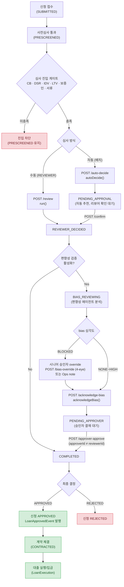
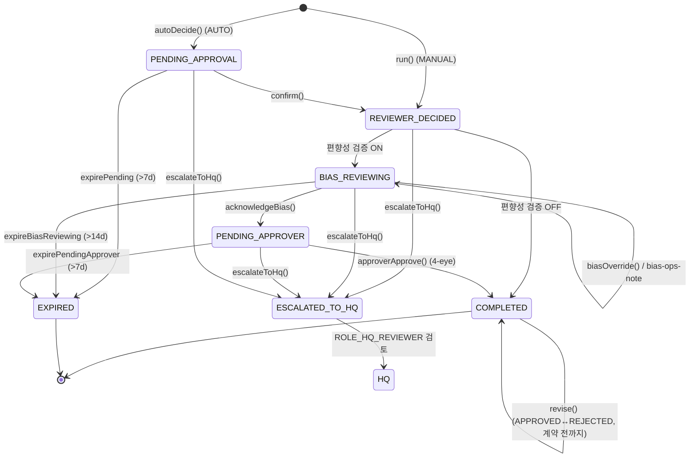
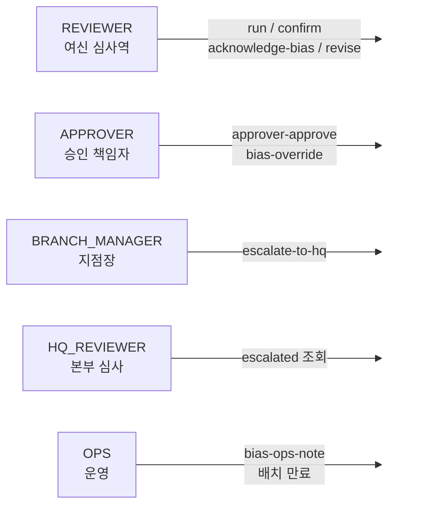

# 대출 심사(Loan Review) 플로우

loan-service의 대출 심사 도메인 전체 흐름입니다. 신청 → 사전심사 → 심사(자동/수동) → 편향성 검증 → 승인자 결재 → 계약/실행으로 이어지는 라이프사이클과, 4-eye 원칙·HQ 에스컬레이션·타임아웃 만료 등 운영 안전장치를 포함합니다.

---

## 1. 전체 라이프사이클 (신청 → 실행)

---

## 2. 심사 상태 머신 (LoanReview.revStatusCd)

---

## 3. 역할(Actor)과 권한

**핵심 통제 — 4-eye 원칙 (이중 확인)**
- `approver-approve`: 결재자(approverId) ≠ 심사역(reviewerId) — `LOAN_196`
- `bias-override`: override 주체 ≠ 심사역(reviewerId) — `LOAN_200`

---

## 4. 상태 코드 레퍼런스

| 상태 (`revStatusCd`) | 의미 |
|---|---|
| `PENDING_APPROVAL` | 자동 추천됨, 리뷰어 확인 대기 |
| `REVIEWER_DECIDED` | 리뷰어 결정 완료, 편향성 검증 전 |
| `BIAS_REVIEWING` | 공정성/규제 편향성 검증 중 |
| `PENDING_APPROVER` | 편향성 통과, 승인자 결재 대기 |
| `COMPLETED` | 최종 확정 (승인 또는 거절) |
| `EXPIRED` | 단계별 타임아웃 만료 |
| `ESCALATED_TO_HQ` | 사기/AML 의심 → 본부 에스컬레이션 |

| 결정 (`revDecisionCd`) | 승인자 결정 (`approvedDecisionCd`) | 편향성 (`biasSeverityCd`) |
|---|---|---|
| `APPROVED` / `REJECTED` | `APPROVE_AS_IS` / `OVERRIDE_APPROVED` / `OVERRIDE_REJECTED` | `BLOCKED` / `HIGH` / `MEDIUM` / `LOW` / `NONE` |

---

## 5. 심사 진입 게이트 (run / autoDecide 전제조건)

심사를 시작하려면 신청이 `PRESCREENED` 상태이면서 아래를 모두 충족해야 합니다.

1. CB(신용평가) 결정 ≠ `REJECT`
2. DSR 상태 = `PASS`
3. IDV(본인확인) = `PASS`
4. 담보 상품이면 모든 담보 LTV = `PASS`
5. 보증 상품이면 서명 보증인 수 ≥ 최소 기준
6. 제출 서류 클리어 (자동/리뷰어 통과)
