# 🏛 LON 여신계 ERD

> 본 문서는 한국 은행권 **여신계(Loan)** 도메인의 데이터 모델을 정의한다.
> 표기·명명·코드 정책은 [data_dictionary.md](./data_dictionary.md) 및 STANDARDS.md 를 따른다.

## 컬럼 표기 규칙 (Mermaid 내부)

- 형식: `<TYPE> <물리명> <PK|FK|UK|없음> "한글논리명"`
- 코드 컬럼: `VARCHAR xxx_cd FK "...코드(CODE)"` — 모두 `CODE_MASTER` FK
- 암호화 컬럼: `BYTEA xxx_enc "...(암호화)"`
- 해시/마스킹: `_hash` / `_masked` 접미사
- 금액: `BIGINT`(원 단위) · 금리/비율: `INT bps` 또는 `DECIMAL(5,4)`
- 공통 감사 컬럼: 모든 테이블 말미에 `created_at / created_by / updated_at / updated_by / deleted_at / deleted_by / version` 순서로 포함
- 이력·스냅샷 테이블은 **append-only** (Soft Delete 대상 아님 — 감사 컬럼은 등록계 4개만)

---

## 0. 전체 도메인 한눈에 보기 (Big Picture)

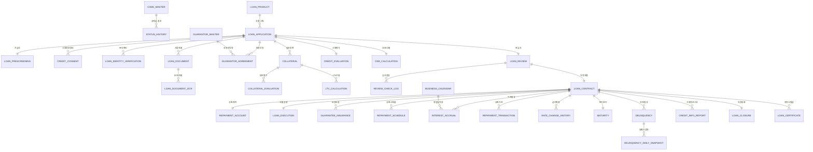

> 박스 다이어그램(컬럼 포함)은 도메인 양이 매우 크므로 아래 **단계별 ERD** 에서 상세히 정의한다.

---

# 단계별 상세 ERD

## STAGE 1. 공통·상품 그룹

> CODE_MASTER, STATUS_HISTORY, BUSINESS_CALENDAR, LOAN_PRODUCT

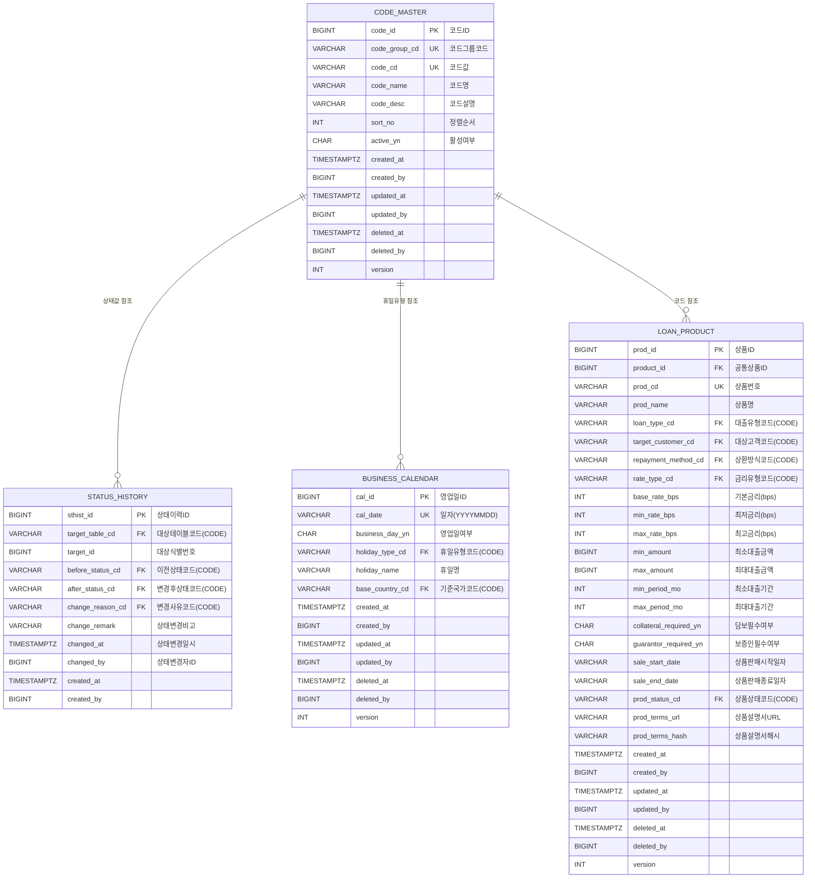

---

## STAGE 2. 신청·가심사·동의·본인확인

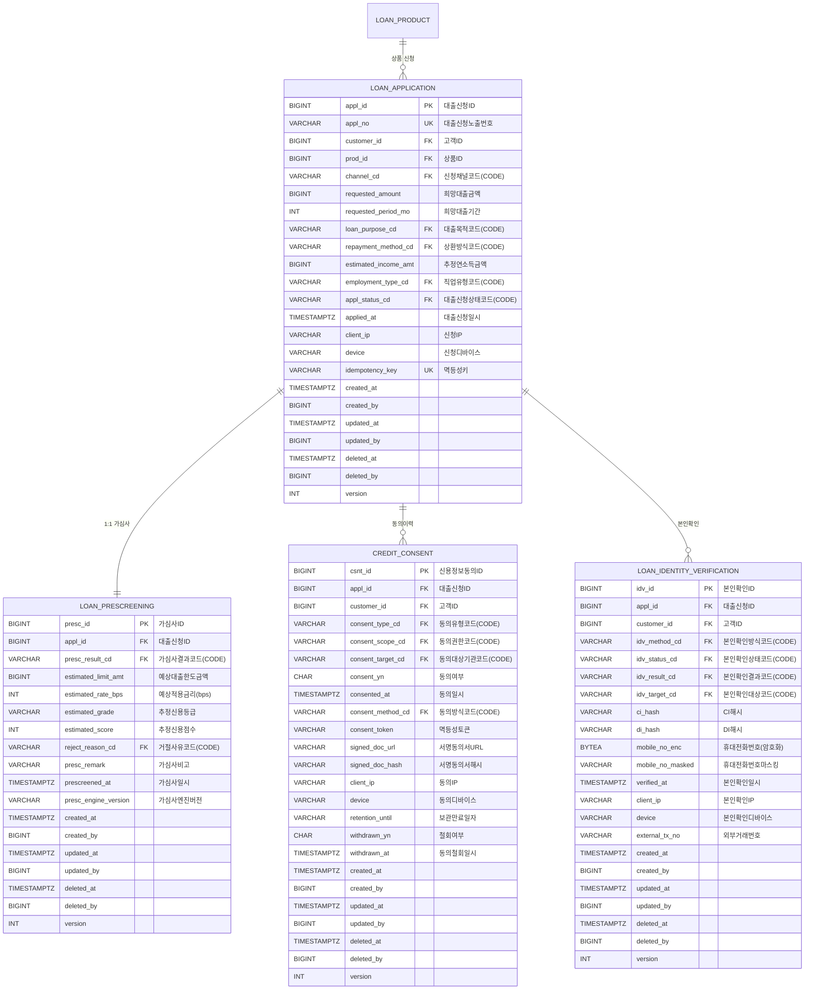

---

## STAGE 3. 서류·OCR

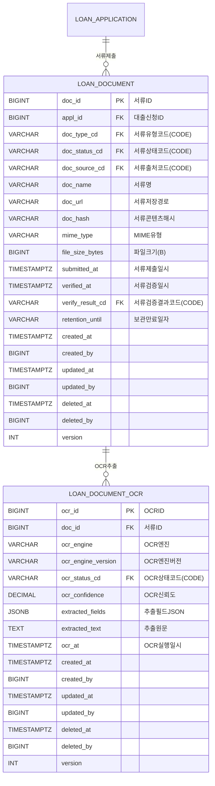

---

## STAGE 4. 보증·담보·LTV

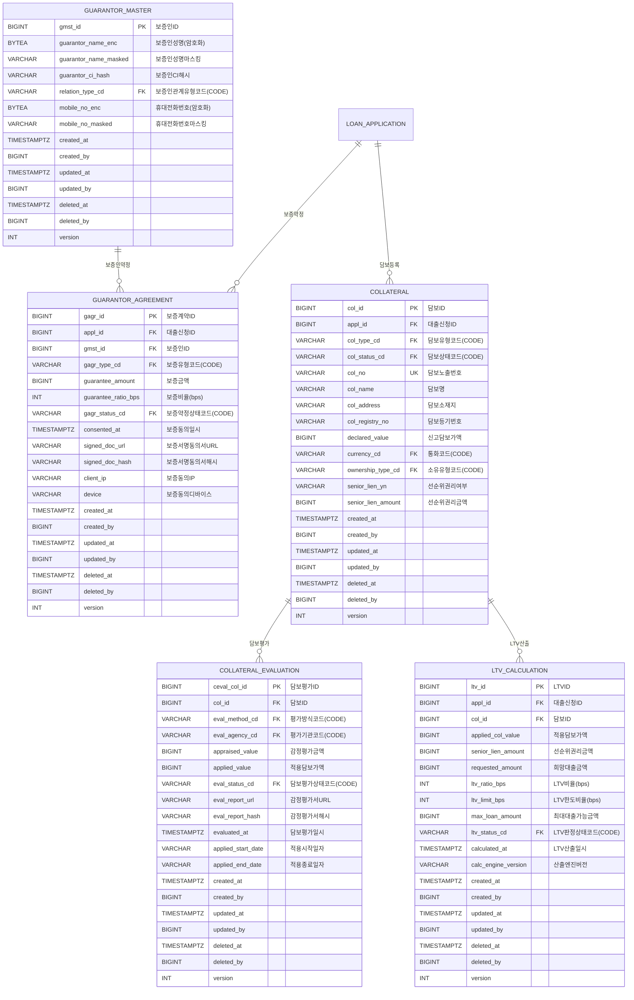

---

## STAGE 5. 신용평가·DSR·심사

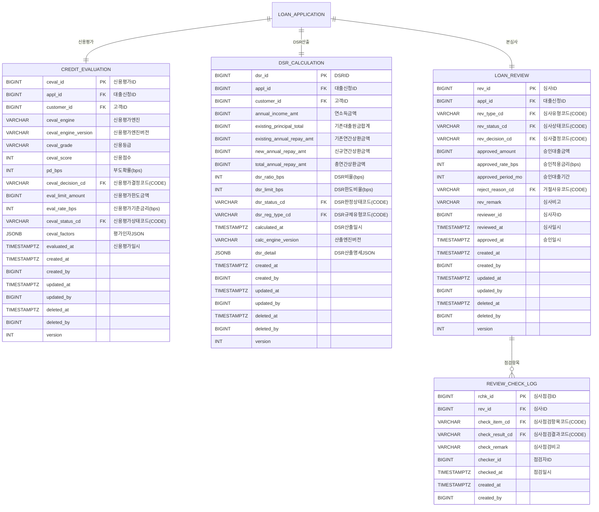

---

## STAGE 6. 계약·상환계좌·실행·보증보험

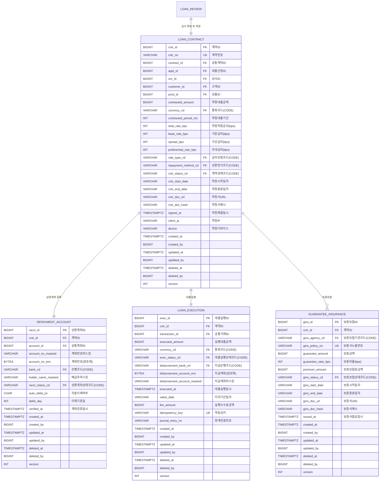

---

## STAGE 7. 상환스케줄·이자발생·상환거래·금리변경

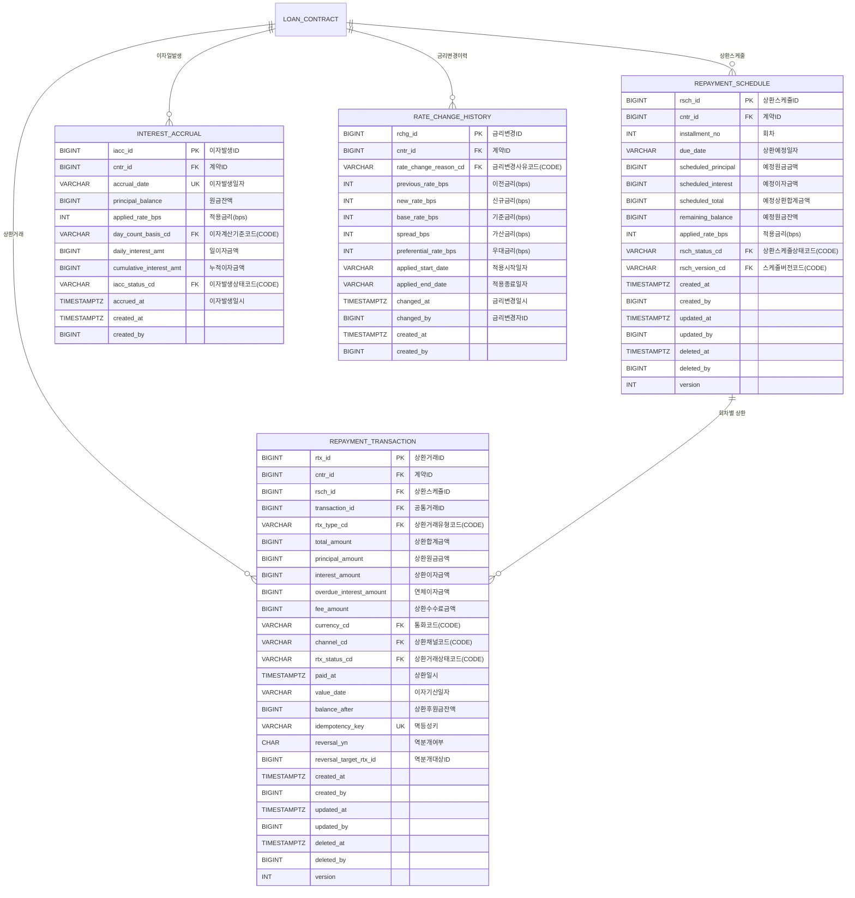

---

## STAGE 8. 만기·연체·신용정보신고

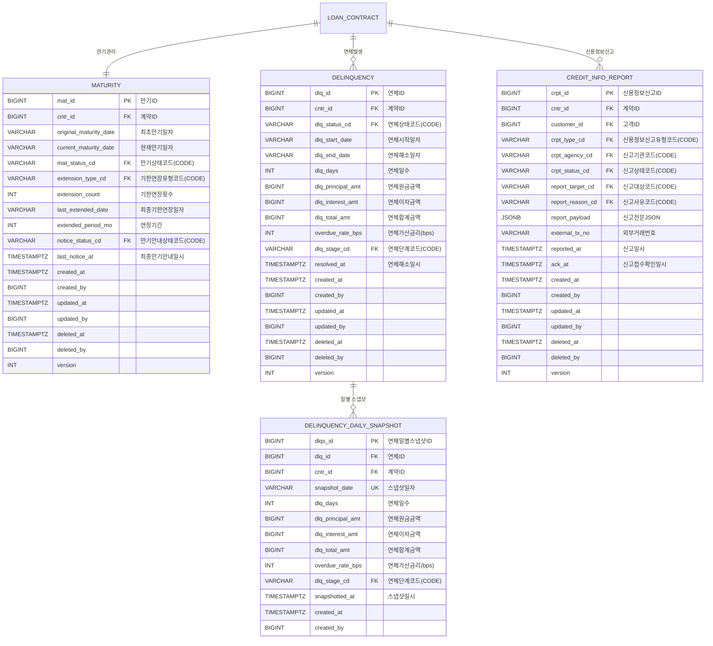

---

## STAGE 9. 약정종료·증명서

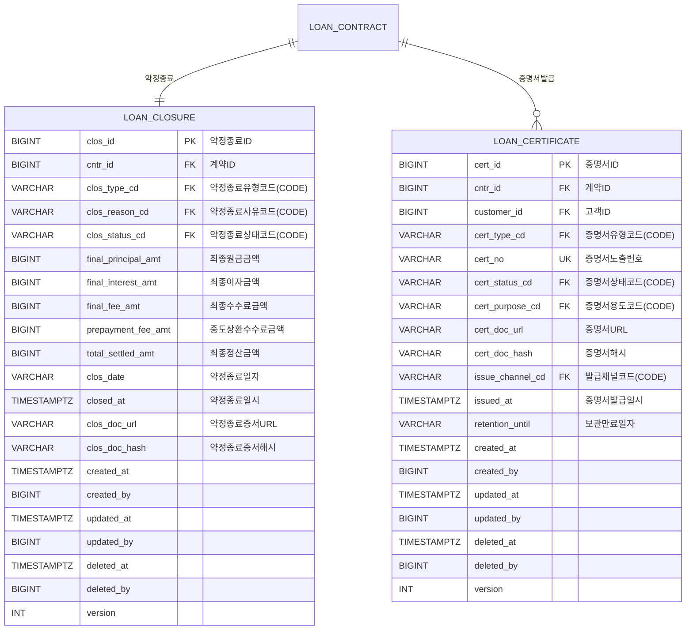

---

# 부속물 1. 그룹 간 관계 다이어그램

```mermaid
flowchart LR
    subgraph G1["공통·상품"]
        CODE_MASTER
        STATUS_HISTORY
        BUSINESS_CALENDAR
        LOAN_PRODUCT
    end
    subgraph G2["신청·동의·본인확인"]
        LOAN_APPLICATION
        LOAN_PRESCREENING
        CREDIT_CONSENT
        LOAN_IDENTITY_VERIFICATION
    end
    subgraph G3["서류·OCR"]
        LOAN_DOCUMENT
        LOAN_DOCUMENT_OCR
    end
    subgraph G4["보증·담보·LTV"]
        GUARANTOR_MASTER
        GUARANTOR_AGREEMENT
        COLLATERAL
        COLLATERAL_EVALUATION
        LTV_CALCULATION
    end
    subgraph G5["평가·심사"]
        CREDIT_EVALUATION
        DSR_CALCULATION
        LOAN_REVIEW
        REVIEW_CHECK_LOG
    end
    subgraph G6["계약·실행"]
        LOAN_CONTRACT
        REPAYMENT_ACCOUNT
        LOAN_EXECUTION
        GUARANTEE_INSURANCE
    end
    subgraph G7["상환·이자·금리"]
        REPAYMENT_SCHEDULE
        INTEREST_ACCRUAL
        REPAYMENT_TRANSACTION
        RATE_CHANGE_HISTORY
    end
    subgraph G8["만기·연체·신고"]
        MATURITY
        DELINQUENCY
        DELINQUENCY_DAILY_SNAPSHOT
        CREDIT_INFO_REPORT
    end
    subgraph G9["종료·증명서"]
        LOAN_CLOSURE
        LOAN_CERTIFICATE
    end

    G1 --> G2
    G2 --> G3
    G2 --> G4
    G2 --> G5
    G4 --> G5
    G3 --> G5
    G5 --> G6
    G6 --> G7
    G6 --> G8
    G7 --> G8
    G6 --> G9
    G8 --> G9
    G1 -. 상태이력/코드 참조 .-> G2
    G1 -. 상태이력/코드 참조 .-> G5
    G1 -. 상태이력/코드 참조 .-> G6
    G1 -. 상태이력/코드 참조 .-> G7
    G1 -. 상태이력/코드 참조 .-> G8
```

---

# 부속물 2. 공통계(共通系) 연계 매핑

| LON 테이블 | 공통계 참조 | 연계 컬럼 | 비고 |
|---|---|---|---|
| LOAN_PRODUCT | common_product | product_id | 마케팅·상품 카탈로그 공통화 |
| LOAN_CONTRACT | common_contract | contract_id | 약정 마스터 공통화 |
| LOAN_CONTRACT | common_contract_party | (간접) | 보증인·공동차주 등 당사자 |
| REPAYMENT_ACCOUNT | common_account | account_id | 자동이체 출금계좌 |
| LOAN_EXECUTION / REPAYMENT_TRANSACTION | common_transaction | transaction_id | 회계·거래 원장 |
| LOAN_PRODUCT 금리 | common_rate_policy / pref_rate_policy | product_id | 기본금리·우대금리 정책 |
| CREDIT_CONSENT | common_terms_consent / _version / _template | (간접) | 약관 동의 트레이서빌리티 |

---

# 부속물 3. 운영 규칙 요약

1. **모든 코드 컬럼**(`*_cd`, `*_status_cd`, `*_type_cd` 등)은 `CODE_MASTER`를 참조한다. DB enum 금지.
2. **상태 변경**은 반드시 `STATUS_HISTORY` 에 append-only 로 기록한다.
3. **개인정보**(성명·주민번호·연락처·계좌번호 등)는 `BYTEA *_enc` 암호화 + `*_masked` 마스킹 컬럼을 함께 운영한다.
4. **금액**은 `BIGINT` 원 단위, **금리·비율**은 `INT bps` 또는 `DECIMAL(5,4)` 로 통일한다.
5. **이력·스냅샷 테이블**(`STATUS_HISTORY`, `INTEREST_ACCRUAL`, `RATE_CHANGE_HISTORY`, `DELINQUENCY_DAILY_SNAPSHOT`, `REVIEW_CHECK_LOG`)은 **append-only**, Soft Delete 미적용.
6. **외부 연계 트랜잭션**(본인확인·신용정보신고·대출실행 등)은 `idempotency_key` 또는 `external_tx_no` 로 중복호출을 차단한다.
7. **물리 삭제 금지** — 모든 등록계 테이블은 `deleted_at IS NULL` 활성 행 조회 패턴을 따른다.

> [검토필요]
> - `LOAN_PRODUCT` 의 채널별 판매 정책 (모바일/창구/제휴) 분리 여부
> - `COLLATERAL` 의 동산/유가증권 등 비부동산 담보 서브타입 필요 여부
> - `CREDIT_INFO_REPORT` 신고기관 분기(KCB/NICE/한국신용정보원) 별 별도 테이블 분리 여부
