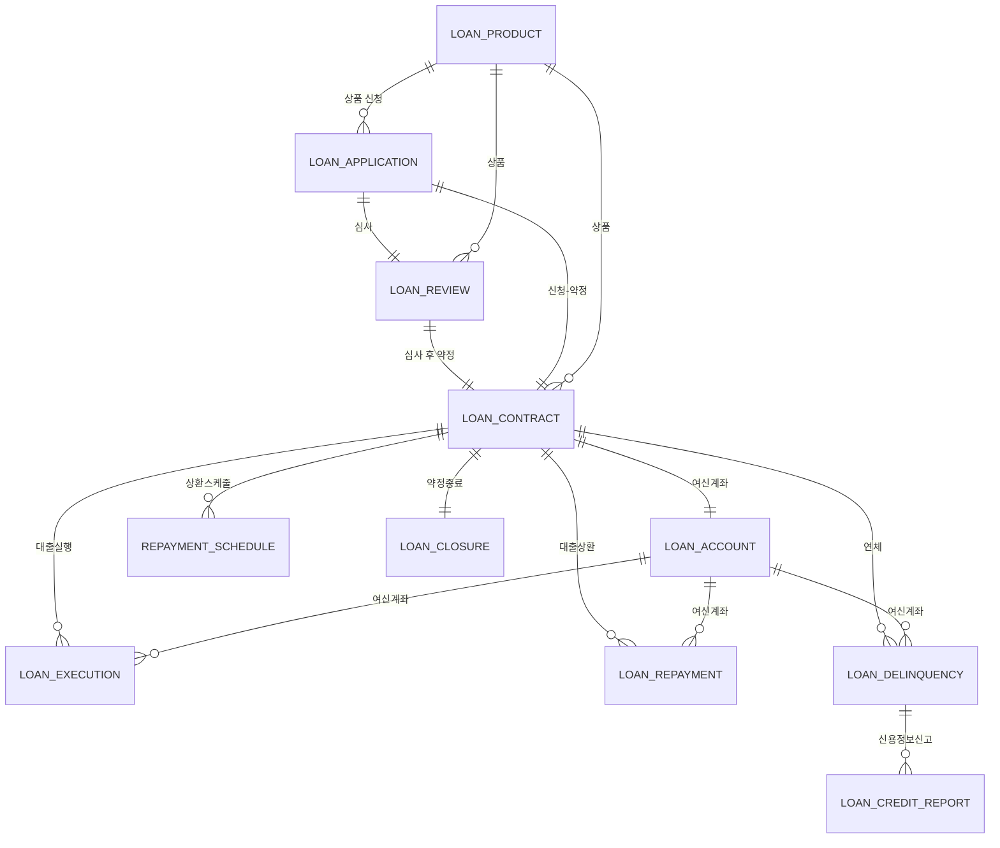
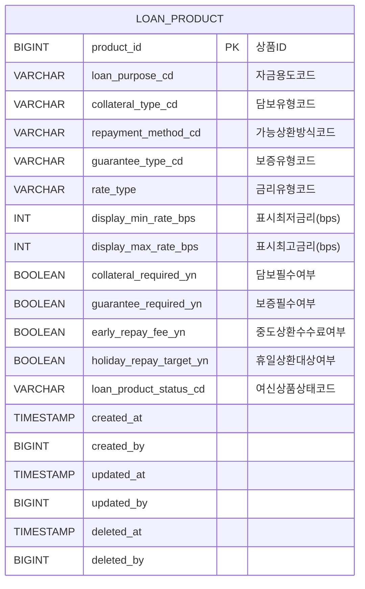
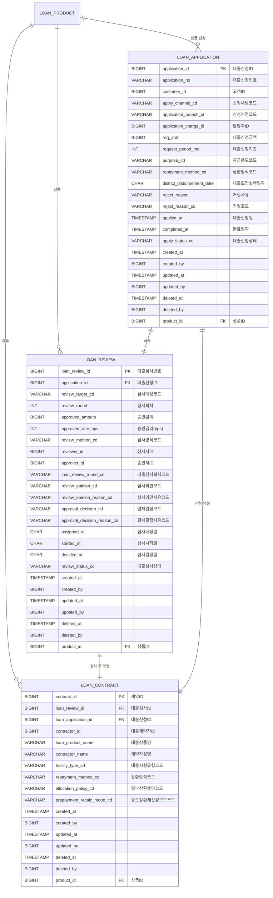
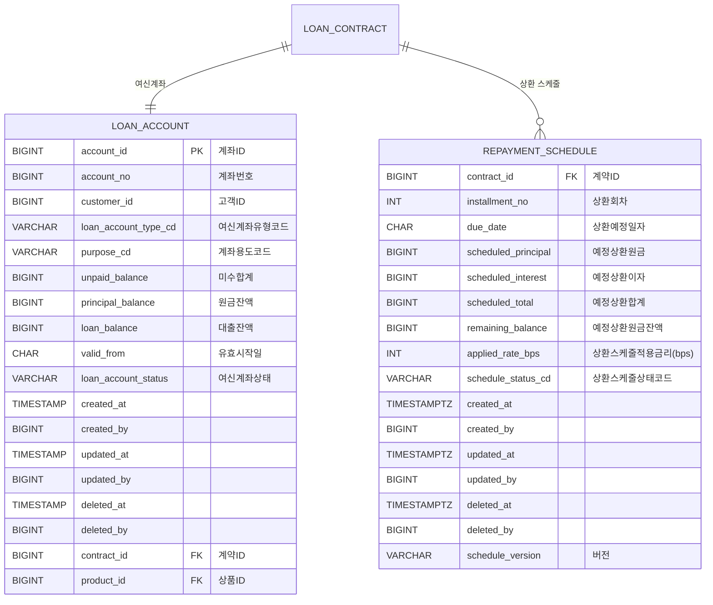
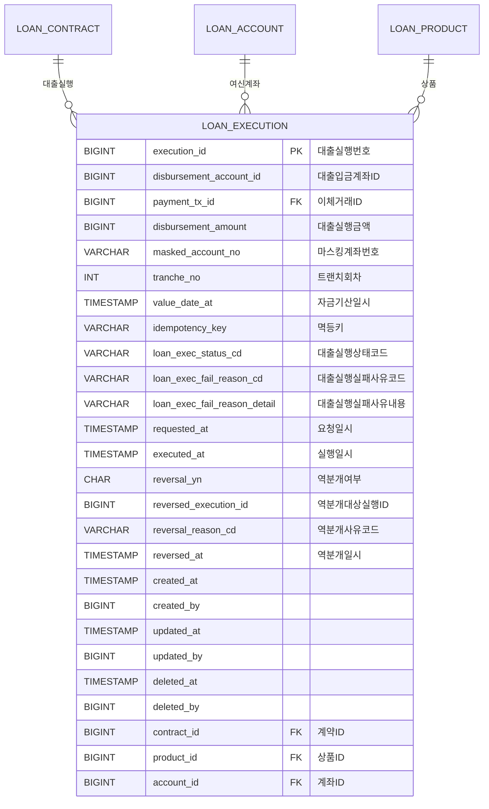
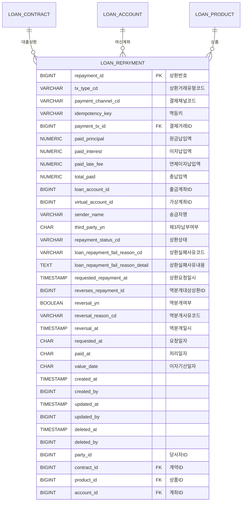
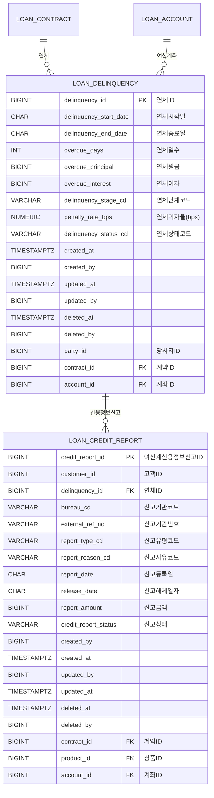
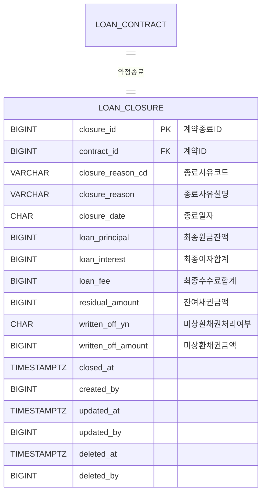

# 🏛 LON 여신계 ERD

> 본 문서는 한국 은행권 **여신계(Loan)** 도메인의 데이터 모델을 정의한다.
> 표기·명명·코드 정책은 [data_dictionary.md](./data_dictionary.md) 및 STANDARDS.md 를 따른다.
>
> 본 ERD 는 **여신계 11개 테이블**(녹색)만 다루며, 공통계 테이블은 [부속물 1](#부속물-1-공통계-연계) 의 연계 컬럼만 표기한다.

## 컬럼 표기 규칙 (Mermaid 내부)

- 형식: `<TYPE> <물리명> <PK|FK|UK> "한글논리명"`
- 코드 컬럼: `VARCHAR xxx_cd FK "...코드(CODE)"` — 모두 `CODE_MASTER` FK
- 금액: `BIGINT` 또는 `NUMERIC(19,4)` · 금리/비율: `INT bps` 또는 `NUMERIC(5,2)`
- 감사 컬럼: 모든 등록계 테이블 말미에 `created_at / created_by / updated_at / updated_by / deleted_at / deleted_by` 포함

---

## 0. 전체 도메인 한눈에 보기

---

# 단계별 상세 ERD

## STAGE 1. 여신상품 (LOAN_PRODUCT)

> 공통 `common_product.product_id` 와 동일 키. 여신 특화 속성만 보유.

---

## STAGE 2. 신청·심사·계약

---

## STAGE 3. 여신계좌·상환스케줄

---

## STAGE 4. 대출실행 (LOAN_EXECUTION)

> `payment_tx_id` 는 공통 `거래내역(common_transaction).거래ID` 를 참조한다.

---

## STAGE 5. 대출상환 (LOAN_REPAYMENT)

> `payment_tx_id` 는 공통 `거래내역(common_transaction).거래ID` 를 참조한다.

---

## STAGE 6. 연체·신용정보신고

---

## STAGE 7. 약정종료 (LOAN_CLOSURE)

---

# 부속물 1. 공통계 연계

| LON 테이블 | 공통계 참조 | 연계 컬럼 | 비고 |
|---|---|---|---|
| LOAN_PRODUCT | common_product | product_id | 공통 상품 마스터 (1:1) |
| LOAN_CONTRACT | common_contract | contract_id | 공통 계약 마스터 |
| LOAN_ACCOUNT | common_account | account_id | 공통 계좌 마스터 |
| LOAN_EXECUTION | 거래내역(common_transaction) | payment_tx_id | 이체거래 |
| LOAN_REPAYMENT | 거래내역(common_transaction) | payment_tx_id | 결제거래 |
