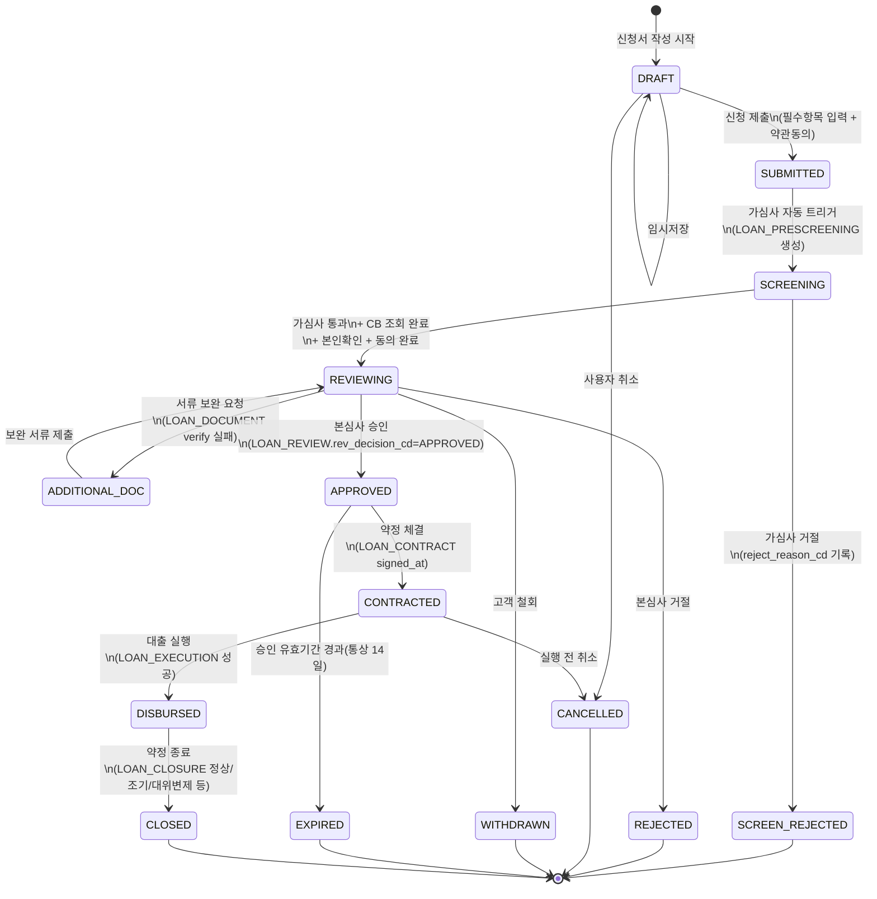
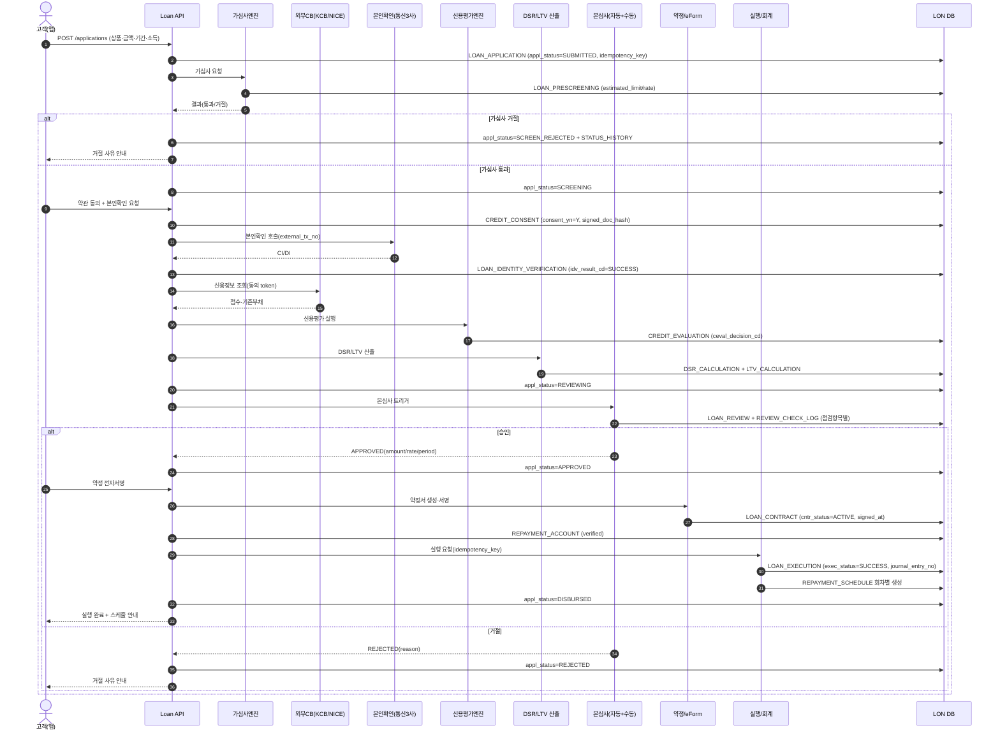
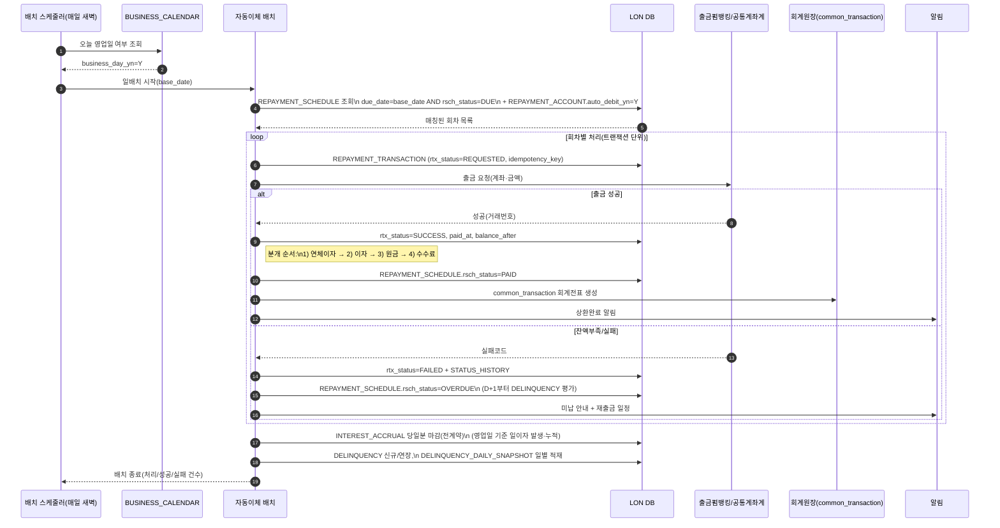
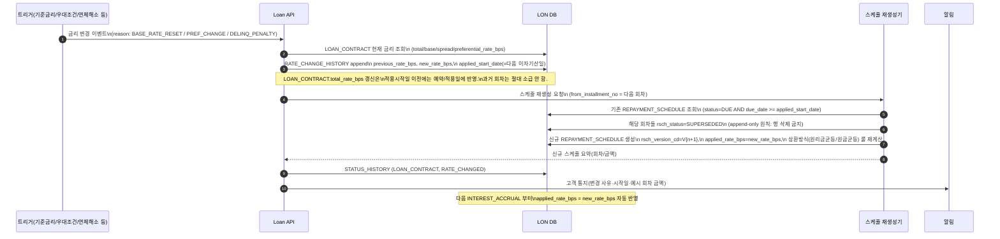

# 🔁 LON 여신계 도메인 흐름

> ERD([loan_erd.md](./loan_erd.md))만으로는 보이지 않는 **상태 전이**와 **핵심 처리 시퀀스**를 정리한다.
> 표기·코드·상태값은 [data_dictionary.md](./data_dictionary.md) 및 ERD와 동일 규칙을 따른다.

---

## 1. 대출신청 상태 전이도 (`LOAN_APPLICATION.appl_status_cd`)

### 1.1 전이 조건·검증 룰

| 전이 | 트리거 | 사전 조건(검증 룰) | 부수 효과 |
|---|---|---|---|
| `DRAFT → SUBMITTED` | 사용자 "신청" 클릭 | 필수항목(상품·금액·기간·소득) 입력, 약관 동의 완료, `idempotency_key` 발급 | `applied_at` 기록 |
| `SUBMITTED → SCREENING` | 가심사 엔진 자동 호출 | 상품 판매기간 내(`LOAN_PRODUCT.sale_*_date`), 금액·기간이 상품 범위 내 | `LOAN_PRESCREENING` row 생성 |
| `SCREENING → SCREEN_REJECTED` | 가심사 엔진 결과 | `presc_result_cd=REJECT` (PD 임계 초과/내부 블랙리스트/한도 0원 등) | `LOAN_PRESCREENING.reject_reason_cd` 기록 |
| `SCREENING → REVIEWING` | 가심사 통과 + 후속 동의 완료 | `CREDIT_CONSENT.consent_yn=Y` (필수 동의 모두), `LOAN_IDENTITY_VERIFICATION.idv_result_cd=SUCCESS`, CB 조회(`CREDIT_EVALUATION` 생성) | DSR/LTV 산출 잡 트리거 |
| `REVIEWING → ADDITIONAL_DOC` | 심사관 또는 자동검증 | `LOAN_DOCUMENT.verify_result_cd=FAIL` 또는 누락 서류 존재 | 고객 알림 + 보완 채널 오픈 |
| `REVIEWING → APPROVED` | 본심사 결정 | `CREDIT_EVALUATION.ceval_decision_cd=APPROVE`, `DSR_CALCULATION.dsr_status_cd=PASS`, 담보필수상품이면 `LTV_CALCULATION.ltv_status_cd=PASS`, `LOAN_REVIEW.rev_decision_cd=APPROVED` | `approved_amount/rate/period` 확정, 승인 유효기간(D+14) 설정 |
| `REVIEWING → REJECTED` | 본심사 거절 | `LOAN_REVIEW.rev_decision_cd=REJECTED` | `reject_reason_cd` 기록, CB 미신고 |
| `APPROVED → CONTRACTED` | 전자약정 서명 완료 | 약정서(`cntr_doc_hash`) 무결성 확인, 보증·담보 약정 완료(`GUARANTOR_AGREEMENT.gagr_status_cd=SIGNED`, `COLLATERAL.col_status_cd=REGISTERED`) | `LOAN_CONTRACT.cntr_status_cd=ACTIVE` |
| `APPROVED → EXPIRED` | 일배치(승인일+14d) | `applied_at + 14d < now` 그리고 미약정 | 알림 후 자동 만료 |
| `CONTRACTED → DISBURSED` | 실행 트랜잭션 성공 | `REPAYMENT_ACCOUNT.racct_status_cd=VERIFIED`, 보증보험(필요시) `GUARANTEE_INSURANCE.gins_status_cd=ISSUED`, 회계전표 생성(`journal_entry_no`) | 상환스케줄 `REPAYMENT_SCHEDULE` 일괄 생성, `value_date` 기준 이자기산 |
| `DISBURSED → CLOSED` | 약정종료 | 잔액=0 (정상만기/조기상환) 또는 대위변제/대손 등 | `LOAN_CLOSURE` 생성, 증명서 발급 가능 상태 |

### 1.2 공통 규칙

- 모든 상태 변경은 `STATUS_HISTORY` 에 append-only 기록 (`target_table_cd=LOAN_APPLICATION`).
- 역행 전이는 `ADDITIONAL_DOC → REVIEWING` 한 곳만 허용. 그 외는 새 신청(`appl_id`) 필수.
- 종료 상태(`*_REJECTED, CANCELLED, WITHDRAWN, EXPIRED, CLOSED`)에서는 다른 상태로 전이 금지.

---

## 2. 핵심 시퀀스

### 2.1 대출 신청 → 가심사 → CB → 한도 → 본심사 → 계약 → 실행

**포인트**
- 외부 호출은 모두 `idempotency_key` 또는 `external_tx_no` 로 재시도 안전성 확보.
- `LOAN_PRESCREENING` 은 1:1(최신본 갱신), `CREDIT_EVALUATION` 도 1:1 — 재평가 시 `version`/`evaluated_at` 으로 추적.
- 본심사 자동거절(시스템 룰 위배) 후 수동 심사관 오버라이드 가능 → `REVIEW_CHECK_LOG` 에 점검자/사유 기록.

---

### 2.2 자동이체 일배치 (스케줄 매칭 → 출금 → 결과 콜백 → 이자/원금 분배)

**포인트**
- 휴일에는 `INTEREST_ACCRUAL` 만 발생, 출금은 익영업일로 이월(상품 정책에 따라).
- 실패 출금은 **새 `REPAYMENT_TRANSACTION` row** 로 재시도(역분개는 `reversal_yn=Y`로 별건 기록).
- 분배(allocation)는 **연체이자 → 정상이자 → 원금 → 수수료** 순서가 기본. 상품별 예외는 `LOAN_PRODUCT` 정책에서 분기.
- 연체 D+1 진입 시 `DELINQUENCY` 생성, 매일 `DELINQUENCY_DAILY_SNAPSHOT` append. `dlq_stage_cd` 는 5/30/90일 등 임계치 도달 시 갱신.

---

### 2.3 금리 변경 → 스케줄 재생성 → 다음 회차 적용

**포인트**
- 금리 변경은 **시점(applied_start_date) 기준**으로만 발효. 과거 발생 이자(`INTEREST_ACCRUAL`)·기지급 회차는 불변.
- `REPAYMENT_SCHEDULE` 재생성은 **기존 행 삭제 금지** — `rsch_version_cd` 로 버전 분리, 구버전은 `SUPERSEDED` 처리.
- 변경 사유는 `rate_change_reason_cd` (CODE) 로 분류: 기준금리리셋 / 우대조건충족·실효 / 연체가산금리 부과·해소 / 상품정책변경.
- 연체가산금리(`DELINQUENCY.overdue_rate_bps`) 는 `RATE_CHANGE_HISTORY` 에는 기록하지 않고 연체 라이프사이클에서만 관리(상품정책에 따라 다름 — [검토필요]).

---

## 3. 운영 규칙 (흐름 관점)

1. **상태 변경 = STATUS_HISTORY append.** 코드 분기 없이 일관 처리.
2. **외부 호출 = idempotency_key 또는 external_tx_no.** 재시도/중복호출 무해성 보장.
3. **append-only 테이블** (`INTEREST_ACCRUAL`, `RATE_CHANGE_HISTORY`, `DELINQUENCY_DAILY_SNAPSHOT`, `REVIEW_CHECK_LOG`, `STATUS_HISTORY`) 은 수정·삭제 금지. 정정은 신규 row + 역분개(`reversal_yn`)로.
4. **스케줄 재생성은 버전 분리.** `rsch_version_cd` 로 비교/감사 가능하게.
5. **회계 분개 순서는 상품정책으로 통제.** 코드에 하드코딩 금지.
6. **일배치 멱등성.** `(cntr_id, due_date)` 기준 매칭, 이미 `PAID/SUCCESS` 회차는 스킵.

> [검토필요]
> - 승인 유효기간(현재 가이드 14일)을 상품별로 차등할지 (`LOAN_PRODUCT` 컬럼 추가 여부)
> - 연체가산금리 부과를 `RATE_CHANGE_HISTORY` 와 통합 관리할지, `DELINQUENCY` 전속으로 둘지
> - 자동이체 실패 시 재출금(retry) 규칙(횟수·간격)을 상품정책으로 분리할지, 운영 파라미터로 둘지
