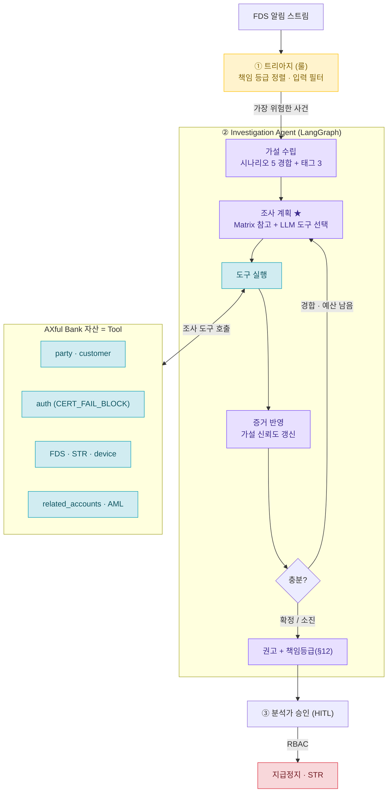

# Fraud Investigation Agent

> 은행 이상거래 사건을 받아 **경쟁 가설을 세우고 → 증거에 따라 무엇을 조사할지 스스로 정해 도구를 호출하고 → 가설을 수정하며 → 권고를 만드는** 조사 에이전트.
> 고정 워크플로우가 아니다 — 결과가 다음 행동을 바꾼다. 앞단에 **책임 기반 트리아지**가 가장 위험한 사건을 공급한다.

---

## TL;DR

분석가는 알림을 ① 먼저 볼 것을 고르고 → ② 그 사건을 파고들어 "무슨 공격인지" 조사하고 → ③ 권고한다. **이 프로젝트의 메인은 ②.** 사건 하나를 받아 에이전트가 **5개 공격 시나리오(보이스피싱·계정탈취·자금세탁·내부자·정상)를 동시에 경합**시키며, *지금 어떤 도구가 가설들을 가장 잘 가르는지* 판단해 AXful Bank 자산(party·auth·FDS·STR…)을 도구로 호출하고, 결과로 가설을 갱신하다, 확정/기각되면 책임 등급과 함께 권고한다. 앞단 **① 트리아지**(책임 등급 정렬)는 가장 위험한 사건을 공급하는 입력 필터. **③ 동작은 분석가 승인(HITL)+RBAC** — 에이전트는 권고만.

---

## 문제

- 알림을 줄 세워 "먼저 볼 것"을 정해도, 분석가는 결국 **그 사건을 한 건씩 파고들어 "무슨 공격인지" 조사**해야 한다 — 디바이스·인증·수취 네트워크·과거 STR을 오가며 가설을 세우고 검증.
- 이 조사는 **경로가 고정이 아니다.** 같은 알림이라도 디바이스가 평소 것이냐 아니냐에 따라 보이스피싱이 되기도, 계정탈취가 되기도 한다 — 다음에 무엇을 볼지가 직전 결과에 달렸다.
- 그래서 이 단계는 정렬(룰)로 안 되고, **경쟁 가설을 유지하며 증거에 따라 조사 계획을 바꾸는** 진짜 에이전트가 필요하다.

## 해결 — 무엇을 하나

**① 트리아지 (입력 필터, 룰)** — 알림을 책임 등급으로 줄 세워 가장 위험한 사건을 에이전트에 공급. 정렬이라 룰이 맞다.

**② Investigation Agent (메인, 에이전트)** — 사건 하나를 받아 루프를 돈다:
1. **가설 수립** — 공격 시나리오 5개(보이스피싱·계정탈취·자금세탁·내부자·정상)를 동시에 열고 신뢰도를 경쟁시킴 + 부가 태그(머니뮬·조직·신규계좌).
2. **조사 계획** — *지금 경합 중인 가설을 가장 잘 가르는 도구*를 골라 호출(혼합형: 분별력 매트릭스 참고 + LLM 판단, 선택 이유 로그).
3. **증거 반영 → 재계획** — 결과로 가설 갱신, 확정(≥0.75)/기각/예산 소진까지 루프.
4. **권고** — 가설 + 근거 사슬 + 책임 등급(§12).

**③ 분석가 승인 (HITL + RBAC)** — 실제 지급정지·STR은 사람 승인. 에이전트는 권고만.

## 아키텍처 (3단계 파이프라인)



> 핵심은 `조사 계획 → 도구 실행 → 증거 반영 → 게이트` 루프와 **게이트에서 조사 계획으로 되돌아가는 선**(재계획). 이 루프백이 워크플로우와 에이전트를 가른다.

## 핵심 차별점 — 왜 특별한가

- **점수가 아니라 책임으로 줄 세운다.** 규정 코퍼스를 **책임 등급표(L4~L0)** 로 응축 — 권리자 적격성(사망·후견)=L4 최상위, AML=L3, 소비자보호=L1. 각 판정에 규정 출처가 박혀 **감사 가능**.
- **결정적인 건 코드, 판단만 AI.** 컴플라이언스 판정(사망 차단)은 LLM에 안 맡기고 코드로 박아 비결정성·환각을 차단. LLM은 "가설 판단·도구 선택"을 하되, *동작*은 사람 승인(HITL)을 거쳐야 발동.
- **두뇌가 죽어도 척추는 산다.** 에이전트 장애 시 알림은 미분류 큐로 흘러 무손실, 결정적 게이트는 코드라 계속 작동. ("막는 줄 알았는데 안 막던" 사일런트 실패의 정반대.)

**안전 모드 — Fail-closed / Fail-soft 분리**

| 모드 | 적용 | 동작 |
|---|---|---|
| **Fail-closed** (차단형) | 권리자 적격성 L4 (사망·후견·공동명의) | 확정 사실 → 즉시 차단 권고, **코드가 강제**. 에이전트 우회 |
| **Fail-soft** (보조형) | 에이전트(조사 루프) | 타임아웃 시 **부분 결과(잠정 가설+미확인 항목)를 분석가에 인계**, 빈손 없음 |

> 핵심: 차단형은 *확정 사실*에만(LLM 아님), 보조형은 *판단*에만. AI가 죽어도 결정적 차단은 멈추지 않는다.

## 왜 에이전트인가 (상태머신이 아니라)

2개 가설·정해진 분기라면 `if device 정상 then 수취인 else 인증` — 상태머신으로 환원된다. 이 설계가 다른 이유:

- **5개 시나리오 동시 경합 + 8개 도구** → "지금 어느 도구가 이 가설 분포를 가장 크게 가르나"를 **매번 계산**해야 함. `device`는 H2(탈취)는 가르지만 H4(내부자)는 못 가르고, `str_history`는 H1·H3·H4를 동시에 건드림 → 분기표로 못 적음.
- **경로가 결과에 따라 갈림** — 같은 알림이 device 결과에 따라 보이스피싱→수취인 조사 / 탈취→인증 조사로 갈라짐.
- **종료가 동적** — 어떤 건 2회, 어떤 건 6회 조사 후 확정.

→ 경쟁 가설 유지 + 증거 기반 재계획 = **LangGraph state + 조건부 루프 필수.** 빼면 성립 안 함.

**설명가능성 (금융 보안 필수)** — 순수 LLM 선택은 "LLM이 골랐다"밖에 답 못 한다. 그래서 **도구 분별력 매트릭스를 LLM에 참고 자료로 주고**, 선택 이유를 매번 로그 → 감사·재현 가능.

> **면접 답변**
> "왜 Agent죠?" → "고정 워크플로우가 아니라 **경쟁 가설을 유지하면서 증거에 따라 조사 계획을 변경**하기 때문입니다."
> "왜 그 도구를 골랐죠?" → "H1·H2가 상위 가설이었고, device가 그 둘을 가장 잘 구분하기 때문입니다 — 분별력 매트릭스를 참고해 LLM이 고르고, 그 이유를 로그로 남깁니다."

## 데모

**① 트리아지 입력 필터** — `triage_demo.html` (작동): 10개 이벤트를 시간차로 주입하면 책임 등급으로 큐가 실시간 재정렬. 사망계좌 30만(이상도 15)이 거액 송금(이상도 75)을 제치고 최상단 → "점수가 아니라 책임" 시연. 이 큐 최상단이 ② 에이전트의 입력.

**② Investigation Agent 조사 루프** — 한 사건이 가설→도구→재계획→권고를 도는 과정(§16-4 H1 추적 예시). 아래 CLI 러너로 동작한다(Python+LangGraph PoC).

## PoC 실행 (Python + LangGraph)

```bash
pip install -r requirements.txt           # langgraph · pydantic · rich · pytest

# 한 사건 조사 — 루프마다 분포 막대 → 도구+이유 → 결과 → 갱신 분포 → 게이트
python scripts/run_investigation.py --case case_h1
python scripts/run_investigation.py --case case_h2 --step   # 한 루프씩

# 핵심 시연: 같은 알림 구조, 다른 경로 (결과가 다음 행동을 바꾼다)
python scripts/run_investigation.py --compare

pytest                                     # 전체 테스트
```

기본은 **mock LLM**이라 키 없이 동작한다. 실제 LLM은 `.env`(→ `.env.example` 복사)에서
`TRIAGE_LLM_PROVIDER=openai|anthropic` + 해당 API 키를 설정하면 켜진다(2티어 모델·키는 env만).
`--compare` 출력은 §16-4 추적 예시 그대로다 — 두 사건 모두 1단계는 `get_device_fingerprint`,
2단계에서 **case_h1**은 평소기기라 `get_related_accounts`(→H1 보이스피싱 L3),
**case_h2**는 낯선기기라 `get_auth_events`(→H2 계정탈취 L2)로 갈린다.
종료 후 권고는 **분석가 승인(HITL)** 을 기다리며, 동작은 승인+RBAC 통과 시에만 실행된다.

사용 가능한 케이스: `case_h1`(보이스피싱 조직) · `case_h2`(계정탈취) · `case_h5`(정상)
· `case_death`(사망계좌 → 조사 중 fail-closed 즉시 종료).

## 어드민 콘솔 연동 (HTTP API)

CLI 와 **동일한 조사 루프**를 FastAPI 사이드카로 노출해 Next.js 어드민 콘솔
(`web/admin`)이 호출한다. 같은 빌딩블록을 같은 순서로 돌리고 rich 렌더링 대신
구조화 JSON(단계별 분포·도구·이유·게이트 + 권고)을 돌려준다.

```bash
pip install -r requirements.txt          # fastapi · uvicorn 포함
python scripts/serve.py                  # 기본 0.0.0.0:8090 (FRAUD_AGENT_PORT 로 변경)
```

엔드포인트: `GET /api/cases`(조사 큐) · `POST /api/investigate`(트레이스+권고) ·
`POST /api/approve`(HITL 승인 + RBAC → 동작 실행, 목). 프론트는
`web/admin/fraud` 페이지에서 `NEXT_PUBLIC_FRAUD_AGENT_URL`(기본 `http://localhost:8090`)로
이 서버를 가리킨다 — 큐 선택 → 단계별 트레이스/분포 막대 → 권고 → 분석가 승인까지
한 화면에서. 동작은 여전히 **HITL 승인 + RBAC(FRAUD_OFFICER) 통과 시에만** 실행(목).

## 기술 스택

| 계층 | 선택 | 근거 |
|---|---|---|
| 오케스트레이션 | LangGraph (판단 루프만 감쌈) | 상태·재시도·HITL·감사 추적 |
| 모델 | 2티어 — 경량(분류) + 상위(판단), 벤더 중립 | 고볼륨은 싸게, 어려운 판단만 상위 |
| 메모리 | 작업=LangGraph state(가설 분포·증거), 사실=DB(party) | 가설·예산을 단계 간 공유 |
| 도구 | AXful 자산을 Tool로(조회), 동작은 HITL+RBAC | 에이전트는 권고만, 실행은 사람+권한 |
| 모니터링 | Langfuse(트레이스) · Arize Phoenix(평가, v2) | 에이전트 결정 추적 |

**일부러 안 쓴 것** (← 판단의 증거): RAG·벡터스토어(키 조회로 충분 + 근사 검색 위험), 캐시(party는 최신성이 생명), 무거운 프레임워크 추상화(감사 구멍), 단일 모델(비용·속도), 인프라 APM(에이전트 결정 못 봄 — 다른 층).

## 기존 백엔드 자산 재사용 (AXful Bank) — 실재 / 목 구분

| 도구 | 백엔드 자산 | PoC 처리 |
|---|---|---|
| `get_auth_events` | 인증보안계 `CERT_FAIL_BLOCK` (실재) | **실연결 구현(토글)** — 계정탈취(H2) 판별 |
| `get_customer` | 본인 도메인 customer (실재) | 실연결 / 목 |
| `get_party`(사망) | party `END_REASON` 등 (실재) | 읽기 추가 후 실연결 / 목 |
| `get_party`(후견) · `get_fds_history` · `get_device_fingerprint` · `get_str_history` · `get_aml_history` · `get_related_accounts` | 미구현 또는 부재 | 목 (인터페이스는 실 스키마 기반) |
| RBAC · JWT | 실재 | 동작 게이팅 · 신원 확정 |

> 도구 인터페이스는 직접 만든 은행 스키마 기반. **인증 이벤트는 실연결**, 별도 인프라가 필요한 도구(연관계좌 그래프·STR/AML 서브시스템·device 서비스)는 목 — **무엇이 실재고 무엇이 목인지 정확히 구분**한다. 상세 경계·로드맵은 위 "실데이터 연동 경계" 표와 corpus §16-9.

## 현재 상태

- **완료**: 설계 전체(2축 가설·도구 매트릭스·혼합형 도구선택·종료조건·루프), 책임 등급표, ① 트리아지 데모 UI(작동), ② 조사 루프(Python+LangGraph) + CLI 러너 + **어드민 콘솔 연동(FastAPI 사이드카 → `web/admin/fraud`)**.
- **진행 예정 (2주 PoC)**: ② 조사 루프를 실제 Python+LangGraph로 — 가설 수립 → Matrix+LLM 도구 선택 → 도구 실행 → 증거 반영 → 게이트 재계획 → 권고. AXful 자산은 Tool로, LLM·외부 연동은 목. CLI 러너로 H1 추적 시연.
- **v2**: 엄밀한 기대정보이득 도구선택(현재 LLM 휴리스틱+매트릭스), 분석가 피드백 학습, LangGraph 체크포인터, 과거 유사사건 검색(이때 벡터 정당).

## 실데이터 연동 경계 (도구별 진짜/목)

8개 도구는 전부 조회 전용이고 기본은 목이다. "실데이터"는 도구마다 난이도가 천차만별 —
일부는 본인 도메인이라 읽기 엔드포인트만 추가하면 되고, 일부는 **서브시스템 자체가 없어 별도 프로젝트급**이다.
이 경계를 명시하는 것 자체가 설계 판단이다(없는 걸 만들지 않고, 가성비 높은 곳만 실연결).

| 도구 | 소스 | 실데이터 | 가르는 것 | 연동 |
|---|---|---|---|---|
| `get_auth_events` | 인증보안계 `CERT_FAIL_BLOCK` | 🟢 | **H2 계정탈취** | **1순위 — 실연결** |
| `get_party`(사망) | party `END_REASON` | 🟡 | fail-closed | 2순위(선택) |
| `get_customer` | customer | 🟢 | baseline | 2순위(선택) |
| `get_fds_history` | `fds_detection` | 🟡 | 과거 패턴 | 목(우선순위 밖) |
| `get_party`(후견) | — 부재 | 🔴 | fail-closed | 목 |
| `get_device_fingerprint` | device 서비스 부재 | 🔴 | H1↔H2 | 목 |
| `get_str_history` | STR 서브시스템 부재 | 🔴 | H1↔H4 | 목 |
| `get_aml_history` | AML 서브시스템 부재 | 🔴 | H3↔H4 | 목 |
| `get_related_accounts` | 수취망 그래프 부재 | 🔴 | H1↔H3·태그 | 목 |

🟢 존재·본인 도메인 / 🟡 존재하나 읽기 엔드포인트 필요 / 🔴 서브시스템 부재(별도 프로젝트급)

- **1순위(가성비 최고)**: `get_auth_events` 하나만 실연결. `CERT_FAIL_BLOCK`은 H2(계정탈취)를 가르는 핵심 도구라 *흥미로운 판단에 실제로 쓰이는 🟢* — "우리 인증보안계가 에이전트 도구로 실제 작동"을 한 도구로 증명한다.
- **2순위(선택)**: `get_party`(사망) + `get_customer`. 사망은 fail-closed 트리거라 의미 있고, `END_REASON` 읽기 엔드포인트만 추가하면 됨. 여력 되면 여기까지.
- **목 유지(지금 만들지 말 것)**: STR·AML·수취망 그래프·device 서비스·후견. 각각 별도 프로젝트급 — PoC에 넣으면 핵심 루프 대신 인프라만 파다 끝난다.

> 실연결 방식: customer-service에 **읽기 전용 `/internal` 엔드포인트 + RBAC + 시드 데이터**(운영 데이터 아님). 상세는 corpus §16-9.

## PM 관점

원래 백엔드 작업에서 **"룰이 정의만 되고 호출부에 연결 안 돼 아무것도 안 막던"** 사일런트 실패를 직접 발견한 경험이 출발점. 분석가가 머릿속에서 하던 *조사 판단*(어떤 가설을 의심하고 무엇을 먼저 볼지 — 측정 안 되던 암묵지)을 가설 분포·도구 선택·근거 로그라는 *재현 가능한 구조*로 옮긴 것 — "정성 가치·암묵지를 정량 구조·시스템으로 옮기는 AI Native PM".

## 파일

- `README.md` — 이 문서 (30초 요약)
- `corpus_registry.md` — 상세 설계 (트리아지 §12~15 → **Investigation Agent §16**: 2축 가설·도구 매트릭스·혼합형 선택·루프)
- `triage_demo.html` — ① 트리아지 입력 필터 데모 (작동)
- `claude_code_prompts.md` — ② 조사 에이전트 빌드용 단계별 프롬프트
