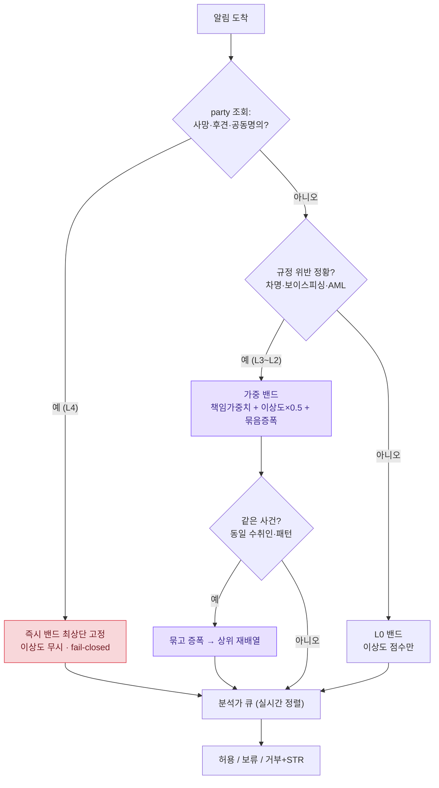
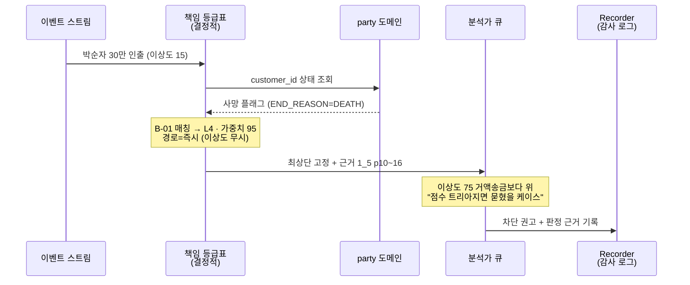
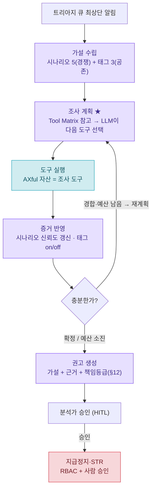

# 금융 컴플라이언스 에이전트 설계 — 규정 코퍼스 · 책임 등급표 · FDS 트리아지

> **이 문서는 두 단계로 진화했다.**
> - **1단계 · 규정 코퍼스 (§0~11)** — 은행업무 PDF를 (A)/(B)·티어로 구조화한 게이팅 코퍼스. 각 행 필드(`ID / 출처 / 층 / 티어 / 액션 / 규정 핵심 / 연동`)가 청크 메타데이터 스키마. 2층 구조: **(A) 규정 = 게이팅용**, **(B) 상품·도메인 지식 = 설명 참고층**. (원래 RAG 인덱싱용으로 설계됨.)
> - **2단계 · FDS 탐지 알림 트리아지 에이전트 (§12~14)** — 위 코퍼스 티어를 **책임 등급표(§12)** 로 응축해 트리아지 우선순위 척추로 재활용. 기술 스택(§13)·데모 시퀀스(§14) 포함. **이 단계에서 RAG·벡터는 제거**(§13-2 참조), 음성은 비핵심.
> - **3단계 파이프라인으로 확장 (§16)** — 트리아지(1단계, 정렬=룰)는 **입력 큐**가 되고, 그 위에 **Fraud Investigation Agent(2단계, 가설→도구→재계획 루프=진짜 에이전트)** 를 얹는다. 트리아지가 "무엇을 먼저?", 에이전트가 "왜 위험?", 분석가가 "무엇을 할까?". §1~15는 1단계 토대, **§16이 2단계**.
>
> **⚠ 우선순위 축 주의** — §1의 "1순위/2순위"는 *코퍼스 구축* 기준(어떤 규정을 모으는 게 중요한가)이고, §12의 책임 등급(L4>L3>…)은 *트리아지 런타임* 기준(틀리면 은행이 얼마나 책임지나)이다. **런타임 판정은 §12가 기준** — 권리자 적격성(사망·후견 = L4)이 최상위, 소비자보호(T1)는 L1. 두 축은 목적이 달라 모순 아님.

---

## 0. 게이팅 액션 4분류 (가장 중요 — 데모 설계의 뼈대)

| 액션 | 정의 | 에이전트 행동 | 주 출처 |
|---|---|---|---|
| **ALLOW** | 규정상 허용 행동 | 안내·실행 | T2B-10 등 경계 판정 |
| **REFUSE** | 규정 위반·권한 없음 | 거부 + 사유 + 정상 절차 안내 | 6대원칙 위반, 권리자 미적격 |
| **NOTIFY** | 사후관리 능동 고지 의무 | 고객에게 권리·변경 사실 선제 알림 | 사후구제권, 본인통보, 약관변경통지 |
| **REFERENCE(B)** | 상품 설명 보조 | 게이팅 아님, 설명 시에만 참조 | 예금상품 지식 |

> **핵심 포인트(1단계)**: 게이팅 에이전트에서 "사후관리"는 REFUSE + NOTIFY 양면. *2단계 트리아지에서는 이 액션 4분류가 §12 책임 등급/처리경로(즉시·가중·NOTIFY·이상도만)로 대체되고, 데모는 §14 이벤트 시퀀스로 구성됨.*

---

## 1. 티어 구조 (우선순위 = 1순위 T1 > 2순위 T2 축)

| 티어 | 명칭 | 질문 | 우선순위 |
|---|---|---|---|
| **T1** | 금융소비자보호 | "이 행동/안내가 적법한가" | **1순위** |
| **T2-①** | 실명·정보 적법성 | "신원·정보 처리가 적법한가" | **2순위** |
| **T2-②** | 권리·권한 적격성 | "거래/지급 상대방이 정당한 권리자·권한자인가" | (T2 클러스터) |
| **T3** | 자금세탁방지(AML) | "이상거래·자금세탁 신호인가" | 분리 유지 + 교차링크 |
| **META** | 내부통제·거버넌스 | (코퍼스 아님 — README/포지셔닝) | — |

> **→ 트리아지 연결**: 위 티어가 §12 책임 등급표(L4~L0)로 매핑되어 런타임 우선순위가 됨. **단 우선순위가 역전된다** — 코퍼스 구축에선 T1(소비자보호)이 1순위였지만, 트리아지 런타임에선 **T2-②(권리자 적격성, 사망·후견)=L4가 최상위**, T1은 L1. "모으는 게 중요한 규정"과 "틀리면 책임이 무거운 규정"이 다르기 때문.

---

## 2. Tier 1 — 금융소비자보호 [1순위] · (A)

REFUSE arm(하면 안 되는 행동) + **NOTIFY arm(고지 의무)** 의 양면.

| ID | 출처 | 층 | 액션 | 규정 핵심 | 고령적합 | 연동 |
|---|---|---|---|---|---|---|
| T1-01 | 2_1 p5 | A | REFUSE | 6대 판매원칙(적합성·적정성·설명의무·불공정영업금지·부당권유금지·광고규제) | ★★★ | 전 데모 판정 기준 |
| T1-02 | 2_1 p6 | A | REFUSE | 판매 14단계·상품설명서·핵심설명서 교부(설명의무 절차화) | ★★★ | 설명의무 체크리스트 |
| T1-03 | 2_1 p2 | A | **NOTIFY** | 약관변경 1개월 전 통지 | ★★ | 사후관리 알림 |
| T1-04 | 2_1 p3 | A | NOTIFY/REF | 예금자보호법 한도 설명 | ★★ | B-03과 연계 |
| T1-05 | 1_3 p16 | A | REFUSE/NOTIFY | 금융거래조건 공시·설명·이해확인 + 금융분쟁조정위(사후구제 제도 근거) | ★★ | 설명의무 정면 보강 |
| T1-06 | 1_4 p10-11 | A | REFUSE | 약관 편입요건(명시·설명·교부)·해석원칙(작성자 불이익) | ★★ | deposit-native 설명의무 |
| **T1-GAP-1** | **출처 미정** | A | **NOTIFY** | 청약철회권·위법계약해지권·자료열람요구권 (금소법 사후구제 3권) | ★★★ | ⚠ 출처 확인 필요 |
| **T1-GAP-2** | **출처 미정** | A | REFUSE | 구속성 영업행위(꺾기) 금지 | ★★ | ⚠ 출처 확인 필요 |

> 취약소비자(고령) 근거: 6대원칙의 **적합성**에 내재 + B-02(비과세종합저축 노인우대)로 보강.

---

## 3. Tier 2-① — 실명·정보 적법성 [2순위] · (A)

AXful Bank의 본인확인(CI)·party·RRN 암호화 설계의 규정 백본.

| ID | 출처 | 층 | 액션 | 규정 핵심 | 고령적합 | 연동 |
|---|---|---|---|---|---|---|
| T2A-01 | 2_1 p3 | A | REFUSE/verify | 실명확인(증표 원본)·금융거래목적확인서·불법차명거래금지확인서·개인정보동의·거주자확인 | ★★★ | 데모4 |
| T2A-02 | 2_1 p6 | A | verify | 실지명의 확인·고객확인 등록·정보 수집·이용 동의 | ★★ | CDD 진입 |
| T2A-03 | 1_4 p20 | A | REFUSE | 타인명의/차명·명의대여=공범·예금주 확정 | ★★★ | **데모4, ↔ T3(대포통장)** |
| **T2A-GAP-1** | **실명법 미업로드** | A | **NOTIFY** | 금융거래정보 제공 시 본인통보 10일 이내 | ★★★ | ⚠ 실명법 자료 권장 |
| **T2A-GAP-2** | **실명법 미업로드** | A | REFUSE | 비밀보장의무 | ★★ | ⚠ 갭 |

> RRN 암호화 컬럼 설계 = 실명법·개인정보보호법상 의무(고유식별정보 암호화). **코퍼스 아닌 면접 답변 근거**로 보관(META 참조).

---

## 4. Tier 2-② — 권리·권한 적격성 (WHO can hold / be paid) · (A)

> 직전 검토 결론: **1_4 = "정당한 당사자인가"(hold/transact)**, **1_5 = "정당한 지급 상대방인가"(be paid)**. 둘이 합쳐 클러스터 완성.

| ID | 출처 | 층 | 액션 | 규정 핵심 | 고령적합 | 연동 |
|---|---|---|---|---|---|---|
| T2B-01 | 1_5 p8 | A | REFUSE | 준점유자 변제 면책요건(선의·무과실) | ★★ | 면책 판정 |
| T2B-02 | 1_5 p9 | A | REFUSE | 편의지급/과다지급·3자지급 면책불가·"본인만 지급" 특약·소송 중 결과확인 후 | ★★★ | **데모1** |
| T2B-03 | 1_5 p10-16 | A | REFUSE | 상속인확인·유언검인·유류분(직계비속 1/2)·상속포기/한정승인·분할 전 공유·사망 미인지 지급 면책(무과실) | ★★★ | **데모2, END_REASON=DEATH** |
| T2B-04 | 1_5 p17 | A | REFUSE | 양도(은행 통지·동의) | ★★ | 권한 게이트 |
| T2B-05 | 1_5 p18-20 | A | REFUSE | 질권(질권자 동의 없이 지급 불가) | ★★ | 권한 게이트 |
| T2B-06 | **1_4 p13** | A | **REFUSE(차등)** | 제한능력자 정의·취소권 / **노령→피성년후견 명시** / 피한정후견=원칙 행위능력자(법원지정 행위만) / 일상행위 취소불가 | ★★★ | **데모3 1차 출처** |
| T2B-07 | 1_4 p5 | A | REFUSE | 보통·저축 질권설정 금지·양도 은행승락 | ★★ | T2B-04/05 보강 |
| T2B-08 | 1_4 p21-22 | A | REFUSE | 공동명의 1인 단독 반환청구 불가·전원 기명날인 | ★★★ | **데모5** |
| T2B-09 | 1_4 p4 | A | 보강 | 소멸시효 5년·선관주의의무(면책요건 법적 토대) | ★ | T2B-01 토대 |
| T2B-10 | 1_4 p9 | A | **ALLOW/경계** | 송금(3자 입금 허용=비게이트) vs 이체(권한 필요) | ★★ | ALLOW/REFUSE 경계 |
| T2B-11 | 1_5 p4 | A | verify | 계좌송금 실명확인 | ★ | T2A 보강 |
| T2B-12 | 2_2 p9-11 | A | REFUSE | 후견·행위능력(여신측) | ★★ | **데모3 보조(T2B-06에 종속)** |
| T2B-13 (edge) | 1_5 p23 | A | REFUSE | 회생·파산 관리인 거래 | ★ | 선택 |
| T2B-14 (edge) | 1_5 p24 | A | REFUSE | 행방불명 재산관리인 | ★ | 선택 |

---

## 5. Tier 3 — 자금세탁방지(AML) · (A)

분리 유지 + T2-①과 교차링크.

| ID | 출처 | 층 | 액션 | 규정 핵심 | 고령적합 | 연동 |
|---|---|---|---|---|---|---|
| T3-01 | 2_1 p20 | A | REFUSE/escalate | AML 일반 | ★★ | — |
| T3-02 | 2_1 p21 | A | escalate | STR/CTR(1천만)·고액현금 문진 | ★★★ | **데모4** |
| T3-03 | 2_1 p22 | A | escalate | CDD/EDD | ★★ | 데모4 |

> **교차링크**: T2A-03(차명·명의대여) ↔ T3-02/03(대포통장 EDD/STR). 동일 사실이 실명법 위반이자 AML 적신호 → 흡수 대신 "분리 + 교차참조".

---

## 6. (B) 상품·도메인 지식 — 게이팅 아님, 어르신 설명용 참고층

| ID | 출처 | 층 | 액션 | 규정 핵심 | 고령적합 |
|---|---|---|---|---|---|
| B-01 | 2_1 p24-30 | B | REFERENCE | 예금상품 | ★ |
| B-02 | 2_1 p19 | B | REFERENCE | 비과세종합저축(노인·장애인 우대) → 취약·고령 근거 | ★★★ |
| B-03 | 1_3 p8-9 | B | REFERENCE | 예금보험(1억·비보호=CD/RP/펀드/금융채) → 잘못 설명 시 설명의무 위반 | ★★ |
| B-04 | 1_4 p2 | B | REFERENCE | 예금종류 taxonomy(설명용) | ★ |

---

## 7. 데모 시나리오 매핑

### 7-1. REFUSE 데모 5종

| # | 시나리오 | 출처 | 티어 | 비고 |
|---|---|---|---|---|
| 1 | 위임 미확인 제3자 전액 인출 거부 | T2B-02 (1_5 p8-9) | T2-② | 3자 지급 면책 불가 |
| 2 | 사망계좌 상속 미확인 인출 거부 | T2B-03 (1_5 p10-16) | T2-② | **END_REASON=DEATH 1:1 연동** |
| 3 | 성년후견 단독거래 **차등 판정** | T2B-06 (1_4 p13) + T2B-12 보조 | T2-② | 피한정=원칙 가능·일상행위 취소불가 → **과잉거부 안 함 어필** |
| 4 | 차명·대포통장 개설/양도 거부 → EDD/STR 에스컬 | T2A-03 + T3-02/03 | T2-① ↔ T3 | **고령 보이스피싱 표적, 가장 극적** |
| 5 | 공동명의 계좌 1인 단독 인출 거부 | T2B-08 (1_4 p21-22) | T2-② | 전원 기명날인 |

### 7-2. NOTIFY 데모 (사후관리 positive arm — 추가 권장)

| # | 시나리오 | 출처 | 티어 | 비고 |
|---|---|---|---|---|
| N1 | 약관 변경 1개월 전 선제 통지 | T1-03 (2_1 p2) | T1 | 사후관리 알림 |
| N2 | 금융거래정보 제공 사실 본인통보(10일) | T2A-GAP-1 | T2-① | ⚠ 실명법 출처 필요 |
| N3 | 사후구제 권리 고지(청약철회·위법계약해지·자료열람) | T1-GAP-1 | T1 | ⚠ 금소법 출처 필요 |
| N4 | 예금자보호 한도 고지 | T1-04 / B-03 | T1 | — |

---

## 8. META — 코퍼스 아님 (README / 포지셔닝)

에이전트 = 자동화된 준법감시(컴플라이언스) 레이어라는 프레이밍 근거.

| 출처 | 내용 | 매핑 |
|---|---|---|
| 1_7 p11 | 컴플라이언스 = "사전적·상시적 통제과정" | 에이전트 설계 철학 1:1 |
| 1_7 p4 | 내부통제 5대 구성요소(통제활동·모니터링) | 게이팅 로직 / Recorder 에이전트 |
| 1_7 p5 | 준법감시인 역할 + **책무구조도(임원 직책별 책무 배분)** | 코어 스파인 "책임 경계는 정확히 정의돼야"(고장난명) 제도적 근거 |
| 1_7 p3 | 내부통제 3목적(성과·정보·준법) | 가치축(효율·리스크 책임) 매핑 |
| 1_3 | 내부통제기준·준법감시인 | (위와 동일 메타) |
| RRN 암호화 | 실명법·개인정보보호법상 고유식별정보 암호화 의무 | 면접 답변 근거 |

---

## 9. 파킹로트 (현 시나리오 보류 — 출처/후보로만 기록)

| 항목 | 출처 | 재진입 조건 |
|---|---|---|
| 연대보증·보증인 보호 특별법 | 2_3 p5-8 | 시나리오를 **노인 연대보증 착취**까지 확장 시 (유일 출처) |
| 법인·단체·국가·조합 거래 | 1_4 p14-19 | **소상공인 법인 운영**까지 확장 시 |
| 회생·파산 / 행방불명 관리인 | 1_5 p23-24 (T2B-13/14) | edge 데모 필요 시 |
| 2_3 여신2 그 외 전체 | 2_2/2_3 운용·담보·금리 | (보류 — 시나리오 밖) |

---

## 10. ⚠ RAG 인덱싱 전 출처 갭 (검색 실패 방지 — 우선 해결)

| 갭 | 우선순위 | 현재 상태 | 조치 |
|---|---|---|---|
| 금소법 **사후구제 3권**(청약철회·위법계약해지·자료열람) | 1순위 NOTIFY 핵심 | 2_1 명시 페이지 미확인 | 2_1 재확인 또는 금소법 자료 1건 추가 |
| 실명법 **본인통보 10일·비밀보장** | 2순위 백본 | 2_1 p3 부분 외 전용 출처 없음 | 실명법/개인정보보호법 자료 권장 |
| **꺾기(구속성영업)** 금지 | 1순위 REFUSE | 출처 불명확 | 2_1 내 확인 또는 금소법 보강 |

---

## 11. 확정된 미결 결정 (이번 검토 반영)

- **Tier 2 ②-1 / ②-2 분기 → 확정.** ②-1 실명(T2A) = 예금 p20·2_1 p3 / ②-2 권리·권한(T2B) = 1_5 p8-20 + 1_4 p5·p13·p21-22 + 2_2 p9-11. (티어 수 3개 유지, 라벨만 정확화)
- **Tier 3(AML) → 분리 유지 + 교차링크.** 흡수 안 함. T2A-03 ↔ T3-02/03 다리.
- **후견 게이트 1차 출처 = 1_4 p13**(deposit-native), 2_2 p9-11은 보조로 강등.

---

## 12. 책임 등급표 — 트리아지 우선순위 척추 (런타임 결정 테이블)

> **맥락 전환**: 위 §2~6의 코퍼스 티어를, FDS 탐지 알림 **트리아지 에이전트**의 운영용 척도로 재활용한 것. 코퍼스 청크의 티어 → **책임 등급(L4~L0)** → **우선순위 가중치**로 응축. 이 표가 런타임 결정의 결정적 척추이며, **RAG는 쓰지 않음** — 코퍼스는 이 표의 *근거 원천(출처)* 으로만 쓰고 런타임엔 표를 조회한다.
> 핵심 원칙: **판정은 표(결정적), 묶기·재배열만 에이전트, 차단 실행은 목.**

### 12-1. 책임 등급 척도 (이상도와 별개 — "누가, 얼마나 책임지나")

| 등급 | 의미 | 결과 책임 |
|---|---|---|
| **L4** | 권리자 적격성 위반 | 무권리자 지급 → 은행이 그 돈을 **직접 배상** (최상위) |
| **L3** | 법규 위반 제재 | AML·실명법 → 감독 제재·형사 책임 |
| **L2** | 권한·동의 누락 | 절차로 회복 가능한 하자 |
| **L1** | 소비자보호 | 사후 분쟁·과태료 |
| **L0** | 규정 무관 | 이상도 점수만으로 평가 |

### 12-2. 처리경로 (결정적 vs 에이전트 분리)

| 경로 | 의미 | 누가 처리 |
|---|---|---|
| **즉시** | 확정 사실 기반 위반(사망·후견 등) → 큐 최상단 고정, 이상도 무시 | 표(결정적), 에이전트 큐 우회 |
| **가중** | 의심·정황(차명·보이스피싱) → 가중치만 부여 | 에이전트가 묶고 재배열 |
| **NOTIFY** | 능동 고지 의무 | 알림 발송 |
| **이상도만** | 규정 무관 | FDS 점수 정렬 |

### 12-3. 책임 등급표 (12행 · 거래맥락 → 등급 → 가중치 → 경로 → 출처)

| ID | 거래맥락 (트리거) | 책임등급·근거 | 가중치 | 경로 | 출처(청크) |
|---|---|---|---|---|---|
| B-01 | 사망계좌(`END_REASON=DEATH`) 출금·송금, 상속 미완 | L4 무권리자 지급 = 직접 배상 | 95 | 즉시 | 1_5 p10~16 (T2B-03) |
| B-02 | 성년후견 개시 확정 + 단독 거래 | L4 무능력자 단독행위 무효 | 92 | 즉시 | 1_4 p13 (T2B-06) |
| B-03 | 위임 미확인 제3자 전액 인출 | L4 3자 지급 면책 불가 | 90 | 즉시 | 1_5 p8~9 (T2B-01/02) |
| B-04 | 공동명의 + 1인 단독 인출·해지 | L4 단독지급 시 은행 책임 | 88 | 즉시 | 1_4 p21~22 (T2B-08) |
| B-05 | 차명·명의대여 정황(신규계좌 즉시 대량이체 등) | L3 실명법 위반 + 대포통장 | 82 | 가중 | 1_4 p20 (T2A-03) ↔ 2_1 p21~22 |
| B-06 | 보이스피싱 정황(의심번호 통화+신규수취인+발화신호) | L3 STR 대상·피해 책임 | 80 | 가중 | 2_1 p21~22 (T3-02/03) |
| B-07 | 고액현금(1천만+) 문진 미이행 | L3 CTR·문진 의무 | 72 | 가중 | 2_1 p21 (T3-02) |
| B-08 | 질권 설정 계좌 + 질권자 동의 없는 지급 | L2 질권자 동의 없이 지급 불가 | 65 | 즉시 | 1_5 p18~20 (T2B-05) |
| B-09 | 양도 통지·동의 없는 권리 변동 | L2 은행 통지·동의 요건 | 55 | 가중 | 1_5 p17 (T2B-04) |
| B-10 | 취약(고령)고객 + 복잡상품, 설명 정황 | L1 6대 판매원칙·설명의무 | 45 | 가중 | 2_1 p5·p6 (T1-01/02) |
| B-11 | 약관 중요변경 미통지 | L1 1개월 전 통지 의무 | 35 | NOTIFY | 2_1 p2 (T1-03) |
| B-12 | 단순 한도초과·이상 패턴 | L0 규정 위반 아님 | 0 | 이상도만 | — (FDS 점수) |

### 12-4. 우선순위 산출 공식 (표 → C 에이전트로 넘기는 값)

- **즉시 행**: 우선순위 = 책임가중치 그대로, **큐 최상단 고정 · 이상도 무시.** → "사망계좌 30만 원"이 이상도 바닥이어도 95로 맨 위. (점수 트리아지가 절대 못 잡는 칸 = 차별점)
- **가중 행**: 우선순위 = 책임가중치 + (이상도 × 0.5) + **묶음증폭**(에이전트가 동적 산출). 같은 수취인 송금 N건 묶이면 증폭 ↑ → 실시간 상향.
- **L0**: 이상도 점수만 정렬.

### 12-5. 분석가 표시문구 (D 보조가 출처 키로 생성)

- B-01 → "사망계좌 인출 시도, 상속 미확인. **즉시 차단 권고.** 근거: 1_5 p10~16 (권리자 적격성 L4)."
- B-06 → "보이스피싱 정황 3건 묶음 — 의심번호 통화 + 동일 수취인 연속 송금. **STR 검토.** 근거: 2_1 p21~22 (AML L3)."

### 12-6. 단서 (면접 대비)

- **가중치 숫자는 확정값 아님 — 보정 출발점.** 등급 순서(L4>L3>L2>L1)는 책임 성격으로 근거 분명하나, 95/92 같은 미세값은 실서비스에서 리스크팀 + 과거 데이터로 튜닝. → **확장 로드맵**: "과거 데이터 기반 가중치 보정"(= 폐기한 아이디어1의 룰 영향 시뮬레이션이 들어올 자리).
- **B-02 후견은 차등.** 성년후견(피성년후견인) 단독거래만 즉시 차단. **피한정후견인은 원칙 행위능력자 → 일상거래 허용, 법원 지정 행위만 게이팅**(1_4 p13). "후견=무조건 차단"이 아니라는 차등 = 과잉거부 안 하는 정밀함 어필. 표에 뭉개지 말고 분기 로직으로 유지.

---

## 13. 면접용 기술 스택 (선택 근거 + 일부러 안 쓴 것)

> **관통 원칙**: "결정적인 건 통제(코드·표·DB), 판단만 AI에 위임." 모델·도구·메모리·캐시·벡터 선택이 전부 이 한 원칙의 반복.
> **우선순위 재배열**: 컴플라이언스 도메인이라 일반 시스템과 달리 **신뢰성·감사가능성 > 비용 > 속도 > 확장성(설계만)**. 속도를 일부러 2순위 뒤로 양보함.
> **에이전트 층 = Python** (LangGraph·LLM SDK 생태계). 백엔드(AXful) = Java Spring Boot. 둘은 **HTTP로 분리**(모듈성).

### 13-1. 채택 스택 (구성요소 · 선택 · 근거)

| 계층 | 선택 | 왜 이걸 골랐나 (면접 한 줄) | 확정도 |
|---|---|---|---|
| 오케스트레이션 | **LangGraph** (C만 감쌈) | 상태머신 그래프로 묶기·재평가 루프·재시도·HITL·감사 추적 기본 제공. 컴플라이언스 감사에 강함. 결정적 척추(B표)는 프레임워크 밖에 둬 가려지지 않게 | 확정 |
| 모델 (경량) | **claude-haiku-4-5** (또는 OpenAI mini급) | 고볼륨 1차 분류·발화 신호추출. 빠르고 쌈 | 구조 확정 |
| 모델 (상위) | **claude-sonnet-4-6** (또는 OpenAI 상위) | 소수의 어려운 판단(묶음·번지는 공격·재배열 근거)에만 | 구조 확정 |
| 모델 추상화 | **설정값 분리 (provider-agnostic)** | 벤더 종속 안 함(⑤). 개발은 익숙한 OpenAI, 데모는 ELLO 스택에 한 줄로 맞춤 | 확정 |
| 메모리: 작업 | **LangGraph state** (in-memory) | 단계 간 공유 메모장. 배치 끝나면 버림 → 별도 저장소 불필요 | 확정 |
| 메모리: 사실 | **관계형 DB** (party PostgreSQL + B표 JSON) | 사망·후견은 ID로 정확 조회. 최신·결정적이어야 함. 기존 party 자산 재사용 | 확정 (PoC 목 데이터) |
| 도구 | **계층적 (조회→판단→동작)** Python 함수 | 조회=자유, 동작(차단·STR)=RBAC 게이팅+감사. 잘못된 도구 호출=감사 구멍이라 시맨틱 선택 배제. 백엔드 RBAC를 도구 계층에 확장 | 확정 |
| 모니터링 (운영) | **Langfuse** (셀프호스팅) | 에이전트 트레이스·세션 리플레이로 "왜 이 순서로 재배열했나" 추적. 오픈소스 무료·프레임워크 비종속 | 확정 |
| 모니터링 (평가) | **Arize Phoenix** | 오탐률·드리프트·평가. ML급 평가 엄밀성 | **v2** (보조) |
| 책임 판정 | **B 책임 등급표** (결정적 코드/JSON) | 우선순위 척추. 사망·후견 즉시 차단을 표가 강제(LLM 비결정성 차단) | 확정 |
| 속도 최적화 | **결정적 우선통과 + 2티어 + 비동기·병렬 + 점진적 응답 + 우선순위 큐** | 병목은 LLM 호출. 캐시가 아니라 위 방법으로 해결. 셋(결정적 게이트·2티어·우선순위 큐)은 이미 설계에 내장 = 감사 분리가 속도도 겸함 | 데모: 점진응답·큐 / 병렬: 설계 |

### 13-2. 일부러 안 쓴 것 (← 차별 포인트)

| 안 쓴 것 | 왜 안 썼나 (면접 답) | 정당해지는 v2 조건 |
|---|---|---|
| **RAG / 벡터스토어** | 찾을 게 다 키로 조회 가능(고객=ID, 규정=B표가 출처 박음). 컴플라이언스라 "비슷한 걸" 가져오는 근사 검색이 위험 | 규정 수백 개로 B표 초과 시 |
| **시맨틱 메모리** | "사망"을 의미 유사도로 찾다 "휴면" 가져오면 사고 | 과거 유사사건 검색 기능 |
| **캐시 (사실 조회)** | party 상태는 최신성이 생명. 옛 값=사망계좌 놓침 | (영구 안 함) |
| **캐시 (LLM)** | PoC는 목이라 호출비 0. 안 생긴 문제 미리 풀면 오버엔지니어링 | 실호출 급증 시 LLM 캐싱 |
| **무거운 프레임워크 추상화** (LangChain 체인) | 결정적 척추 가리면 감사 구멍 | — |
| **인프라 APM** (SigNoz/ELK/Grafana) | 에이전트 결정 사슬 못 봄. LLM 옵저버빌리티와 다른 층 | 물리 배포 시 인프라 층에 병행 |
| **단일 모델** | 고볼륨에 비싼 모델=비용·속도 붕괴 | — |
| **Opus** | 트리아지엔 과하고 비쌈 | v2 대규모 병렬 추적 |
| **체크포인터** (state DB 백업) | PoC는 "안 죽는다 치고" in-memory로 충분 | 회복탄력성 진짜 이중화 |

### 13-3. 도구별 기술 실체 (거의 다 Python 함수)

| 도구 | 실체 / 스택 | 외부 의존 | PoC |
|---|---|---|---|
| party 조회 | Python 함수 + psycopg/SQLAlchemy | DB or Java `/internal` API | 진짜(목 데이터) |
| 거래맥락 조회 | Python (객체 필드 접근) | 없음 | 진짜 |
| B표 조회 | Python + JSON 룩업 | 없음 | 진짜 |
| 발화 신호 추출 | Python + LLM SDK(openai/anthropic) | 모델 API | 진짜(개발=목) |
| 묶음 평가 | Python + LLM SDK | 모델 API | 진짜 |
| 설명 생성 | Python + LLM SDK + 출처 조회 | 모델 API | 진짜 |
| 우선순위 큐 | Python + heapq/list | 없음 | 진짜 |
| fallback 큐 | Python + list | 없음 | 진짜 |
| 통신사 조회 | Python + httpx | 외부(전화층) | **목** |
| FDS 차단(BLOCK) | Python + httpx | 외부 FDS | **목(자리만)** |
| STR/EDD 기록 | Python + httpx | 보고 시스템 | **목** |

> 새 인프라 거의 없음: 벡터스토어·캐시서버·메시지브로커 전부 미사용. 핵심 의존은 **LLM SDK + DB 클라이언트** 둘. 나머지는 Python 표준 라이브러리 + 기존 자산 재사용.

### 13-4. AXful 백엔드 자산 재사용 매핑

| 백엔드 작업(①~④) | 에이전트에서 어떻게 쓰이나 |
|---|---|
| ① JWT 인증 (게이트웨이 1회 검증·X-User 헤더) | 에이전트 호출자 신원 확정 |
| ② party 도메인 (CI 동일인·사망/후견 플래그·soft delete) | 사실 메모리 = party 조회 도구의 데이터 원천 |
| ③ RBAC (`BankRole`·`hasAnyRole`·`/internal` 보호) | 계층3 동작 도구(차단·STR)의 권한 게이팅 |
| ④ FDS (`fds_detection`·룰·BLOCK/MONITOR) | 트리아지 입력(detection 스트림) + 차단 도구 연동 자리 |

### 13-5. v2 로드맵 (PoC에서 "자리만" 둔 것 모음)

- 분석가 피드백 → 가중치 보정 (지속학습 루프 닫기) · Arize Phoenix 평가/드리프트
- LangGraph 체크포인터 (state 영속화, 회복탄력성 이중화)
- LLM 호출 캐싱 (비용 절감)
- 비동기·병렬 실제 구현 (대량 동시 알림)
- 과거 유사사건 검색 (이때 벡터스토어 정당)
- 인프라 APM 병행 (물리 배포)

---

## 14. A 이벤트 시퀀스 — 데모 대본 (트리아지 동작 시연)

> 목표: **큐가 실시간 재배열되는 것**을 시연. "이상도 낮은데 책임 높은" 케이스와 "묶이며 올라가는" 케이스를 의도적으로 심음. 10 이벤트 · 3 클라이맥스.
> §12 책임 등급표가 입력, §13 스택이 실행 환경, 이 시퀀스가 둘이 도는 걸 보여주는 각본.

### 14-1. 등장 계좌 (목 데이터 — party 플래그)

| 계좌 | 상태 | 용도 |
|---|---|---|
| 한가람 | 정상 | 필러 |
| 오미정 | 정상 | 거액 일반송금(이상도↑·책임 없음) — 대비용 |
| 故 박순자 | **사망 3일 전 · 상속 미완** | 클라이맥스1 |
| 이복남(78) | 정상이나 **보이스피싱 진행 중** | 클라이맥스2 |
| 정해진 | **성년후견 개시 확정** | 차등 판정 |
| 최정우 | 정상 | 필러 |

### 14-2. 우선순위 3밴드 (§12-4 재확인)

- **즉시 밴드(결정적)** — 최상단 고정, 이상도 무시. (사망·후견 등 L4 즉시행)
- **가중 밴드** — 책임가중치 + 이상도×0.5 + 묶음증폭
- **L0 밴드** — 이상도 점수만

### 14-3. 타임라인 (10 이벤트)

| T+ | 이벤트 | 매칭(경로) | 점수 | 효과 |
|---|---|---|---|---|
| 00 | 한가람 새벽 50만 이체 | B-12 (L0) | 이상도 40 | [한가람 40] |
| 03 | 오미정 900만 신규수취인 송금 | B-12 (L0) | 이상도 75 | [오미정 75, 한가람 40] |
| 06 | **故박순자 30만 인출** | **B-01 (즉시·L4)** | 이상도 15 → 고정 | **★C1** |
| 10 | 이복남 800만 '안전계좌' + "검찰" + 의심번호 통화 | B-06 (가중·L3) | 80+70×.5=**115** | 보이스피싱 단건이 거액 위로 |
| 13 | 최정우 해외결제 | B-12 (L0) | 이상도 55 | 하위 편입 |
| 16 | 이복남 동일 수취인 2건째 | B-06 묶음 | +증폭=**135** | 묶이며 상승 |
| 19 | 이복남 3건째 | B-06 묶음 | +증폭=**155** | **★C2** |
| 23 | **정해진 단독거래** | **B-02 (즉시·L4)** | 92 → 고정 | 즉시밴드 진입 |
| 27 | (에이전트 타임아웃) | — | — | **★C3 fallback** |
| 30 | 에이전트 복구 | — | — | 미분류 큐 재평가 복귀 |

### 14-4. 클라이맥스 1 (T+06) — 이상도 무시, 책임이 이긴다

박순자 인출은 30만·평범한 시간 → **이상도 15**(점수 트리아지면 큐 바닥). party 사망 플래그 → B-01 즉시 → **이상도 무시·최상단 고정**.
```
큐: [★박순자 (즉시·사망)]  ← 이상도 15
     오미정 75 (거액·정상) ← 이상도 75인데 아래!
     한가람 40
```
표시문구: "사망계좌 인출 시도, 상속 미확인. 즉시 차단 권고. 근거 1_5 p10~16 (L4)."
→ **점수 vs 규정 트리아지의 차별점 전부가 이 한 장면.**

### 14-5. 클라이맥스 2 (T+19) — 흩어진 걸 묶으니 보인다

이복남 3건을 따로 보면 각각 중위권. 에이전트가 **동일 수취인·패턴으로 묶고** 묶음증폭 → 80→115→135→155 상승.
```
큐: 박순자 (즉시)
     ★이복남 (보이스피싱 묶음 3건) 155 ← 묶여서 상위
     오미정 75 / 최정우 55 / 한가람 40
```
표시문구: "보이스피싱 정황 3건 묶음 — 의심번호 통화 + 동일 수취인 연속 송금. STR 검토. 근거 2_1 p21~22 (L3)."
→ 단건씩 봤으면 놓쳤을 "진행 중 공격"을 묶기·재배열이 드러냄.

### 14-6. 클라이맥스 3 (T+27) — 두뇌가 죽어도 척추는 산다

에이전트(C) 타임아웃. 처리 중이던 **가중 알림(이복남 묶음)이 미분류 큐로 fallback** — 알림 무손실. 동시에 **즉시 밴드(박순자·정해진)는 코드라 큐에 그대로**.
```
[정상 큐]   박순자 (즉시) · 정해진 (즉시·후견)  ← 에이전트 죽어도 코드가 유지
[미분류 큐] 이복남 묶음  ← 장애 → 사람이 직접 확인
```
→ "막는 줄 알았는데 안 막던" 사일런트 실패의 정반대. T+30 복구 시 미분류 큐 재평가 복귀.

### 14-7. 차등 판정 단서 (T+23)

정해진은 **성년후견**이라 단독거래 차단. 만약 **피한정후견**이면 일상거래 통과, 법원 지정 행위만 차단 — "후견=무조건 차단"이 아닌 차등. 데모에 "(피한정후견이면 일상거래 허용)" 자막 한 줄 → 과잉거부 안 하는 정밀함.

### 14-8. 데모 진짜/목 경계 · 운영 노트

- **진짜로 도는 것**: 큐 묶기·재배열·점진 응답·fallback (= 두뇌)
- **목**: party 사망·후견 플래그(목 데이터), 통신사 의심번호 조회, FDS 실제 차단(데모는 "차단 권고"까지만, 실제로 안 막음), STR 기록
- **주입 방식**: 10건을 스크립트로 시간차 주입(2~3초 간격). 각 주입마다 큐 재정렬 **애니메이션**이 보여야 살아남 — 정적 표로는 클라이맥스가 죽음.
- **T+초는 데모용 압축**. 실제 이벤트는 불규칙 도착.

---

## 15. 다이어그램 · 안전 모드 (GitHub 렌더용)

### 15-1. 트리아지 우선순위 의사결정 플로우



### 15-2. 사망계좌 이벤트 처리 시퀀스 (감사 추적 예시)



### 15-3. 안전 모드 — Fail-closed / Fail-soft

상태 머신에 두 종류의 게이트를 의도적으로 분리해 박았다.

| 모드 | 적용 대상 | 트리거 | 동작 |
|---|---|---|---|
| **Fail-closed** (차단형) | 권리자 적격성 L4 (사망·후견·공동명의), AML STR | 확정 사실 | 즉시 차단 권고, **코드가 강제**. 에이전트·LLM 우회. 4-eye 등 사람 확인으로만 해제 |
| **Fail-soft** (보조형) | 에이전트(묶기·우선순위 재배열), 통신사 조회 | 장애·타임아웃 | **미분류 큐로 무손실 진행** + 경고. AI는 보조라 차단 안 함 |

설계 원칙: **차단형은 *확정 사실*에만, 보조형은 *판단*에만.** LLM이 틀리거나 죽어도 결정적 차단(사망·후견)은 멈추지 않고, 반대로 에이전트의 판단(묶기)이 실패해도 알림은 사람에게 무손실 전달된다. (cf. 여신계 doc-agent의 fail-soft/fail-closed 분리와 동일 어휘 — 본 도메인은 *확정 사실 vs 판단* 축으로 분리한 점이 차이.)

---

## 16. Fraud Investigation Agent — 메인 프로젝트 (2단계)

> **이 프로젝트의 중심.** 트리아지(§12·§14)는 이 에이전트에 사건을 공급하는 **입력 필터**로 내려가고, 조사 루프가 메인이다.
> 3단계: **① 트리아지** "무엇을 먼저 볼까?"(정렬=룰) → **② Investigation Agent** "무슨 공격인가?"(가설·조사 루프=에이전트) → **③ 분석가** "무엇을 할까?".
> **왜 에이전트인가 (한 문장)**: 고정 워크플로우가 아니라 **경쟁 가설을 유지하면서 증거에 따라 조사 계획을 변경**하기 때문. → LangGraph 필수, 빼면 성립 안 함.

### 16-1. 에이전트 루프 (7 노드)



### 16-2. 가설 모델 — 2축 (배타 시나리오 + 공존 태그)

가설을 한 축에 섞으면 신뢰도가 깨진다("보이스피싱"과 "대포통장"은 동시 참이지만 "정상"과 "탈취"는 배타). 그래서 분리:

**축 1 · 공격 시나리오 (배타 — 신뢰도 경쟁, 합 ≈ 100)**

| | 시나리오 | 핵심 질문 |
|---|---|---|
| H1 | 보이스피싱 | 고객이 조종당해 송금? |
| H2 | 계정탈취 | 고객이 아니라 탈취자가 송금? |
| H3 | 자금세탁 | 구조화·다단 경유? |
| H4 | 내부자 부정 | 직원 권한 오남용? |
| H5 | 정상(오탐) | 의심 해소 |

**축 2 · 부가 태그 (공존 — 독립 on/off)**: T1 머니뮬 · T2 조직 연관 · T3 신규개설계좌.
→ `H1 + T1 + T2`("보이스피싱 + 머니뮬 + 조직") 같은 조합이 가능 — 현실적.

```
State 예시
  scenarios: {H1:0.35, H2:0.25, H3:0.15, H4:0.05, H5:0.20}   # 합≈1
  tags:      {T1:false, T2:false, T3:false}
  evidence:  [...]      budget_left: 4      decisive_fact: null
```

### 16-3. 도구 레이어 — AXful Bank 자산을 Tool로 노출

| Tool | AXful 자산 | 주는 신호 | 실연결/목 |
|---|---|---|---|
| `get_auth_events` | 인증보안계 (CERT_FAIL_BLOCK) | 인증 실패·비번 변경(→H2) | 🟢 실연결(1순위) |
| `get_customer` | customer | 평소 거래·디바이스 baseline | 🟢 실연결/목 |
| `get_party` | party 도메인 | 사망·후견(→fail-closed), 명의자 불일치(→T1) | 🟡 사망=읽기후 실연결/목, 후견=목 |
| `get_fds_history` | fds_detection·incident | 과거 탐지 패턴 | 🟡 목(우선순위 밖) |
| `get_device_fingerprint` | device 서비스 부재 | 평소/낯선 기기 | 🔴 목 |
| `get_str_history` | STR 서브시스템 부재 | 과거 의심거래 보고 | 🔴 목 |
| `get_related_accounts` | 수취 네트워크 그래프 부재 | 동일 디바이스 다고객, 연관계좌(→T1·T2·T3) | 🔴 목 |
| `get_aml_history` | AML 서브시스템 부재 | 구조화·세탁 이력(→H3·H4) | 🔴 목 |

목표: "위험 시나리오를 **확정하거나 기각하라**" / 예산: 최대 5~6회 호출. **순서는 안 줌 — 에이전트가 정함.**
실연결/목 경계의 근거·로드맵은 §16-9. (도구 인터페이스는 전부 실 스키마 기반, 데이터 원천만 진짜/목으로 갈림.)

### 16-4. 도구 선택 — 혼합형 (Matrix + LLM) ★핵심

순수 LLM은 "왜 그 도구?"에 "LLM이 골랐다"밖에 답 못 한다(금융 보안=설명·감사·재현 중시). 순수 매트릭스는 에이전트가 아닌 전문가시스템이 된다. **그래서 매트릭스가 감사 가능한 뼈대를 주고, LLM이 그 위에서 판단한다.**

**Tool Matrix — 각 도구가 어떤 시나리오 쌍을 가르나** (분별력 사전)

```
get_device_fingerprint:  separates  H1↔H2, H2↔H5
get_auth_events:         separates  H2↔H5
get_related_accounts:    separates  H1↔H3   (+ reveals T1·T2·T3)
get_str_history:         separates  H1↔H4, H3 강화
get_aml_history:         separates  H3↔H5, H4
get_party:               decisive   사망·후견 → 즉시 fail-closed
```

**Planner 노드 (조사 계획)** — 매트릭스를 프롬프트에 넣어 LLM이 선택:
```
현재 시나리오 분포: H1 35%, H2 25%, H3 15%, H5 20% ...
사용 가능 도구 + 각 도구가 구분하는 시나리오 쌍: [Matrix]
남은 예산: 3회
→ 지금 경합 중인 상위 가설을 가장 잘 가르는 도구를 고르고, 이유를 한 줄로.
```

**면접 답변이 이렇게 나온다**: "왜 device를 조회했나?" → *"H1(보이스피싱)·H2(탈취)가 상위였고, device_fingerprint가 그 둘을 가장 잘 구분하기 때문."* — "LLM이 골랐다"가 아니라 "설명 가능한 근거를 참고해 골랐다". **선택 이유는 매번 로그**(감사·재현).

> 정보이득을 LLM 휴리스틱 + 매트릭스 참고로 처리(PoC). 엄밀한 기대정보이득 수식은 v2.

### 16-5. 종료조건 · 조사 예산

시나리오 신뢰도 0~1, 증거마다 갱신. 게이트 판정 순서:
1. **결정적 사실**(조사 중 party 사망·후견 확인) → 즉시 종료(fail-closed, 예산 무관)
2. 한 시나리오 **≥0.75** → 확정 종료 · **≤0.15** → 기각(후보 닫음)
3. **예산 소진**(도구 6회/재계획 4회/30초) → 최고 신뢰 0.5~0.74면 "잠정 가설+미확인 항목" 인계(fail-soft), 전부 <0.4면 "보류+증거" 큐 환원
4. 그 외(경합) → 재계획 루프백

"확신해서 끝"과 "지쳐서 끝"을 구분하고, 후자도 빈손 아닌 부분결과를 넘긴다 (§15-3 연결).

### 16-6. 왜 진짜 에이전트인가 (상태머신과의 차이)

2개 가설·정해진 분기는 if문으로 환원된다(`if device 정상 then …`). 이 설계가 다른 이유:
- **5 시나리오가 동시 경합 + 8 도구** → "지금 어느 도구가 이 분포를 가장 크게 가르나"를 **매번 계산**해야 함. device는 H2는 가르지만 H4·H5는 못 가르고, str_history는 H1·H3·H4를 동시에 건드림 → 분기표로 못 적음.
- **경로가 결과에 따라 갈림**: device가 평소 기기면 H2 약화→수취인 조사로, 낯선 기기면 H2 강화→인증 조사로. 같은 알림, 다른 경로.
- **종료가 동적**: 어떤 건 2회, 어떤 건 6회.
→ 경쟁 가설 유지 + 증거 기반 재계획 = LangGraph state+조건부 루프 필수.

### 16-7. 가드레일

조사 예산 상한(무한 루프 방지) · 결정적 사실은 코드가 가로챔(에이전트 무관) · 동작은 HITL+RBAC(에이전트는 *권고*만) · fail-soft(타임아웃→부분결과 인계). 책임 등급표(§12)=권고 우선순위, AXful 자산=조사 도구, §15 안전모드=루프 가드레일.

### 16-8. 구현 매핑 (PoC — 설계 → 코드)

> 위 설계가 `fraud-investigation-agent/` 아래 실제 코드로 어디에 박혔는지. 설계문서를 구현문서로 고정한다.

**모듈 지도** (`src/agent/`)

| 모듈 | 역할 | 대응 설계 |
|---|---|---|
| `models.py` | `AgentState`(LangGraph state)·`Recommendation`·`Case` 등 | §16-2 2축 가설·§16-5 종료 유형 |
| `tool_matrix.py` | `TOOL_MATRIX` 분별력 사전 + `render_matrix()` | §16-4 |
| `tools.py` | 8개 조회 도구 + `TOOLS` 레지스트리·`load_case()` | §16-3 |
| `hypotheses.py` | `init_scenarios()`·`observe()` | §16-1 H/O, §16-2 |
| `llm.py` | `LLMClient`·`MockLLMClient`·`OpenAIClient`·`AnthropicClient`·`get_llm_client()` | §16-4 Planner, §13 2티어 |
| `planner.py` | `plan_next_tool()` — 선택 이유 `tool_log` 기록 | §16-1 P, §16-4 |
| `graph.py` | `build_graph()`·`run_investigation()`·`investigate()`·`approve_and_execute()` | §16-1 루프, §16-5 게이트, HITL |
| `recommend.py` | `build_recommendation()` — 등급·근거사슬·동작 제안 | §16-1 R, §12 |
| `tracing.py` | `trace_node()` — Langfuse 훅(선택, 기본 no-op) | §13 모니터링 |

**루프 7노드 → graph.py 함수** (`build_graph` 내 노드)

`hypothesize` → `plan` → `act` → `observe` → `gate`(조건부 엣지) → `plan`(루프백) / `recommend` → *interrupt(HITL)* → `execute_action`.
- `gate`: §16-5 우선순위(decisive→max≥0.75→budget==0→else plan).
- HITL: `interrupt_before=["execute_action"]` + `MemorySaver`. `execute_action` 은 `hitl_approved` + RBAC(`FRAUD_OFFICER`) 통과 시에만 동작(목) 실행.

**도구 → 함수 / 실서비스 엔드포인트** (`tools.py`, 전부 조회 전용·PoC 목)

| Tool 함수 | AXful 자산 | 실서비스 엔드포인트(주석 자리) |
|---|---|---|
| `get_party` | party 도메인 | `GET /internal/party/{customer_id}` (사망·후견→fail-closed) |
| `get_customer` | customer | `GET /internal/customer/{customer_id}` |
| `get_auth_events` | 인증보안계 | `GET /internal/auth/{customer_id}/events` |
| `get_device_fingerprint` | FDS·세션 | `GET /internal/fds/device?account={account}` |
| `get_fds_history` | fds_detection·incident | `GET /internal/fds/{customer_id}/history` |
| `get_str_history` | STR | `GET /internal/str/{customer_id}` |
| `get_related_accounts` | 거래·수취 네트워크 | `GET /internal/network/related?account={account}` |
| `get_aml_history` | AML | `GET /internal/aml/{customer_id}/history` |

**LLM (§16-4, §13 2티어)** — `llm.py`
- provider: `TRIAGE_LLM_PROVIDER` = `openai` | `anthropic` | `mock`(기본).
- 2티어: 도구 선택(판단)=heavy 모델, 권고 서술=light 모델. `TRIAGE_LLM_MODEL_LIGHT/HEAVY` 로 덮어씀.
  기본값 — openai: `gpt-4o-mini`/`gpt-4o`, anthropic: `claude-haiku-4-5`/`claude-sonnet-4-6`.
- 벤더 SDK 는 지연 import, **API 키는 env 만**(`OPENAI_API_KEY`/`ANTHROPIC_API_KEY`). `.env.example` 참조.
- 실제 LLM 에서도 **도구 선택 이유는 `tool_log` 에 필수 기록**(설명가능성).

**실행·검증**
- 러너: `scripts/run_investigation.py --case <name> [--step] [--compare]`.
- 케이스: `data/cases/{case_h1,case_h2,case_h5,case_death}.json`.
- 테스트: `pytest` (구조·도구·LLM·그래프·게이트·통합 스냅샷).

### 16-9. 실데이터 연동 경계 · 로드맵 (도구별 진짜/목)

> 8개 도구는 전부 조회 전용·기본 목. "실데이터"는 도구마다 난이도가 천차만별이라, **무엇을
> 실연결하고 무엇을 목으로 둘지의 경계 자체가 설계 판단**이다 — 없는 서브시스템을 PoC에서 만들지
> 않고, 가성비 높은 곳만 붙인다. (백엔드 스캔 결과 `/internal` 엔드포인트는 현재 0개 → 연동
> 표면부터 새로 만들어야 함. `guardian` 0건, STR/AML/수취망/device 는 실서브시스템 부재.)

| 도구 | 소스 | 실데이터 | 가르는 것(§16-4) | 연동 단계 |
|---|---|---|---|---|
| `get_auth_events` | 인증보안계 `CERT_FAIL_BLOCK` | 🟢 존재·본인 도메인 | **H2↔H5 (계정탈취)** | **1순위 — 실연결(Stage 7)** |
| `get_party`(사망) | party `END_REASON` | 🟡 존재, 읽기 엔드포인트 필요 | fail-closed | 2순위(선택) |
| `get_customer` | customer | 🟢 존재·본인 도메인 | baseline | 2순위(선택) |
| `get_fds_history` | `fds_detection` | 🟡 존재 | 과거 패턴(맥락) | 목(우선순위 밖) |
| `get_party`(후견) | 부재(`guardian` 0건) | 🔴 | fail-closed | 목 |
| `get_device_fingerprint` | device 서비스 불명확 | 🔴 | H1↔H2 | 목 |
| `get_str_history` | STR 서브시스템 부재 | 🔴 | H1↔H4 | 목 |
| `get_aml_history` | AML 서브시스템 부재 | 🔴 | H3↔H4 | 목 |
| `get_related_accounts` | 수취 네트워크 그래프 부재 | 🔴 | H1↔H3 (+태그) | 목 |

범례: 🟢 존재·본인 도메인 / 🟡 존재하나 읽기 엔드포인트 추가 필요 / 🔴 서브시스템 부재(각각 별도 프로젝트급).

**3단계 로드맵**

1. **1순위 — `get_auth_events` 단일 실연결 (가성비 최고, = Stage 7).** ✅ **구현됨(토글).**
   `CERT_FAIL_BLOCK` 은 H2(계정탈취)를 가르는 *핵심 판단 도구*라, 흔한 baseline 조회가 아니라
   **흥미로운 판단에 실제로 쓰이는 🟢**. customer 도 🟢지만 baseline 이라 덜 인상적. auth_events 하나면
   "우리 인증보안계가 에이전트 도구로 실제 작동"이 증명된다.
   구현: customer-service `GET /api/v1/internal/auth/{customerId}/events`(직원 역할 보호,
   `CertificateUseRepository.countCertFailuresByCustomerSince` 재사용) + `tools.py` 토글
   (`TRIAGE_REAL_TOOLS=get_auth_events` + `TRIAGE_BACKEND_URL`). 미설정 시 목.
2. **2순위(선택) — `get_party`(사망) + `get_customer`.** 사망은 fail-closed 트리거라 의미 있고,
   `END_REASON` 읽기 엔드포인트만 추가하면 되니 🟡 중간. 여력 될 때만.
3. **목 유지(지금 만들지 말 것) — 🔴 5종 + 후견.** STR·AML 서브시스템, 수취망 그래프, device 서비스는
   각각 별도 프로젝트급. PoC에 넣으면 핵심 루프(가치)는 못 만들고 인프라만 파다 끝난다.

**실연결 방식**: customer-service 에 **읽기 전용 `/internal` 엔드포인트 + RBAC(BankRole) 게이팅 + 시드
데이터**(운영 PII 아님). 에이전트(Python)는 그 엔드포인트를 `tools.py` 의 해당 함수에서 호출(현재 목 자리).
