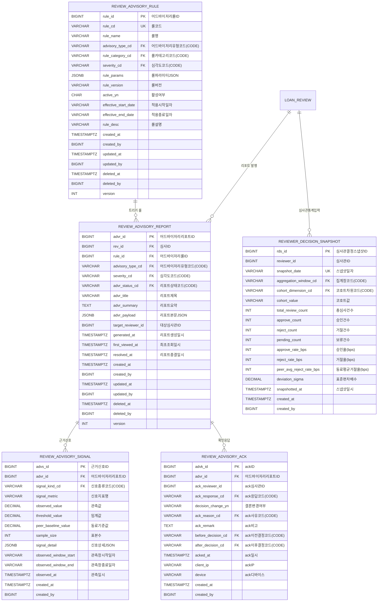
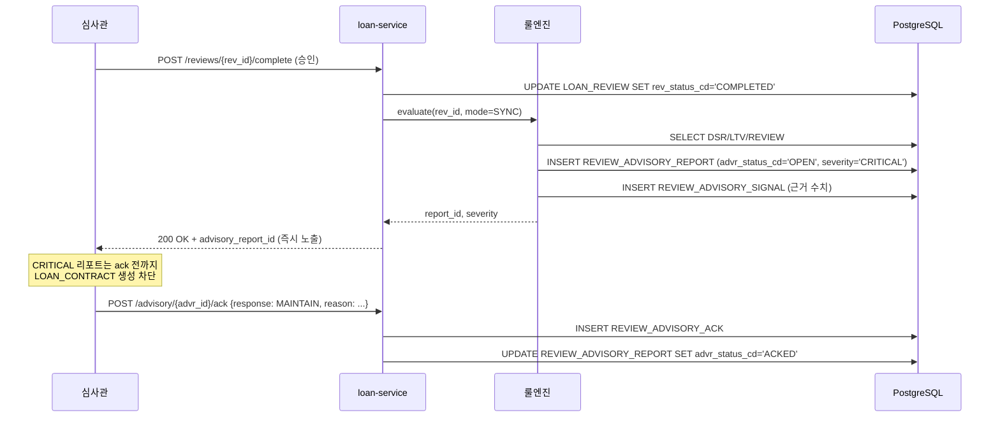
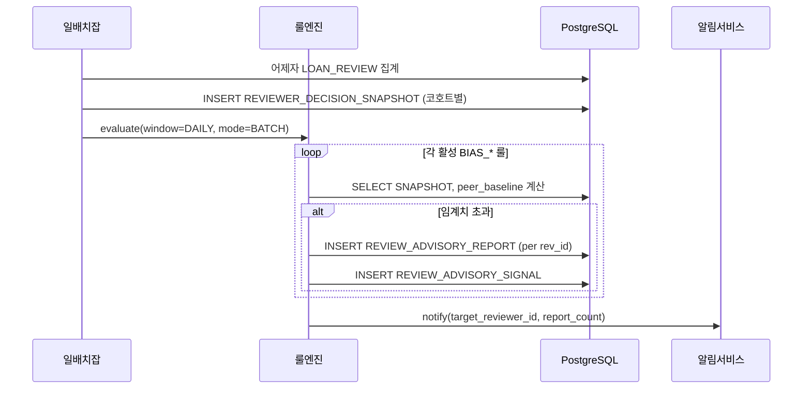
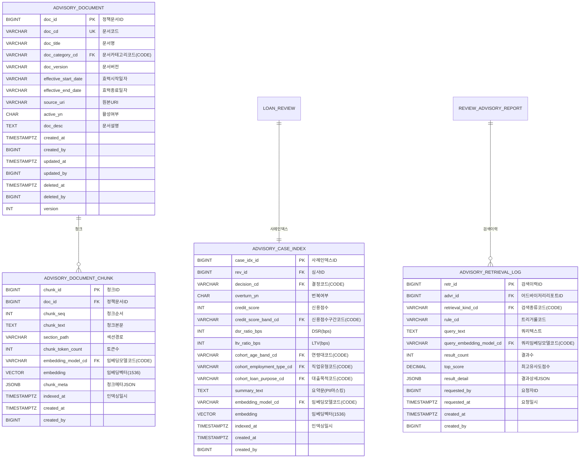
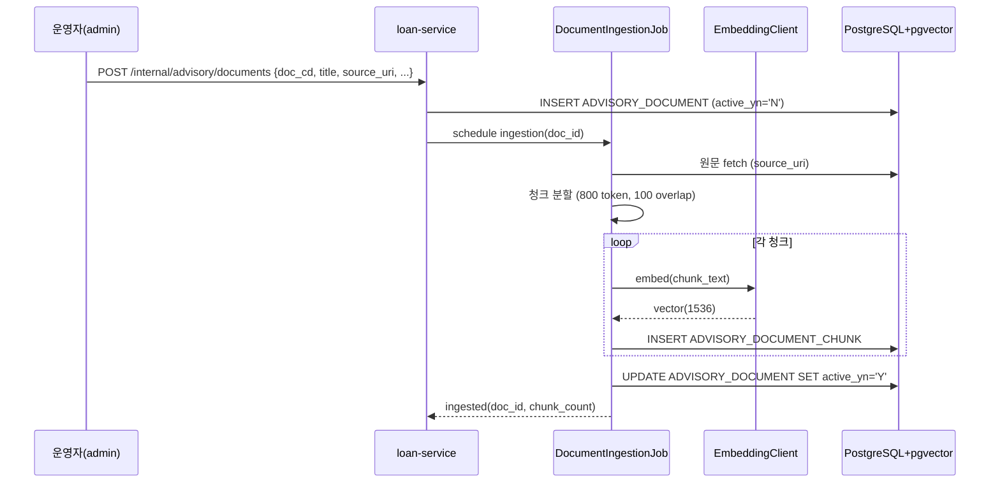
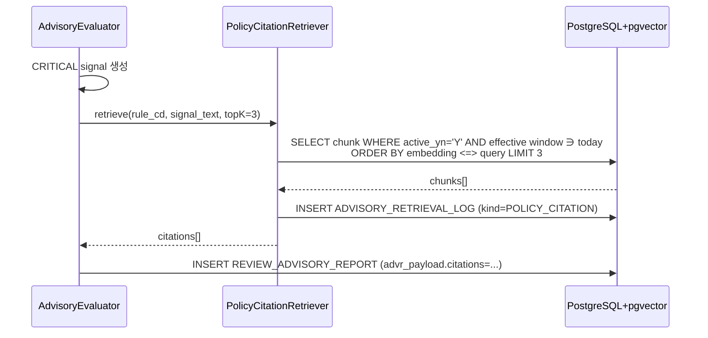
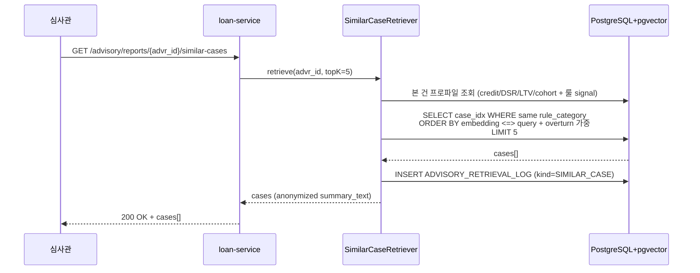

# 📋 LON 심사관 어드바이저리(편향감지·재심사권유) 도입 계획

> **상태**: 초안 (Draft)
> **작성일**: 2026-05-22
> **대상 도메인**: 여신계(LON) — `LOAN_REVIEW` 후속 보조 기능
> **연관 문서**: [loan_erd.md](../loan_erd.md), [AI_GUIDELINES.md](../AI_GUIDELINES.md)

---

## 1. 배경 및 목표

### 1.1 문제 정의
현행 LON 도메인은 `LOAN_REVIEW` 단계에서 심사관(`reviewer_id`)이 단독으로 결정(`rev_decision_cd`)을 내리는 구조다. 이 구조에는 두 가지 잠재 리스크가 있다.

1. **심사관 편향**: 특정 심사관이 특정 속성(연령대·성별·지역·직업유형 등)에 대해 평균보다 유의미하게 높은 거절율을 보이는 패턴을 검출할 장치가 없다.
2. **결정 일관성 부재**: 유사 프로파일(신용점수·DSR·LTV·소득 구간이 유사한) 신청 건이 같은 시점에 다른 결론으로 분기될 때, 이를 사후에 탐지할 장치가 없다.

### 1.2 목표
*심사 결정 권한을 빼앗지 않으면서*, 위 두 리스크에 해당하는 패턴이 발견되면 **심사관에게 재검토를 권유하는 리포트**를 발행한다. 심사관은 리포트를 확인(ack)하고, 결론을 유지하거나 변경할 수 있으며, 그 응답은 모두 감사 로그로 남는다.

### 1.3 도입 가치
- **컴플라이언스**: 자동화된 결정(GDPR Art. 22 / 신용정보법상 설명요구권)에 해당하지 않으므로 규제 부담이 없다.
- **감사 가능성**: "편향 신호가 떴는데 무시했다" / "유사 신청자와 다른 결론을 냈는데 정당화 사유가 없다" 같은 사후 패턴 분석이 가능해진다.
- **점진적 강화 경로**: MVP 단계에선 리포트만 발행하되, 누적된 ack 데이터를 기반으로 추후 룰 정밀도/자동화 수준을 단계적으로 올릴 수 있다.

---

## 2. 범위 (Scope) / 비범위 (Out of Scope)

### 2.1 범위
| 항목 | 설명 |
|---|---|
| 편향 감지 리포트 | 심사관별 의사결정 분포를 룰 기반으로 분석하여 임계치 초과 시 리포트 발행 |
| 재심사 권유 리포트 | 유사 신청 프로파일과의 결정 분기 또는 룰 위반 의심 신호 발견 시 리포트 발행 |
| 리포트 ack 워크플로우 | 심사관이 리포트를 봤다는 ack + "결론 유지/변경" 사유 입력 |
| 트리거 룰 카탈로그 | 룰을 메타데이터화하여 운영자가 임계치/대상 컬럼 변경 가능 |
| 감사 로그 | 누가·언제·무엇을 보고·어떻게 반응했는지 append-only 기록 |
| **유사 과거 심사 사례 검색 (RAG-B)** | 본 건과 유사 프로파일의 과거 처리·번복 사례를 retrieve 해서 심사관에게 참고로 제시 (Phase 6, §11) |
| **정책·규정 근거 인용 (RAG-C)** | CRITICAL 룰 발화 시 관련 신용정책/내규 조항을 retrieve 해서 리포트 본문에 첨부 (Phase 6, §11) |

### 2.2 비범위
| 항목 | 사유 |
|---|---|
| 자동 거절 번복 / 자동 승인 | 심사 결정 권한은 심사관 고유. 본 도구는 *권유*만 한다. |
| 신청인에게 리포트 노출 | 운영자/감사 도구이며, 신청인은 별도의 *이의신청(adverse action)* 경로를 통해서만 접근. |
| 외부 신용평가 모델 변경 | `CREDIT_EVALUATION` 엔진은 손대지 않는다. 리포트는 *이미 산출된 결과*만 본다. |
| 실시간(<1s) 트리거 | MVP는 본심사 종료 직후 비동기 배치(분 단위)로 충분. |
| **생성형 요약(LLM Generation)** | RAG 의 **R(Retrieval)만 채택**. G(요약·결론 생성)는 환각·책임 소재·설명요구권 이슈로 본 단계에서 제외. 검색 결과는 *원문 그대로* 제시. |
| **신청인 자연어 사유서 자동 작성** | 동일하게 G 영역. 거절 통지서는 기존 정형 문구 + 심사관 수기 사유 유지. |

---

## 3. 권한 및 책임 모델

### 3.1 권한 매트릭스
| 주체 | 리포트 생성 | 리포트 조회 | ack 등록 | 룰 정의 변경 | 심사 결정 변경 |
|---|---|---|---|---|---|
| 시스템(룰 엔진) | ✅ | — | — | — | ❌ |
| 심사관 (`reviewer`) | ❌ | ✅ (자신 대상 + 자신이 처리한 건) | ✅ | ❌ | ✅ (기존대로) |
| 감사관 (`auditor`) | ❌ | ✅ (전체) | ❌ | ❌ | ❌ |
| 운영자 (`admin`) | ❌ | ✅ (전체) | ❌ | ✅ | ❌ |

### 3.2 핵심 원칙
1. **리포트는 결정을 바꾸지 않는다.** `LOAN_REVIEW` 의 `rev_decision_cd` 변경은 *언제나* 심사관의 명시적 액션을 통해서만 일어난다.
2. **ack는 의무다.** 리포트가 발행되었는데 해당 심사 건이 이후 단계(`LOAN_CONTRACT` 등)로 진행되려면 ack가 선행되어야 한다. ack 없이 진행 시도 시 워크플로우 게이트에서 차단.
3. **무시도 결정이다.** 심사관이 ack 후 "결론 유지"를 선택해도 그 자체가 감사 로그에 남으므로, 사후 통계(특정 심사관이 편향 리포트를 80% 무시함 등)가 가능하다.

---

## 4. 도메인 모델 (ERD 확장)

기존 `LOAN_REVIEW` 와 `REVIEW_CHECK_LOG` 에 신규 5개 테이블을 추가한다. 모두 LON 명명 규칙([loan_erd.md](../loan_erd.md))을 따른다.

### 4.1 테이블 역할 요약

| 테이블 | 역할 | 비고 |
|---|---|---|
| `REVIEW_ADVISORY_RULE` | 트리거 룰 메타데이터. `rule_params` 에 임계치/대상 컬럼을 JSON 으로 격납. | 등록계 (Soft Delete 대상). 룰 비활성화는 `active_yn = 'N'`. |
| `REVIEW_ADVISORY_REPORT` | 룰 트리거 시 발행되는 리포트 본체. 한 심사(`rev_id`) 당 다수 리포트 가능. | 등록계. `advr_status_cd`: OPEN / VIEWED / ACKED / RESOLVED. |
| `REVIEW_ADVISORY_SIGNAL` | 리포트의 *수치적 근거*. "어떤 지표가 어떤 값으로 임계치를 넘었는가". | **append-only 이력**. Soft Delete 미적용. |
| `REVIEW_ADVISORY_ACK` | 심사관의 ack 응답. ack 시점의 결정 전/후 코드 함께 캡처. | **append-only 이력**. 한 리포트에 ack 여러 번 가능 (예: 보류 → 추가검토 → 확정). |
| `REVIEWER_DECISION_SNAPSHOT` | 편향 감지 룰의 *입력 데이터*. 일/주 단위 집계 결과. | **append-only 스냅샷**. 룰 엔진 성능 확보용. |

### 4.2 코드 그룹 (CODE_MASTER 추가)

| `code_group_cd` | 예시 `code_cd` | 의미 |
|---|---|---|
| `ADVISORY_TYPE` | `BIAS_DETECTION`, `REREVIEW_RECOMMEND` | 어드바이저리 유형 |
| `ADVISORY_SEVERITY` | `INFO`, `WARN`, `CRITICAL` | 리포트 심각도 |
| `ADVR_STATUS` | `OPEN`, `VIEWED`, `ACKED`, `RESOLVED` | 리포트 라이프사이클 |
| `RULE_CATEGORY` | `REVIEWER_DEVIATION`, `PEER_DIVERGENCE`, `THRESHOLD_VIOLATION` | 룰 분류 |
| `SIGNAL_KIND` | `REJECT_RATE_DEVIATION`, `PEER_DECISION_DIVERGENCE`, `DSR_OVERRIDE`, `LTV_OVERRIDE` | 신호 종류 |
| `ACK_RESPONSE` | `MAINTAIN`, `OVERTURN`, `ESCALATE`, `NEEDS_MORE_INFO` | ack 응답 유형 |
| `ACK_REASON` | `INSUFFICIENT_EVIDENCE`, `REVIEWER_JUDGMENT`, `POLICY_EXCEPTION` | 결론 유지/변경 사유 |
| `AGG_WINDOW` | `DAILY`, `WEEKLY`, `MONTHLY` | 통계 집계 창 |
| `COHORT_DIM` | `AGE_BAND`, `EMPLOYMENT_TYPE`, `LOAN_PURPOSE`, `REGION` | 편향 분석 코호트 축 |

> 신용정보법상 민감속성(성별·국적·종교 등)은 *분석 입력*으로 사용하지 않는다. 코호트 차원에서도 제외.

---

## 5. 트리거 룰 카탈로그 (MVP)

룰은 `REVIEW_ADVISORY_RULE.rule_params` JSON 으로 표현되며, 운영자가 변경 가능하다. MVP 출시 시 시드 데이터로 아래 5개를 기본 탑재한다.

### 5.1 편향 감지(BIAS_DETECTION) 룰

| `rule_cd` | 룰명 | 트리거 조건 | severity |
|---|---|---|---|
| `BIAS_REJECT_RATE_DEVIATION` | 심사관 거절율 편차 | 특정 코호트(`COHORT_DIM`)에서 심사관의 거절율이 동료 평균 대비 +2σ 초과 (최근 30일, 최소 표본 30건) | WARN |
| `BIAS_APPROVAL_RATE_DEVIATION` | 심사관 승인율 편차 | 동일하게 승인율 -2σ 초과 (지나친 승인도 리스크) | WARN |

> 신호 출처: `REVIEWER_DECISION_SNAPSHOT`. 트리거 시점은 본심사 완료 직후가 아니라, 일배치(`DAILY` 스냅샷) 직후 해당 일에 처리된 모든 심사 건에 대해 일괄 평가.

### 5.2 재심사 권유(REREVIEW_RECOMMEND) 룰

| `rule_cd` | 룰명 | 트리거 조건 | severity |
|---|---|---|---|
| `PEER_DECISION_DIVERGENCE` | 유사 신청자 결정 분기 | 신용점수·DSR·LTV가 ±5% 이내인 최근 90일 신청 건들 사이에서 결정이 70:30 미만으로 분기되고 본 건이 소수 결정에 해당 | WARN |
| `DSR_THRESHOLD_OVERRIDE` | DSR 한도 초과 승인 | `DSR_CALCULATION.dsr_status_cd` = `OVER_LIMIT` 인데 본심사가 승인(`APPROVED`) | CRITICAL |
| `LTV_THRESHOLD_OVERRIDE` | LTV 한도 초과 승인 | `LTV_CALCULATION.ltv_status_cd` = `OVER_LIMIT` 인데 본심사가 승인 | CRITICAL |

> 신호 출처: `LOAN_REVIEW` + `DSR_CALCULATION` + `LTV_CALCULATION` + `CREDIT_EVALUATION` 조인 쿼리. 트리거 시점은 본심사 완료 직후 동기 트리거 (CRITICAL 룰은 ack 전 다음 단계 진행 차단).

### 5.3 룰 평가 모드

| 모드 | 시점 | 대상 룰 |
|---|---|---|
| **동기 (SYNC)** | `LOAN_REVIEW` 상태가 `COMPLETED` 로 전이되는 트랜잭션 내부 | `*_THRESHOLD_OVERRIDE` 류 (개별 건 평가) |
| **비동기 배치 (BATCH)** | 일배치 (`REVIEWER_DECISION_SNAPSHOT` 갱신 직후) | `BIAS_*`, `PEER_DECISION_DIVERGENCE` (집계 필요) |

---

## 6. 워크플로우

### 6.1 동기 트리거 시퀀스 (예: DSR 한도 초과 승인)

### 6.2 비동기 배치 시퀀스 (편향 감지)

### 6.3 ack 게이트 (CRITICAL 리포트)

- `LOAN_REVIEW.rev_status_cd` = `COMPLETED` & 결정 = `APPROVED` 인 상태에서 `REVIEW_ADVISORY_REPORT` 중 `severity='CRITICAL'` & `advr_status_cd ∈ (OPEN, VIEWED)` 인 건이 있으면, `LOAN_CONTRACT` 생성 API가 409 Conflict 로 거부.
- WARN/INFO 는 차단하지 않음. 단, 미해결 리포트가 있으면 후속 단계에서 경고 배너만 노출.

---

## 7. 외부 인터페이스 (API 개요)

> 상세 스펙은 OpenAPI 문서로 별도 분리. 본 문서는 엔드포인트와 권한 매트릭스만 정의.

| Method | Path | 권한 | 설명 |
|---|---|---|---|
| `POST` | `/internal/advisory/evaluate` | system | 룰 평가 트리거 (SYNC/BATCH 공용) |
| `GET` | `/advisory/reports` | reviewer/auditor/admin | 리포트 목록 (필터: 심사관/유형/심각도/상태) |
| `GET` | `/advisory/reports/{advr_id}` | 위와 동일 | 리포트 상세 (signal 포함) |
| `POST` | `/advisory/reports/{advr_id}/view` | reviewer | 조회 마킹 (`first_viewed_at` 갱신, OPEN→VIEWED) |
| `POST` | `/advisory/reports/{advr_id}/ack` | reviewer | ack 응답 등록 |
| `GET` | `/advisory/rules` | admin/auditor | 룰 카탈로그 조회 |
| `PUT` | `/advisory/rules/{rule_id}` | admin | 룰 활성화/임계치 조정 |
| `GET` | `/advisory/stats/reviewers/{reviewer_id}` | auditor/admin | 심사관별 ack 통계 (감사용) |

---

## 8. 구현 단계 (Phase별 로드맵)

> **공통 원칙**
> - 각 Phase 의 **세부 작업(Task)** 은 한 단계씩 진행 후 커밋·보고 후 멈춤. 자동 연속 진행 금지.
> - 커밋 메시지는 `<type>(<scope>): <한글 subject>` 한 줄. body/불릿 금지.
> - `feat(loan): ...` 과 `test(loan): ...` 는 **반드시 별도 커밋**. 한 커밋에 섞지 않음.
> - 통합 테스트는 테스트 클래스별로 **다른 연도(2030/2040/2050/...)** 를 사용해 DB 격리.
> - PR 단위는 Phase. Phase 내부 Task 는 동일 PR 의 연속 커밋으로 적층.
> - 모든 신규 코드 위치: `services/loan-service/src/main/java/com/bank/loan/advisory/...`

### Phase 1 — 기반 스키마 & 도메인 (1주, 6 commits)

#### 목표
어드바이저리 기능이 올라설 **DB 스키마 · 코드 마스터 · JPA 엔티티 · 리포지토리** 까지 완비. 비즈니스 로직은 손대지 않는다.

#### 산출물
| 산출물 | 위치 | 비고 |
|---|---|---|
| CODE_MASTER 시드 부트스트랩 | `services/master-service/src/main/java/com/bank/master/code/AdvisoryCodeSeeder.java` | §4.2 의 9개 `code_group_cd` + 하위 `code_cd` 시드. master_db 는 JPA `ddl-auto: update` 로 관리되므로 Flyway 가 아닌 `ApplicationRunner` 멱등 시드로 처리. |
| Flyway 마이그레이션 (테이블) | `services/loan-service/src/main/resources/db/migration/V2__advisory_tables.sql` | 5개 테이블 DDL + 인덱스 + FK |
| JPA 엔티티 5종 | `com.bank.loan.advisory.domain.{ReviewAdvisoryRule, ReviewAdvisoryReport, ReviewAdvisorySignal, ReviewAdvisoryAck, ReviewerDecisionSnapshot}` | 등록계 2종은 `BaseAuditEntity` 상속, 이력계 3종은 append-only |
| Repository 5종 | `com.bank.loan.advisory.repository.*Repository` | Spring Data JPA |
| ERD 문서 갱신 | `docs/loan_erd.md` — `STAGE 2.5 심사관 어드바이저리` 섹션 신설 | mermaid + 코드 그룹 표 |

#### 세부 작업 (Task 단위, 각 단위마다 commit + 보고 후 멈춤)

| Task | 내용 | 커밋 |
|---|---|---|
| **1-1** | `AdvisoryCodeSeeder` 작성 — master-service `ApplicationRunner` 로 9개 `code_group_cd` × 평균 3~4개 `code_cd` 멱등 시드. (loan-service Flyway 는 loan_db 만 관리하므로 master_db 의 code_master 시드는 master-service 부트스트랩에서 처리.) | `feat(master): 어드바이저리 코드 마스터 시드 추가` |
| **1-2** | `V2__advisory_tables.sql` 작성 — 5개 테이블 DDL. PK BIGSERIAL, 등록계 7개 감사 컬럼, 이력계 append-only, `JSONB` 컬럼 3종(`rule_params`, `advr_payload`, `signal_detail`), 필수 인덱스(`rev_id`, `target_reviewer_id`, `(reviewer_id, snapshot_date)`). | `feat(loan): 어드바이저리 테이블 5종 마이그레이션 추가` |
| **1-3** | JPA 엔티티 5종 + Repository 작성. 코드 컬럼은 `*Cd` String 그대로(enum 금지). | `feat(loan): 어드바이저리 도메인 엔티티/리포지토리 추가` |
| **1-4** | `loan_erd.md` STAGE 2.5 섹션 추가 (mermaid + 표). | `docs(loan): 어드바이저리 ERD STAGE 2.5 섹션 추가` |
| **1-5** | Repository 슬라이스 테스트 (`@DataJpaTest`) — CRUD 최소 검증, 코드 FK 무결성, append-only 테이블 update 금지 검증. | `test(loan): 어드바이저리 리포지토리 슬라이스 테스트 추가` |
| **1-6** | Phase 1 전체 빌드·마이그레이션 smoke (loan-service 기동 → 종료). | (commit 없음, 보고만) |

#### 완료 기준 (DoD)
- [ ] `./gradlew :services:loan-service:flywayMigrate` 성공
- [ ] `./gradlew :services:loan-service:test` 신규 슬라이스 테스트 통과
- [ ] `code_group_cd` 9개 모두 `CODE_MASTER` 에 존재 (SQL 확인)
- [ ] 5개 테이블 모두 `version=0` 기본값 + 7개 감사 컬럼(등록계) 또는 `created_at/by`(이력계) 존재

#### 의존성·리스크
- **의존**: 없음 (기존 `CODE_MASTER`, `LOAN_REVIEW` 만 참조). master-service / loan-service 가 서로 다른 DB 인스턴스이므로 코드 시드는 master-service 부트스트랩, 테이블 DDL 은 loan-service Flyway 로 분리 적용.
- **리스크**: `LOAN_REVIEW.rev_id` FK 가 cascade delete 면 안 됨 → `ON DELETE NO ACTION`. 마이그레이션 리뷰 시 명시.

---

### Phase 2 — 룰 엔진 코어 & 동기 트리거 (1.5주, 8 commits)

#### 목표
**CRITICAL 룰 2종(DSR/LTV 한도 초과 승인)** 을 동기 트리거로 발화시키고, **미해결 CRITICAL 리포트가 있으면 `LOAN_CONTRACT` 생성을 차단** 하는 ack 게이트를 동작시킨다.

#### 산출물
| 산출물 | 위치 | 비고 |
|---|---|---|
| 룰 인터페이스 | `com.bank.loan.advisory.engine.AdvisoryRule` | `RuleContext → List<AdvisorySignal>`, `supports(mode)`, `ruleCd()` |
| 룰 컨텍스트 | `com.bank.loan.advisory.engine.RuleContext` | `revId`, `mode(SYNC/BATCH)`, `lookupServices(...)` |
| 룰 엔진 오케스트레이터 | `com.bank.loan.advisory.engine.AdvisoryEvaluator` | 활성 룰 조회 → `evaluate` 호출 → 리포트/시그널 영속화 |
| CRITICAL 룰 2종 | `com.bank.loan.advisory.engine.rules.DsrThresholdOverrideRule`, `LtvThresholdOverrideRule` | DSR/LTV `OVER_LIMIT` × 본심사 `APPROVED` 매칭 |
| 동기 훅 | `LoanReviewService.complete()` 트랜잭션 종료 시점에 `evaluator.evaluate(revId, SYNC)` 호출 | 기존 시그니처 비변경, 내부 추가만 |
| ack 게이트 | `LoanContractService.create()` 진입 검증에 미해결 CRITICAL 리포트 조회 → 있으면 `LOAN_xxx` 비즈니스 에러 throw | 새 에러코드 1개 추가 |
| ack 서비스 | `com.bank.loan.advisory.service.AdvisoryAckService` | `acknowledge(advrId, request)` — 응답코드/사유/리마크/before·afterDecisionCd 기록, 리포트 상태 `OPEN/VIEWED → ACKED` 전이 |
| 에러코드 | `LoanErrorCode.ADVISORY_CRITICAL_UNACKED` 등 2~3종 | |

#### 세부 작업

| Task | 내용 | 커밋 |
|---|---|---|
| **2-1** | `AdvisoryRule` 인터페이스 + `RuleContext` + `AdvisoryEvaluator` 골격(룰 미등록 시 no-op). | `feat(loan): 어드바이저리 룰 엔진 코어 골격 추가` |
| **2-2** | `DsrThresholdOverrideRule` 구현 — `DSR_CALCULATION.dsr_status_cd='OVER_LIMIT'` × `LOAN_REVIEW.rev_decision_cd='APPROVED'`. signal: `observed=dsr_ratio`, `threshold=dsr_limit`. | `feat(loan): DSR 한도 초과 승인 어드바이저리 룰 추가` |
| **2-3** | `LtvThresholdOverrideRule` 구현 — 동일 패턴, LTV. | `feat(loan): LTV 한도 초과 승인 어드바이저리 룰 추가` |
| **2-4** | `LoanReviewService.complete()` 종료 시점 `AdvisoryEvaluator.evaluate(revId, SYNC)` 훅. 트랜잭션 동일 — 룰 실패 시 본심사 롤백 여부는 `try/catch + 로그` 로 격리(권유 도구이므로 본심사 자체는 살린다). 단 INSERT 실패는 트랜잭션 무결성 위해 throw. | `feat(loan): 본심사 완료 시 어드바이저리 룰 동기 평가 훅 추가` |
| **2-5** | `AdvisoryAckService` + `AdvisoryReportRepository.findUnresolvedCriticalByRevId(revId)` 구현. | `feat(loan): 어드바이저리 ack 서비스 추가` |
| **2-6** | `LoanContractService.create()` 진입 시 ack 게이트 — 미해결 CRITICAL 있으면 `BusinessException(ADVISORY_CRITICAL_UNACKED, 409)` throw. | `feat(loan): 약정한도 생성 시 CRITICAL 리포트 ack 게이트 추가` |
| **2-7** | 단위 테스트 — 각 룰별 트리거 만족/불만족 + 경계값(`OVER_LIMIT` 외 상태) + ack 후 게이트 해제. | `test(loan): 어드바이저리 룰/게이트 단위 테스트 추가` |
| **2-8** | 통합 테스트 — 본심사 승인 → CRITICAL 리포트 자동 발행 → 약정 생성 409 → ack → 약정 생성 성공. **테스트 연도=2030.** | `test(loan): 어드바이저리 동기 트리거 통합 테스트 추가` |

#### 완료 기준 (DoD)
- [ ] DSR 초과 승인 시나리오에서 `REVIEW_ADVISORY_REPORT(severity=CRITICAL, advr_status_cd=OPEN)` 1건 + `REVIEW_ADVISORY_SIGNAL` 1건 생성
- [ ] 동일 시나리오에서 `POST /contracts` 호출 시 409 + 에러코드 `ADVISORY_CRITICAL_UNACKED`
- [ ] `POST /advisory/reports/{id}/ack` 호출 후 `advr_status_cd=ACKED` 전이 + `REVIEW_ADVISORY_ACK` 1건 적재
- [ ] ack 후 `POST /contracts` 성공 (200/201)
- [ ] **기존 LoanReview/LoanContract 통합 테스트가 모두 그대로 통과** (회귀 없음)

#### 의존성·리스크
- **의존**: Phase 1 마이그레이션 완료. `DsrCalculationRepository`, `LtvCalculationRepository` 존재 확인 필요 (없으면 Phase 1 에 보강 Task 추가).
- **리스크**:
  - 룰 평가가 동기 트랜잭션 내부라 본심사 응답시간 증가 가능 → 룰 SELECT 는 단순 키 기반으로만 한정.
  - 룰 INSERT 실패가 본심사 롤백을 일으키면 운영 사고. → INSERT 는 트랜잭션 안에서 하되, SELECT/계산 오류는 `Result.failure` 로 흡수하고 본심사는 유지(다음 배치에서 재평가).

---

### Phase 3 — 비동기 배치 룰 & 코호트 분석 (1.5주, 9 commits)

#### 목표
**일배치로 `REVIEWER_DECISION_SNAPSHOT` 을 적재** 하고, 이를 입력으로 **BIAS_* 룰 2종 + PEER_DECISION_DIVERGENCE 룰** 을 발화시킨다.

#### 산출물
| 산출물 | 위치 | 비고 |
|---|---|---|
| 스냅샷 배치 잡 | `com.bank.loan.advisory.batch.ReviewerDecisionSnapshotJob` | Spring Batch — 일자 파라미터, 코호트 차원별 집계 |
| 스냅샷 배치 컨트롤러 (수동 트리거) | `com.bank.loan.advisory.controller.InternalAdvisoryBatchController` | `POST /internal/advisory/snapshot?baseDate=...` — 운영 재실행용 |
| BIAS 룰 2종 | `BiasRejectRateDeviationRule`, `BiasApprovalRateDeviationRule` | 동료평균 + ±2σ + 최소 표본 30 |
| PEER 룰 | `PeerDecisionDivergenceRule` | 신용점수 ±5점, DSR/LTV ±5%, 최근 90일, 70:30 분기 + 본 건 소수 |
| 배치 평가 잡 | `AdvisoryBatchEvaluationJob` | 스냅샷 완료 후 활성 BATCH 룰 일괄 평가 |
| 통계 입력 헬퍼 | `com.bank.loan.advisory.engine.peer.SimilarApplicantFinder` | 신청 프로파일 ±N 매칭 쿼리 |

#### 세부 작업

| Task | 내용 | 커밋 |
|---|---|---|
| **3-1** | `ReviewerDecisionSnapshotJob` — 어제자 `LOAN_REVIEW` 를 코호트 차원(`AGE_BAND`, `EMPLOYMENT_TYPE`, `LOAN_PURPOSE`, `REGION`) × `(reviewer_id, snapshot_date)` 으로 그룹 집계, `peer_avg_reject_rate_bps`/`deviation_sigma` 계산 후 `REVIEWER_DECISION_SNAPSHOT` INSERT. | `feat(loan): 심사관 결정 스냅샷 일배치 잡 추가` |
| **3-2** | 운영 수동 트리거 컨트롤러 + 배치 잡 등록. | `feat(loan): 심사관 결정 스냅샷 수동 실행 API 추가` |
| **3-3** | `BiasRejectRateDeviationRule` — 스냅샷 row 마다 본인 거절율 vs 동료평균 +2σ 초과 검사. 트리거 시 해당 코호트·기간에 처리된 모든 본심사 건에 대해 리포트 N건 발행. | `feat(loan): 심사관 거절율 편차 어드바이저리 룰 추가` |
| **3-4** | `BiasApprovalRateDeviationRule` — 대칭(승인율 -2σ). | `feat(loan): 심사관 승인율 편차 어드바이저리 룰 추가` |
| **3-5** | `SimilarApplicantFinder` — 신용점수·DSR·LTV ±5% 매칭 native query. 인덱스 검토(`(credit_score, dsr_ratio_bps, ltv_ratio_bps)` 부분 인덱스 후보). | `feat(loan): 유사 신청자 매칭 헬퍼 추가` |
| **3-6** | `PeerDecisionDivergenceRule` — 본 건의 매칭 그룹에서 결정 70:30 분기 + 본 건이 소수일 때 리포트 발행. | `feat(loan): 유사 신청자 결정 분기 어드바이저리 룰 추가` |
| **3-7** | `AdvisoryBatchEvaluationJob` — 스냅샷 후 활성 BATCH 룰 전체 실행 + 대상 심사관에게 알림 이벤트 발행(`AdvisoryReportPublishedEvent`). | `feat(loan): 어드바이저리 배치 평가 잡 추가` |
| **3-8** | 통합 테스트 — 시드 심사 데이터(편향 패턴) → 배치 실행 → 리포트 발화 확인. **테스트 연도=2040.** | `test(loan): 어드바이저리 배치 룰 통합 테스트 추가` |
| **3-9** | 통합 테스트 — PEER 분기 시나리오. **테스트 연도=2050.** | `test(loan): 유사 신청자 분기 룰 통합 테스트 추가` |

#### 완료 기준 (DoD)
- [ ] `POST /internal/advisory/snapshot?baseDate=YYYY-MM-DD` 실행 시 코호트별 row 적재 + `deviation_sigma` 값 산출
- [ ] 편향 패턴 시드(특정 심사관이 특정 코호트에서 거절율 폭증)에서 BIAS 룰 트리거 → 해당 일 처리 심사 건 각각에 리포트 1건씩 발행
- [ ] PEER 분기 시드(신용점수 720±2 인 10건 중 9건 승인, 1건 거절)에서 거절 1건에 리포트 발행
- [ ] **민감속성(성별·국적·종교·혼인상태) 컬럼이 `cohort_dimension_cd` 입력에 사용되지 않음**을 코드·쿼리 검색으로 검증

#### 의존성·리스크
- **의존**: Phase 2 의 `AdvisoryEvaluator` 가 BATCH 모드를 지원해야 함 (Phase 2 골격에 mode 분기 포함 필수).
- **리스크**:
  - 스냅샷 집계가 느려질 수 있음 → 최초엔 `(reviewer_id, snapshot_date)` + GIN 필요 없음, 단순 B-tree 로 시작. 운영 데이터 누적 후 재검토.
  - PEER 룰의 ±5% 윈도우가 너무 좁으면 표본 부족 → §10-2 참고. 룰 파라미터를 `rule_params` JSON 으로 빼서 운영 중 조정 가능하게.

---

### Phase 4 — 외부 API & 권한 가드 & 운영 도구 (1주, 7 commits)

#### 목표
§7 의 **REST 엔드포인트 8종** 을 구현하고, **reviewer/auditor/admin 권한 분기**, **룰 변경 감사 로그** 를 완성한다.

#### 산출물
| 산출물 | 위치 | 비고 |
|---|---|---|
| 어드바이저리 컨트롤러 | `com.bank.loan.advisory.controller.AdvisoryReportController` | §7 의 5종(`/advisory/reports/**`) |
| 룰 관리 컨트롤러 | `AdvisoryRuleController` | §7 의 2종(`/advisory/rules/**`) |
| 통계 컨트롤러 | `AdvisoryStatsController` | §7 의 1종(`/advisory/stats/reviewers/{id}`) |
| 권한 가드 | `@PreAuthorize` 어노테이션 적용 + `LoanRoles` 상수 보강 | reviewer/auditor/admin 분기 |
| 자신 대상 필터링 | `AdvisoryReportQueryService.findForViewer(actorId, role, filter)` | reviewer 는 본인 대상/처리 건만 노출 |
| 룰 변경 감사 | `STATUS_HISTORY` 에 `REVIEW_ADVISORY_RULE` 타깃 행 추가 | 활성화/임계치/적용기간 변경 시 BEFORE/AFTER 캡처 |
| DTO 11종 | `com.bank.loan.advisory.dto.*` | List/Detail/Ack/View/UpdateRule 등 |

#### 세부 작업

| Task | 내용 | 커밋 |
|---|---|---|
| **4-1** | DTO 11종 작성. | `feat(loan): 어드바이저리 외부 API DTO 추가` |
| **4-2** | `AdvisoryReportController` 5종 + `AdvisoryReportQueryService.findForViewer` (reviewer 본인 대상 필터). | `feat(loan): 어드바이저리 리포트 외부 API 추가` |
| **4-3** | `AdvisoryRuleController` 2종 + 룰 활성화/임계치 변경 감사 로그. | `feat(loan): 어드바이저리 룰 관리 API 추가` |
| **4-4** | `AdvisoryStatsController` — 심사관별 ack 응답 분포(`MAINTAIN/OVERTURN/ESCALATE/NEEDS_MORE_INFO` 비율), 룰별 트리거 수, 미해결 리포트 수. | `feat(loan): 어드바이저리 통계 API 추가` |
| **4-5** | Spring Security 권한 가드 — reviewer/auditor/admin 분기. 잘못된 role 호출 시 403. | `feat(loan): 어드바이저리 API 권한 가드 추가` |
| **4-6** | 통합 테스트 — 각 엔드포인트 happy path + 권한 거부 + reviewer 의 타인 리포트 접근 차단. **테스트 연도=2060.** | `test(loan): 어드바이저리 외부 API 통합 테스트 추가` |
| **4-7** | OpenAPI 문서 갱신(`docs/api/advisory.yaml` 또는 springdoc 어노테이션). | `docs(loan): 어드바이저리 OpenAPI 문서 추가` |

#### 완료 기준 (DoD)
- [ ] 8개 엔드포인트 모두 200/4xx 정상 응답
- [ ] reviewer 가 본인 ack 미처리 리포트만 조회 가능 (타인 리포트 GET 시 404)
- [ ] admin 만 룰 임계치 변경 가능, 변경 시 `STATUS_HISTORY` 에 row 1건 적재
- [ ] OpenAPI 문서에 8개 엔드포인트 + 요청/응답 스키마 등재

#### 의존성·리스크
- **의존**: Phase 2~3 의 도메인 서비스가 모두 동작.
- **리스크**: reviewer 본인 필터링 누락 시 정보 유출 → 권한 테스트 케이스 필수(타인 리포트 GET 시 404 검증).

---

### Phase 5 — 관측·튜닝·문서화 (0.5주, 4 commits)

#### 목표
운영 가시성을 확보하고, 첫 1개월 운영 데이터를 기반으로 **임계치를 재조정**한다.

#### 산출물
| 산출물 | 위치 | 비고 |
|---|---|---|
| Prometheus 지표 | `com.bank.loan.advisory.observability.AdvisoryMetrics` | Micrometer 카운터·게이지·히스토그램 5종 |
| Grafana 대시보드 JSON | `infra/grafana/dashboards/advisory.json` | 4 패널 |
| 운영 룬북 | `docs/runbook/advisory.md` | CRITICAL 게이트 차단 시 대응, 룰 비활성화 절차 |
| 튜닝 보고서 | `docs/plan/loan_review_advisory_tuning_M1.md` | 1개월차 실측 기반 임계치 재조정안 |

#### 세부 작업

| Task | 내용 | 커밋 |
|---|---|---|
| **5-1** | Micrometer 지표 5종 — `advisory_report_published_total{rule_cd,severity}`, `advisory_ack_response_total{response_cd}`, `advisory_critical_gate_blocked_total`, `advisory_open_reports{severity}` 게이지, `advisory_evaluate_duration_seconds` 히스토그램. | `feat(loan): 어드바이저리 Prometheus 지표 추가` |
| **5-2** | Grafana 대시보드 4 패널 — 룰별 트리거 빈도, 심사관별 ack 응답 분포, 미해결 리포트 누적, CRITICAL 게이트 차단 추세. | `feat(loan): 어드바이저리 Grafana 대시보드 추가` |
| **5-3** | 운영 룬북 — CRITICAL 게이트 차단 발생 시 (a) 룰 임계치 임시 완화 절차, (b) 룰 비활성화 절차, (c) 신청인 통지 의무 체크리스트(§10-6). | `docs(loan): 어드바이저리 운영 룬북 추가` |
| **5-4** | 운영 1개월차 임계치 튜닝 보고서 작성 + `REVIEW_ADVISORY_RULE.rule_params` 조정 마이그레이션. | `docs(loan): 어드바이저리 1개월차 튜닝 보고서 추가` |

#### 완료 기준 (DoD)
- [ ] `/actuator/prometheus` 에서 5개 지표 모두 노출
- [ ] Grafana 대시보드 4 패널 모두 데이터 표시
- [ ] 룬북에 §10-4 (CRITICAL 게이트 우회 권한) 결정사항 반영
- [ ] 튜닝 보고서가 §10-2 (PEER 윈도우 N 값) 에 대한 확정안 포함

#### 의존성·리스크
- **의존**: Phase 4 까지 운영 환경 배포 완료 + 최소 30일 데이터 누적.
- **리스크**: 초기 임계치가 너무 민감하면 운영자 알람 피로 → Phase 5-4 시점에 반드시 보정.

---

### Phase 6 — RAG 보강 (유사 사례 검색 & 정책 인용) (2주, 10 commits)

> 상세 설계는 §11 참고. 본 Phase 는 §11 의 도메인 모델·워크플로우를 구현 단위로 분해한 것.

#### 목표
**Retrieval Only RAG** 로 (B) **유사 과거 심사 사례 검색** 과 (C) **CRITICAL 룰 발화 시 정책·규정 근거 자동 인용** 을 동작시킨다. 생성(G)은 제외.

#### 산출물 (요약)
| 산출물 | 위치 | 비고 |
|---|---|---|
| Flyway 마이그레이션 | `V3__advisory_rag_tables.sql` | pgvector 확장 + 4 테이블(`ADVISORY_DOCUMENT`, `ADVISORY_DOCUMENT_CHUNK`, `ADVISORY_CASE_INDEX`, `ADVISORY_RETRIEVAL_LOG`) |
| 임베딩 클라이언트 추상화 | `com.bank.loan.advisory.rag.embedding.{EmbeddingClient, EmbeddingClientFactory}` + 어댑터 | 모델 코드 기반 라우팅 |
| 정책문서 인입 잡 | `com.bank.loan.advisory.rag.ingestion.DocumentIngestionJob` | 청크 분할 + 임베딩 + `ADVISORY_DOCUMENT_CHUNK` 적재 |
| 과거 사례 인덱싱 잡 | `CaseIndexingJob` | 종결된 `LOAN_REVIEW` + ack 결합 → `ADVISORY_CASE_INDEX` |
| Retriever 2종 | `SimilarCaseRetriever`, `PolicyCitationRetriever` | pgvector cosine + 메타데이터 필터 |
| 자동 인용 훅 | `AdvisoryEvaluator` 가 CRITICAL signal 발화 시 `PolicyCitationRetriever.retrieve(ruleCd, topK)` → `advr_payload.citations` 적재 | Phase 2 의 evaluator 확장 |
| 외부 API 3종 | `GET /advisory/reports/{id}/similar-cases`, `GET /advisory/reports/{id}/citations`, `POST /internal/advisory/documents` | §11.5 |

#### 세부 작업

| Task | 내용 | 커밋 |
|---|---|---|
| **6-1** | `V3__advisory_rag_tables.sql` — `CREATE EXTENSION IF NOT EXISTS vector;` + 4 테이블 + ivfflat 인덱스. `ADVISORY_DOCUMENT_CHUNK.embedding VECTOR(1536)`. | `feat(loan): RAG 벡터 테이블 4종 마이그레이션 추가` |
| **6-2** | `EmbeddingClient` 인터페이스 + 어댑터(`InProcessSbertAdapter` 1종으로 시작, 외부 API 는 후속). 모델 코드(`EMBEDDING_MODEL`) 기반 라우팅. | `feat(loan): 임베딩 클라이언트 추상화 추가` |
| **6-3** | `DocumentIngestionJob` — 청크 크기 800 token, 중첩 100 token. `ADVISORY_DOCUMENT` 등록 시 자동 청크화 + 임베딩 + 적재. 같은 doc 의 재인덱싱은 새 `doc_version` 으로 append-only. | `feat(loan): 정책문서 인입 배치 잡 추가` |
| **6-4** | `CaseIndexingJob` — 종결 상태 `LOAN_REVIEW` + 관련 `REVIEW_ADVISORY_ACK` 결합. PII 마스킹(고객명·주민번호·계좌번호 제거) 후 summary_text 생성. 일배치. | `feat(loan): 과거 심사 사례 인덱싱 배치 잡 추가` |
| **6-5** | `SimilarCaseRetriever` — 쿼리: 본 건의 신용점수·DSR·LTV·코호트 + 룰 signal 임베딩. 메타 필터: 같은 `RULE_CATEGORY` + `overturn_yn` 우선 가중. top-K=5. 검색 시 `ADVISORY_RETRIEVAL_LOG` append. | `feat(loan): 유사 과거 심사 사례 검색 서비스 추가` |
| **6-6** | `PolicyCitationRetriever` — 쿼리: `rule_cd` + signal 본문. 메타 필터: `effective_start_date ≤ today ≤ effective_end_date` 인 활성 문서만. top-K=3. | `feat(loan): 정책 근거 검색 서비스 추가` |
| **6-7** | `AdvisoryEvaluator` 확장 — CRITICAL signal 발화 시 `PolicyCitationRetriever` 호출 → `REVIEW_ADVISORY_REPORT.advr_payload.citations[]` 에 `{doc_cd, chunk_seq, score, snippet}` 추가. Best-effort: 검색 실패해도 리포트 발행은 진행. | `feat(loan): CRITICAL 룰 발화 시 정책 근거 자동 인용 훅 추가` |
| **6-8** | 외부 API 3종 + 권한 가드 — `/similar-cases` `/citations` 는 reviewer/auditor/admin, `/documents` 등록은 admin. reviewer 본인 대상 리포트에 한정. | `feat(loan): RAG 외부 API 및 권한 가드 추가` |
| **6-9** | 통합 테스트 — 정책문서 1건 인입 → CRITICAL 룰 발화 → 리포트 `citations` 적재 검증 + 유사 사례 검색 happy path + 검색 감사로그 적재. **테스트 연도=2070.** | `test(loan): RAG 인용/유사사례 통합 테스트 추가` |
| **6-10** | 운영 보안 가이드 — 임베딩 모델 운영(자체 호스팅 권장 / 외부 API 사용 시 데이터 송신 정책), 청크 PII 마스킹 검증, 정책문서 버전 관리 절차. | `docs(loan): RAG 운영 보안 가이드 추가` |

#### 완료 기준 (DoD)
- [ ] `pgvector` 확장 활성화 + 4 테이블 + ivfflat 인덱스 생성
- [ ] 정책문서 1건 등록 → 청크 N개 + embedding 적재 검증 (SQL 확인)
- [ ] DSR 한도 초과 승인 시나리오에서 `advr_payload.citations` 에 최소 1개 인용 + 각 인용에 `doc_cd / chunk_seq / score / snippet`
- [ ] `GET /advisory/reports/{id}/similar-cases` 호출 시 top-5 사례 + 각 사례에 `overturn_yn / decision_cd / 익명화 summary_text`
- [ ] 모든 검색 호출이 `ADVISORY_RETRIEVAL_LOG` 1행 append (감사 가능)
- [ ] `CASE_INDEX.summary_text` 에 PII(고객명·주민번호·계좌번호) 미포함 — 정규식·키워드 검증

#### 의존성·리스크
- **의존**: Phase 2 의 `AdvisoryEvaluator` 가 hook 확장 가능한 구조. Phase 1 의 `REVIEW_ADVISORY_REPORT.advr_payload JSONB` 컬럼 활용.
- **리스크**:
  - **PII 유출**: 과거 사례 인덱싱 시 PII 마스킹 누락 시 감사 사고. → 6-4 에서 정규식 + 키워드 + 통합 테스트 6-9 에서 검증.
  - **임베딩 모델 외부 송신**: 신용정책 문서는 영업비밀. 외부 API 모델 사용 시 데이터 송신 정책 사전 합의 필수. MVP 는 자체 호스팅 모델 권장.
  - **검색 정확도**: top-K 가 무관한 결과로 채워지면 심사관 신뢰 저하. → 6-6 의 메타 필터(`rule_cd` + 효력일자) 강제. cosine 점수 임계치 미만은 제외.
  - **벡터 인덱스 비용**: ivfflat 은 PG 메모리 사용량이 큼. 운영 시작 시 청크 수 모니터링.

---

### 8.1 전체 일정 요약

| Phase | 기간 | 커밋 수 | 누적 LOC 추정 | 핵심 산출물 |
|---|---|---|---|---|
| 1 | 1주 | 6 | ~1,500 | 5 테이블 + 엔티티/리포지토리 |
| 2 | 1.5주 | 8 | ~2,500 | 룰 엔진 + CRITICAL 룰 2종 + ack 게이트 |
| 3 | 1.5주 | 9 | ~3,000 | 스냅샷 배치 + BIAS/PEER 룰 3종 |
| 4 | 1주 | 7 | ~2,000 | 외부 API 8종 + 권한 가드 |
| 5 | 0.5주 | 4 | ~500 | 관측·튜닝·룬북 |
| 6 | 2주 | 10 | ~3,500 | RAG 인입·검색·인용 (B+C) |
| **합계** | **7.5주** | **44** | **~13,000** | — |

### 8.2 진행 규칙 (재확인)

- Phase 1 의 Task 1-1 부터 시작. **각 Task 종료 시 commit + 보고 + 멈춤**.
- `feat(...)` 커밋과 `test(...)` 커밋은 항상 별도.
- 통합 테스트 연도 할당: Phase 2=2030, Phase 3=2040/2050, Phase 4=2060, Phase 6=2070. 향후 Phase 추가 시 2080+.
- Phase 단위 PR 머지 후 다음 Phase 시작. Phase 내부 Task 는 동일 PR 연속 커밋.
- **Phase 5 와 Phase 6 의 순서**: Phase 5(관측·튜닝)는 Phase 4 이후 운영 1개월 데이터 누적이 전제. Phase 6(RAG) 는 그동안 병행 가능. 단, RAG 의 `CaseIndexingJob` 은 최소 3개월 누적 사례를 권장하므로 운영 일정상 Phase 5 → Phase 6 순으로 마무리.

---

## 9. 테스트 전략

### 9.1 단위 테스트
- 각 `AdvisoryRule` 구현체별로 트리거 조건 만족/불만족 케이스
- 임계치 경계값(±1 differs) 테스트
- 민감속성 코호트가 *입력*에서 배제되는지 검증

### 9.2 통합 테스트 (loan-service)
- 동기 트리거: `LOAN_REVIEW` 승인 → CRITICAL 리포트 자동 발행 → `LOAN_CONTRACT` 생성 차단
- ack 후 차단 해제
- 배치 트리거: 시드 심사 데이터 기반 BIAS 룰 발화
- **테스트 격리**: 배치 테스트는 테스트별로 다른 연도 사용 (2030/2040/...)

### 9.3 회귀 방지
- 기존 `LOAN_REVIEW` 워크플로우는 어드바이저리 도입 *전후* 동일하게 동작해야 함 (리포트가 발행되어도 결정 자체는 그대로)
- 룰 비활성화(`active_yn='N'`) 시 트리거되지 않음을 검증

---

## 10. 미해결 이슈 / 검토필요

> 결정 전, 도메인 전문가/PO 와 합의 필요.

1. **코호트 차원 확정** — `COHORT_DIM` 후보 중 *법적으로 분석 가능한* 차원만 남기는 작업. 신용정보법·차별금지법 검토 필요. (현재 안: 연령대·직업유형·대출목적·지역. 성별/국적/혼인상태 제외.)
2. **PEER_DECISION_DIVERGENCE 의 "유사 프로파일" 정의** — 신용점수 ±N점 + DSR ±N% + LTV ±N% 의 N 값 확정. 너무 좁으면 표본 부족, 너무 넓으면 의미 없음. 초기엔 ±5% / ±5점, 운영 데이터로 보정.
3. **ack 미이행 SLA** — 리포트 발행 후 N시간 내 ack 미이행 시 자동 escalation? (현재 안: 없음. WARN 은 영구히 OPEN 으로 남겨도 무방.)
4. **CRITICAL 게이트의 우회 권한** — 운영 장애 시 admin 이 게이트를 수동 우회할 수 있는가? (현재 안: 불가. 우회 필요 시 룰 비활성화 후 재평가.)
5. **`LOAN_REVIEW.rev_decision_cd` 변경 시 리포트 처리** — 심사관이 ack 후 결론을 바꿨다면 기존 리포트는 `RESOLVED` 로 종결되는가, 새 리포트가 재발행되는가? (현재 안: 결론 변경 시 기존 리포트 종결 + 룰 재평가 트리거.)
6. **신청인 통지 의무** — 거절된 신청 건에 BIAS_DETECTION 리포트가 떴고 이후 ack 결과 결론 변경된 경우, 신청인에게 어떻게 안내할 것인가? (본 도구의 범위 밖이지만, 후속 *이의신청 채널* 설계 시 연계 필요.)

---

## 11. RAG 보강 — 유사 사례 검색(B) & 정책 근거 인용(C)

### 11.1 배경 및 채택 범위

§1~§10 의 룰 기반 어드바이저리는 *"무엇이 임계치를 넘었는가"* 까지는 말해 주지만, *"과거에는 어떻게 처리했는가 / 어느 규정 근거인가"* 는 알려 주지 못한다. 심사관이 ack 단계에서 결론 유지/변경을 판단하려면 이 두 가지 맥락이 필요하다.

| 채택 | 이름 | 역할 |
|---|---|---|
| ✅ **B** | 유사 과거 심사 사례 검색 | 본 건과 유사 프로파일의 종결된 과거 심사 + ack 결과(특히 `OVERTURN`) 를 retrieve 해서 참고자료로 제시 |
| ✅ **C** | 정책·규정 근거 인용 | CRITICAL 룰 발화 시 관련 내규/신용정책 조항을 retrieve 해서 리포트 본문에 자동 첨부 |
| ❌ A | 리포트 자연어 요약 생성 | LLM 생성(G)이 필요 → 환각·책임 소재 이슈로 본 단계 제외 |
| ❌ D | ack 사유 자동 분류 | 후속 검토 (학습 데이터 누적 후) |

### 11.2 핵심 원칙

1. **Retrieval Only.** 검색 결과는 *원문 그대로* 제시하고, 모델이 재가공한 텍스트는 리포트에 넣지 않는다.
2. **모든 검색은 감사 로그.** 어느 리포트가 무엇을 언제 검색했는지 `ADVISORY_RETRIEVAL_LOG` 에 append-only.
3. **PII 격리.** 과거 사례 인덱스에는 고객명·주민번호·계좌번호 등 식별 PII 가 들어가지 않는다. 신용점수·DSR·LTV·코호트만 유지.
4. **정책문서 버전 관리.** 같은 문서의 개정판은 `doc_version` 으로 별도 row. 효력일자 윈도우 밖 청크는 검색 제외.

### 11.3 도메인 모델 (테이블 4종)

#### 11.3.1 테이블 역할

| 테이블 | 역할 | Soft Delete |
|---|---|---|
| `ADVISORY_DOCUMENT` | 정책·규정·내규 문서 마스터. 같은 문서의 개정은 `doc_version` 으로 새 row. | ✅ (등록계) |
| `ADVISORY_DOCUMENT_CHUNK` | 문서 청크 + 임베딩. `embedding VECTOR(1536)` (pgvector). | ❌ (append-only) |
| `ADVISORY_CASE_INDEX` | 종결된 `LOAN_REVIEW` 1건당 1행. PII 제거된 `summary_text` + 메타 + 임베딩. | ❌ (append-only, 재인덱싱 시 새 row) |
| `ADVISORY_RETRIEVAL_LOG` | 검색 1회당 1행. 어느 리포트가 무엇을 검색했는지 감사용. | ❌ (append-only) |

#### 11.3.2 코드 그룹 추가 (CODE_MASTER)

| `code_group_cd` | 예시 `code_cd` | 의미 |
|---|---|---|
| `DOC_CATEGORY` | `CREDIT_POLICY`, `REGULATION`, `INTERNAL_GUIDE` | 정책문서 카테고리 |
| `EMBEDDING_MODEL` | `SBERT_KO_V1`, `BGE_M3_V1`, `OPENAI_TE3_SMALL` | 임베딩 모델 식별자 |
| `RETRIEVAL_KIND` | `SIMILAR_CASE`, `POLICY_CITATION` | 검색 종류 |
| `SCORE_BAND` | `EXCELLENT`, `GOOD`, `FAIR`, `POOR` | 신용점수 구간 (코호트 보조) |

> 임베딩 모델 변경 시 `EMBEDDING_MODEL` 에 새 code 추가 + 신규 row 부터 새 모델 적용. 기존 row 는 그대로 두되 검색 시 동일 모델끼리만 매칭 (모델 코드를 메타 필터로).

### 11.4 워크플로우

#### 11.4.1 정책문서 인입 (C 의 사전조건)

#### 11.4.2 CRITICAL 룰 발화 시 자동 인용 (C)

#### 11.4.3 유사 사례 검색 (B, 심사관 요청 시)

### 11.5 외부 API

| Method | Path | 권한 | 설명 |
|---|---|---|---|
| `GET` | `/advisory/reports/{advr_id}/similar-cases` | reviewer/auditor/admin | 본 리포트와 유사 과거 사례 top-5. reviewer 는 자신 대상 리포트만. |
| `GET` | `/advisory/reports/{advr_id}/citations` | reviewer/auditor/admin | 본 리포트의 정책 인용 목록(이미 적재된 `advr_payload.citations` 의 풀 페이로드). |
| `POST` | `/internal/advisory/documents` | admin | 정책문서 등록 + 인입 잡 스케줄링 (`{doc_cd, doc_title, doc_category_cd, doc_version, source_uri, effective_*}`). |
| `PUT` | `/internal/advisory/documents/{doc_id}/activate` | admin | 인입 완료된 문서 활성화/비활성화 (`active_yn`). |
| `POST` | `/internal/advisory/index/cases` | admin/system | 과거 사례 재인덱싱 트리거 (일배치 외 수동 실행용). |

### 11.6 운영·보안 정책

#### 11.6.1 임베딩 모델 선택
- **자체 호스팅 우선** (예: `BGE-M3`, `SBERT-Ko`) — 신용정책 문서는 영업비밀이며 사례 인덱스는 내부 데이터.
- **외부 API 모델 사용 시**: (a) 데이터 송신 정책 사전 합의, (b) 정책문서는 카테고리별 송신 허용 여부를 `ADVISORY_DOCUMENT.doc_meta` 로 관리, (c) `ADVISORY_CASE_INDEX` 의 외부 송신은 금지.

#### 11.6.2 PII 마스킹 (CaseIndexingJob)
- `summary_text` 작성 전 다음 패턴 정규식 마스킹:
  - 주민번호: `\d{6}-\d{7}` → `[RRN]`
  - 계좌번호: `\d{3,6}-\d{2,6}-\d{6,}` → `[ACCT]`
  - 휴대전화: `01[016789]-?\d{3,4}-?\d{4}` → `[PHONE]`
  - 한글 이름(2~4자) 뒤 `님` / `씨` → `[NAME]씨`
- 마스킹 검증 테스트(Task 6-9)에서 위 패턴 미발견 검증.

#### 11.6.3 정책문서 버전 관리
- 개정 시 `doc_cd` 동일 + `doc_version` 증가로 새 row.
- 신구 문서의 `effective_start_date` / `effective_end_date` 가 겹치지 않도록 등록 시 검증.
- 효력 만료 문서의 청크는 검색 SQL 의 `effective window` 필터로 자동 제외(데이터 자체는 남김 — 과거 사례 사후 분석용).

#### 11.6.4 자기 일치 모델
- 사례 인덱스 / 정책 청크 / 쿼리 임베딩은 **반드시 같은 `embedding_model_cd`** 끼리만 비교. 다른 모델 row 는 메타 필터로 제외.
- 모델 마이그레이션 절차: (a) 새 모델로 전체 재인덱싱 → (b) 활성 모델 코드 스위치 → (c) 구 모델 row 는 30일 보존 후 정리.

### 11.7 미해결 이슈 (Phase 6 전제)

> §10 의 통합 미해결 이슈와 별도로, RAG 도입에 한정된 결정 사항.

1. **임베딩 모델 확정** — `EMBEDDING_MODEL` 의 기본값을 어느 모델로? 자체 호스팅 인프라(KServe/Triton) 가용 여부에 따라 결정.
2. **벡터 차원** — `VECTOR(1536)` 가정이나, 선택 모델에 따라 384/768/1024 등으로 달라짐. 마이그레이션 V4 작성 시 확정.
3. **`OVERTURN` 가중치** — 유사 사례 검색에서 `overturn_yn='Y'` 사례에 cosine 점수 외 별도 boost(예: +0.1)를 줄 것인가, 별도 정렬할 것인가. 초기 안: top-5 중 절반은 `overturn` 우선, 나머지는 cosine 순.
4. **신청인 정보권 vs RAG 결과** — 신청인이 자신에 대한 결정 근거를 요구할 때(신용정보법), `advr_payload.citations` 의 정책문서 본문을 그대로 제공할지 여부. 정책상 *근거 조항명* 만 노출하고 본문은 비공개가 일반적이지만 법무 합의 필요.
5. **사례 인덱스 보존 기간** — 종결된 과거 심사의 사례 인덱스를 영구 보존할지 N년 후 익명화·삭제할지. 신용정보 보존기간(통상 5년) 과의 정합성 검토.
6. **CRITICAL 외 룰의 자동 인용 확대** — 본 단계는 CRITICAL 룰만 자동 인용. WARN 룰까지 확대 시 정책문서 인용 빈도가 폭증 → 운영 부담 vs 가치 trade-off 후속 결정.

---

## 부록 A. 명명/표기 규칙 준수 체크리스트

- [x] 모든 PK 는 `BIGINT` + 의미 있는 접미사 (`_id`)
- [x] 모든 코드 컬럼은 `*_cd` + `CODE_MASTER` FK (DB enum 금지)
- [x] 모든 등록계 테이블에 `created_at/by`, `updated_at/by`, `deleted_at/by`, `version` 7개 감사 컬럼
- [x] 이력·스냅샷 테이블(`REVIEW_ADVISORY_SIGNAL`, `REVIEW_ADVISORY_ACK`, `REVIEWER_DECISION_SNAPSHOT`)은 append-only, Soft Delete 미적용
- [x] 비율은 `INT bps`, 표본수는 `INT`, 표준편차 배수는 `DECIMAL` 사용
- [x] JSON 컬럼은 `JSONB` 사용 (`rule_params`, `advr_payload`, `signal_detail`)
- [x] 개인정보 직접 컬럼 없음 (`reviewer_id` 만; 신청인 PII 는 `LOAN_APPLICATION` 참조로 간접 접근)
- [x] RAG 테이블 4종 명명 규칙 준수 (`ADVISORY_DOCUMENT*`, `ADVISORY_CASE_INDEX`, `ADVISORY_RETRIEVAL_LOG`)
- [x] `embedding VECTOR(N)` 차원은 마이그레이션 V4 작성 시 모델에 맞춰 확정
- [x] `ADVISORY_CASE_INDEX.summary_text` 는 PII 마스킹 후 저장 (§11.6.2)
- [x] 모든 RAG 검색은 `ADVISORY_RETRIEVAL_LOG` 1행 append (감사 가능)
