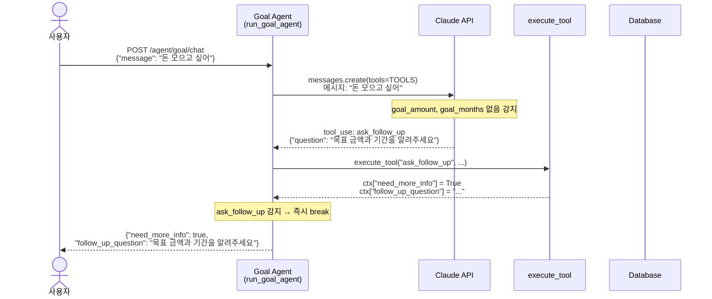
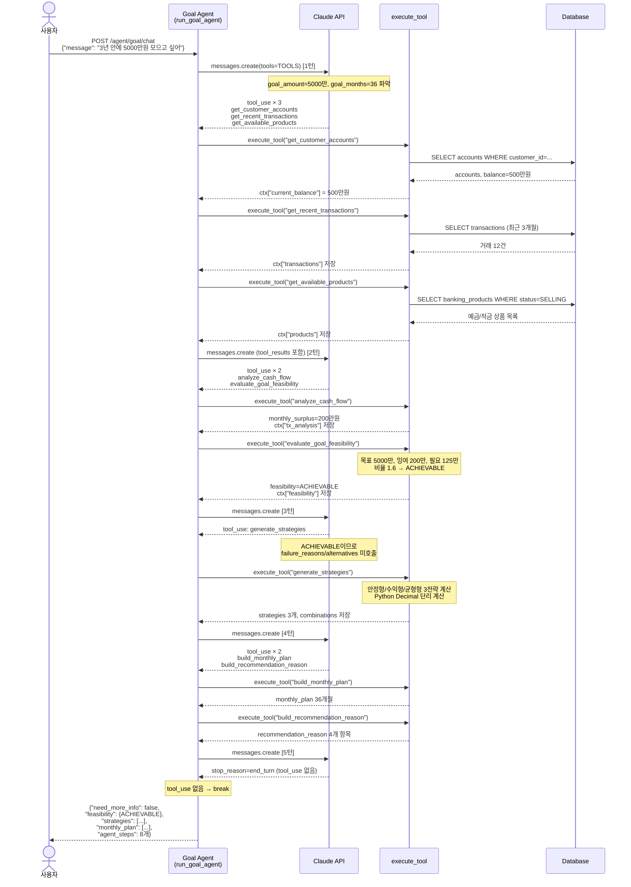
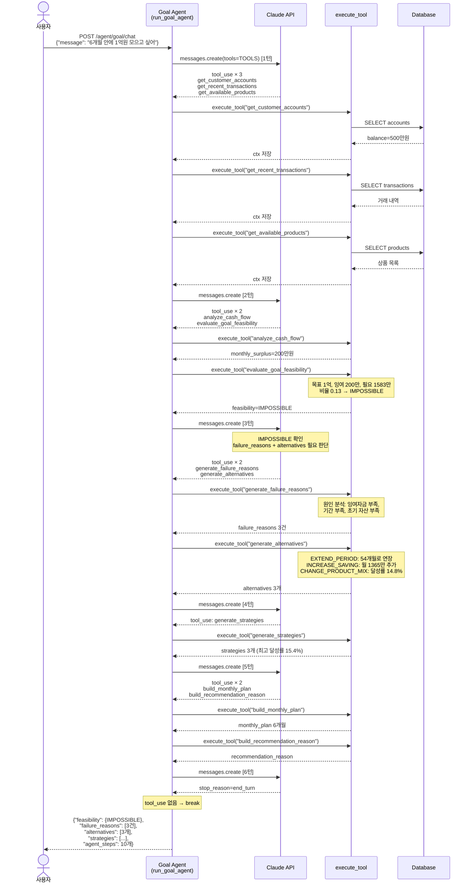

# 금융 목표 달성 에이전트 — 문서 패키지

---

## 목차

1. [PR 설명](#1-pr-설명)
2. [API 명세서](#2-api-명세서)
3. [Mermaid 시퀀스 다이어그램](#3-mermaid-시퀀스-다이어그램)
4. [면접 예상 질문 및 답변](#4-면접-예상-질문-및-답변)

---

# 1. PR 설명

## Summary

기존 고정 워크플로우 기반 금융 목표 달성 플래너(`/agent/goal/analyze`)를  
**Tool Calling 기반 Goal-Based Financial Agent**(`/agent/goal/chat`)로 확장합니다.

사용자가 자연어로 금융 목표를 입력하면 Claude(LLM)가 상황을 판단하여 필요한 도구를 선택·실행하고,  
Python이 모든 수치 계산을 담당하는 구조로 신뢰성과 유연성을 동시에 확보합니다.

---

## Background

### 기존 추천 엔진의 한계

기존 `/agent/goal/analyze`는 다음 구조였습니다.

```
입력 (goal_amount, goal_months)
  → 계좌 조회
  → 거래 분석
  → 가능성 판단
  → 상품 추천
  → 결과 반환
```

**문제점:**
- 실행 순서가 코드에 하드코딩되어 있어 입력과 무관하게 항상 동일한 경로 실행
- 정보가 부족해도 오류 없이 분석을 강행 (목표 금액 누락 시 0원으로 계산)
- 달성 가능 여부와 무관하게 항상 동일한 결과 구조 반환
- 자연어 입력 불가 (숫자 값을 API body에 직접 전달해야 함)

### 개선 방향

LLM이 사용자 메시지를 이해하고, 상황에 맞는 도구를 선택적으로 실행하는  
**Tool Calling Agent** 구조로 전환합니다.

---

## Changes

### 신규 파일

| 파일 | 역할 |
|------|------|
| `app/agent_goal_chat.py` | Tool Calling Agent 메인 구현 |

### 수정 파일

| 파일 | 변경 내용 |
|------|----------|
| `app/config.py` | `anthropic_api_key` 필드 추가 |
| `app/main.py` | `POST /agent/goal/chat` 엔드포인트 추가 |

### 기존 파일 변경 없음

`agent_goal_planner.py`의 모든 계산 함수는 그대로 재사용합니다.  
새 에이전트는 기존 함수를 Tool로 감싸는 방식으로 구현되었습니다.

---

## Architecture

### 전체 구조

```
사용자 (자연어 메시지)
    ↓
POST /agent/goal/chat
    ↓
run_goal_agent()
    ├── 1. Claude API 호출 (tools=TOOLS 전달)
    │       Claude가 tool_use 블록 생성
    ├── 2. execute_tool() 실행
    │       Python 함수가 DB 조회 및 계산 수행
    │       결과를 ctx(context 누산기)에 저장
    ├── 3. tool_result를 messages에 추가 → 다음 턴 재진입
    └── 4. end_turn 또는 ask_follow_up → 루프 종료
    ↓
_build_response(ctx)
    ↓
JSON 응답 반환
```

### Claude의 역할 (LLM)

- 사용자 메시지에서 goal_amount, goal_months 추출
- 정보 부족 시 ask_follow_up 도구 호출 결정
- feasibility 결과를 보고 failure_reasons / alternatives 호출 여부 결정
- 전체 분석 흐름에서 어떤 도구를 어떤 순서로 호출할지 결정
- **수치 계산은 절대 하지 않음**

### Python의 역할

- 11개 도구 함수의 실제 구현 (DB 조회, Decimal 계산, ROUND_DOWN 처리)
- Context 누산기(`ctx`) 관리 — Claude는 이 dict를 직접 볼 수 없음
- Claude가 전달한 파라미터 키(customer_id 등)를 받아 직접 DB에서 데이터 조회
- 모든 금융 수치(잉여자금, 달성률, 월 납입액 등) 계산

### 도구 목록 (11개)

| 도구 | 역할 |
|------|------|
| `ask_follow_up` | 정보 부족 시 추가 질문 생성 |
| `get_customer_accounts` | 활성 계좌 목록·잔액 조회 |
| `get_recent_transactions` | 최근 3개월 거래 내역 조회 |
| `get_available_products` | 판매 중인 예금·적금 상품 조회 |
| `analyze_cash_flow` | 월 평균 수입·지출·잉여자금 계산 |
| `evaluate_goal_feasibility` | 달성 가능성 판단 (ACHIEVABLE/TIGHT/DIFFICULT/IMPOSSIBLE) |
| `generate_failure_reasons` | 실패 원인 분석 (TIGHT 이하일 때) |
| `generate_alternatives` | 3가지 대안 시나리오 생성 (기간 연장/저축 증가/상품 변경) |
| `generate_strategies` | 안정형·수익형·균형형 3가지 전략 생성 |
| `build_monthly_plan` | 월별 납입 계획표 생성 |
| `build_recommendation_reason` | 추천 사유 4개 항목 구조화 |

### Agent Loop

```python
MAX_AGENT_ITERATIONS = 20

for iteration in range(MAX_AGENT_ITERATIONS):
    response = claude.messages.create(tools=TOOLS, ...)
    
    tool_use_blocks = [b for b in response.content if b.type == "tool_use"]
    
    if not tool_use_blocks:        # end_turn → 루프 종료
        break
    
    for block in tool_use_blocks:
        result = execute_tool(block.name, block.input, db, ctx)
        if block.name == "ask_follow_up":
            break                  # 즉시 종료
    
    if ctx.get("need_more_info"):
        break
    
    messages.append(tool_results)  # 다음 턴 재진입
else:
    ctx["warning"] = "최대 반복 횟수 초과"
```

---

## Testing

### Mock 테스트 (`test_goal_chat_mock.py`)

Claude API 실제 호출 없이 tool_use 시퀀스를 직접 주입하여  
`execute_tool()` / `context 누산기` / `_build_response()` 동작을 검증합니다.

| 케이스 | 메시지 | Tool 호출 수 | 결과 |
|--------|--------|-------------|------|
| Case A | "돈 모으고 싶어" | 1 (ask_follow_up) | PASS |
| Case B | "3년 안에 5000만원 모으고 싶어" | 8 | PASS |
| Case C | "6개월 안에 1억원 모으고 싶어" | 10 | PASS |

**Case B Tool 순서:**
```
1. get_customer_accounts    → 잔액 500만원
2. get_recent_transactions  → 12건
3. get_available_products   → 예금/적금 각 1개
4. analyze_cash_flow        → 월 잉여 200만원
5. evaluate_goal_feasibility → ACHIEVABLE
6. generate_strategies      → 3개 전략 (최고 141.7%)
7. build_monthly_plan       → 36개월 계획
8. build_recommendation_reason
```

**Case C 분기 확인:**  
`evaluate_goal_feasibility` → IMPOSSIBLE 판정 후  
`generate_failure_reasons` + `generate_alternatives` 추가 호출 (Case B 미호출)

---

## API Example

### 정보 부족 케이스

```bash
curl -X POST http://localhost:8000/agent/goal/chat \
  -H "Content-Type: application/json" \
  -d '{"customer_id": "CUST001", "message": "돈 모으고 싶어"}'
```

```json
{
  "agent_type": "GOAL_BASED_FINANCIAL_AGENT",
  "need_more_info": true,
  "follow_up_question": "목표 금액과 목표 기간을 알려주세요. 예: '3년 안에 5000만원'",
  "agent_steps": [
    {"tool": "ask_follow_up", "result_summary": "추가 질문 생성: ..."}
  ]
}
```

### 달성 가능 케이스

```bash
curl -X POST http://localhost:8000/agent/goal/chat \
  -H "Content-Type: application/json" \
  -d '{"customer_id": "CUST001", "message": "3년 안에 5000만원 모으고 싶어"}'
```

---

# 2. API 명세서

## POST /agent/goal/chat

### 개요

| 항목 | 내용 |
|------|------|
| URL | `POST /agent/goal/chat` |
| 인증 | 없음 (내부 API) |
| Content-Type | `application/json` |
| 설명 | 자연어 메시지로 금융 목표를 입력받아 Tool Calling Agent가 분석 후 결과 반환 |

---

### Request

#### Body

| 필드 | 타입 | 필수 | 설명 |
|------|------|------|------|
| `customer_id` | string | 필수 | 고객 ID |
| `message` | string | 필수 | 자연어 목표 입력 (예: "3년 안에 5000만원 모으고 싶어") |

#### 예시

```json
{
  "customer_id": "CUST001",
  "message": "3년 안에 5000만원 모으고 싶어"
}
```

---

### Response

#### 공통 필드

| 필드 | 타입 | 설명 |
|------|------|------|
| `agent_type` | string | 항상 `"GOAL_BASED_FINANCIAL_AGENT"` |
| `need_more_info` | boolean | `true`이면 정보 부족, follow_up_question 참조 |
| `follow_up_question` | string \| null | need_more_info가 true일 때 추가 질문 문자열 |
| `agent_steps` | array | 실행된 Tool 호출 로그 목록 |
| `warning` | string \| null | 최대 반복 횟수(20회) 초과 시 경고 메시지 |

#### agent_steps 항목

| 필드 | 타입 | 설명 |
|------|------|------|
| `tool` | string | 호출된 도구 이름 |
| `input` | object | 도구에 전달된 입력값 |
| `result_summary` | string | 도구 실행 결과 한 줄 요약 |

#### feasibility

목표 달성 가능성 분석 결과.

| 필드 | 타입 | 설명 |
|------|------|------|
| `feasibility` | string | `ACHIEVABLE` / `TIGHT` / `DIFFICULT` / `IMPOSSIBLE` |
| `goal_amount` | number | 목표 금액 (원) |
| `goal_months` | integer | 목표 기간 (개월) |
| `current_balance` | number | 현재 계좌 총 잔액 (원) |
| `remaining_amount` | number | 추가 필요 금액 (원) |
| `required_monthly_saving` | number | 목표 달성에 필요한 월 저축액 (원) |
| `monthly_surplus` | number | 월 평균 잉여자금 (원) |
| `surplus_to_required_ratio` | number | 잉여자금 / 필요 저축액 비율 |
| `is_feasible` | boolean | 달성 가능 여부 |
| `estimated_months_at_current_rate` | integer \| null | 현재 속도로 달성 시 예상 소요 개월 |

**feasibility 판정 기준:**

| 판정 | 조건 |
|------|------|
| `ACHIEVABLE` | 잉여/필요 비율 ≥ 1.2 |
| `TIGHT` | 잉여/필요 비율 ≥ 0.9 |
| `DIFFICULT` | 잉여/필요 비율 ≥ 0.6 |
| `IMPOSSIBLE` | 잉여/필요 비율 < 0.6 또는 잉여자금 ≤ 0 |

#### failure_reasons

ACHIEVABLE이 아닐 때 실패 원인 문자열 배열. ACHIEVABLE이면 빈 배열.

원인 유형:
- 월 저축 가능 금액 부족
- 목표 기간 부족
- 초기 자산 부족 (현재 잔액 < 목표의 10%)
- 지출 비율 과다 (지출 > 수입의 85%)
- 잉여자금 없음

#### alternatives

ACHIEVABLE이 아닐 때 3가지 대안 시나리오. ACHIEVABLE이면 빈 배열.

| type | 설명 |
|------|------|
| `EXTEND_PERIOD` | 기간 연장 시나리오 (이자 포함 시뮬레이션으로 최소 달성 개월 탐색) |
| `INCREASE_MONTHLY_SAVING` | 필요 월 저축액 역산 시나리오 |
| `CHANGE_PRODUCT_MIX` | 최고금리 상품 조합 적용 시 달성률 계산 |

#### strategies

안정형·수익형·균형형 3가지 투자 전략. 각 전략 필드:

| 필드 | 타입 | 설명 |
|------|------|------|
| `name` | string | 전략명 (안정형/수익형/균형형) |
| `strategy_type` | string | `STABLE` / `GROWTH` / `BALANCED` |
| `expected_final_amount` | number | 예상 최종 금액 (원) |
| `expected_interest` | number | 예상 이자 수익 (원) |
| `achievement_rate` | number | 목표 대비 달성률 (%) |
| `pros` | array[string] | 장점 목록 |
| `cons` | array[string] | 단점 목록 |

#### recommendation_reason

추천 사유 4개 항목.

| 필드 | 타입 | 설명 |
|------|------|------|
| `cash_flow_status` | string | 현금흐름 상태 설명 |
| `goal_feasibility` | string | 목표 달성 가능성 설명 |
| `product_selection_reason` | string | 추천 상품 선택 이유 |
| `strategy_selection_reason` | string | 선택 전략 이유 |
| `summary` | string | 위 4개를 합친 한 문단 요약 |

#### monthly_plan

최우선 추천 상품 기준 월별 납입 계획 배열. 각 항목:

| 필드 | 타입 | 설명 |
|------|------|------|
| `month` | integer | 납입 회차 |
| `year_month` | string | 해당 연월 (YYYY-MM) |
| `monthly_payment` | number | 월 납입액 (원) |
| `cumulative_savings` | number | 누적 납입 원금 (원) |
| `projected_total` | number | 예상 누적 금액 이자 포함 (원) |
| `remaining_to_goal` | number | 목표까지 남은 금액 (원) |
| `achievement_rate` | number | 현재 시점 달성률 (%) |

---

### 응답 예시

#### Case A — 정보 부족

```json
{
  "agent_type": "GOAL_BASED_FINANCIAL_AGENT",
  "need_more_info": true,
  "follow_up_question": "목표 금액과 목표 기간을 알려주세요. 예: '3년 안에 5000만원'",
  "agent_steps": [
    {
      "tool": "ask_follow_up",
      "input": {
        "question": "목표 금액과 목표 기간을 알려주세요. 예: '3년 안에 5000만원'",
        "missing_fields": ["goal_amount", "goal_months"]
      },
      "result_summary": "추가 질문 생성: 목표 금액과 목표 기간을 알려주세요."
    }
  ],
  "feasibility": {},
  "failure_reasons": [],
  "alternatives": [],
  "strategies": [],
  "recommendation_reason": {},
  "monthly_plan": [],
  "warning": null
}
```

#### Case B — 달성 가능 (요약)

```json
{
  "agent_type": "GOAL_BASED_FINANCIAL_AGENT",
  "need_more_info": false,
  "follow_up_question": null,
  "agent_steps": [
    {"tool": "get_customer_accounts",      "result_summary": "계좌 1개, 총 잔액 5,000,000원"},
    {"tool": "get_recent_transactions",    "result_summary": "거래 12건 조회"},
    {"tool": "get_available_products",     "result_summary": "예금 1개, 적금 1개"},
    {"tool": "analyze_cash_flow",          "result_summary": "월 잉여자금 2,000,000원"},
    {"tool": "evaluate_goal_feasibility",  "result_summary": "달성 가능성: ACHIEVABLE"},
    {"tool": "generate_strategies",        "result_summary": "전략 3개, 최고 달성률 141.7%"},
    {"tool": "build_monthly_plan",         "result_summary": "월별 계획 36개월"},
    {"tool": "build_recommendation_reason","result_summary": "추천 사유 구조화 완료"}
  ],
  "feasibility": {
    "feasibility": "ACHIEVABLE",
    "goal_amount": 50000000.0,
    "goal_months": 36,
    "current_balance": 5000000.0,
    "remaining_amount": 45000000.0,
    "required_monthly_saving": 1250000.0,
    "monthly_surplus": 2000000.0,
    "surplus_to_required_ratio": 1.6,
    "is_feasible": true,
    "estimated_months_at_current_rate": 23
  },
  "failure_reasons": [],
  "alternatives": [],
  "strategies": [
    {
      "name": "안정형", "strategy_type": "STABLE",
      "achievement_rate": 72.5, "expected_final_amount": 36269000.0
    },
    {
      "name": "수익형", "strategy_type": "GROWTH",
      "achievement_rate": 141.7, "expected_final_amount": 70856000.0
    },
    {
      "name": "균형형", "strategy_type": "BALANCED",
      "achievement_rate": 103.3, "expected_final_amount": 51641000.0
    }
  ],
  "monthly_plan": [
    {"month": 1,  "year_month": "2026-07", "monthly_payment": 1400000.0, "achievement_rate": 13.5},
    {"month": 36, "year_month": "2029-06", "monthly_payment": 1400000.0, "achievement_rate": 118.8}
  ],
  "warning": null
}
```

#### Case C — 달성 불가 (요약)

```json
{
  "need_more_info": false,
  "feasibility": {
    "feasibility": "IMPOSSIBLE",
    "goal_amount": 100000000.0,
    "goal_months": 6,
    "monthly_surplus": 2000000.0,
    "required_monthly_saving": 15833333.0
  },
  "failure_reasons": [
    "월 저축 가능 금액 부족: 목표 달성에 월 15,833,333원이 필요하지만 현재 잉여자금은 2,000,000원으로 13,833,333원이 부족합니다.",
    "목표 기간 부족: 현재 잉여자금(2,000,000원/월)으로 목표를 달성하려면 최소 48개월이 필요하나 설정 기간은 6개월입니다.",
    "초기 자산 부족: 현재 보유 잔액(5,000,000원)이 목표 금액의 5.0% 수준으로 초기 기반이 낮습니다."
  ],
  "alternatives": [
    {
      "type": "EXTEND_PERIOD",
      "suggested_goal_months": 54,
      "reason": "기간을 48개월 연장(6개월 → 54개월)하면 현재 잉여자금 유지 시 약 100,600,000원 달성이 가능합니다."
    },
    {
      "type": "INCREASE_MONTHLY_SAVING",
      "additional_amount": 13650000.0,
      "reason": "월 13,650,000원 추가 저축 시 목표 기간(6개월) 내 달성 가능합니다."
    },
    {
      "type": "CHANGE_PRODUCT_MIX",
      "achievement_rate": 14.8,
      "reason": "최고금리 상품 조합 적용 시 예상 달성률 14.8%입니다."
    }
  ]
}
```

---

### 에러 응답

| HTTP 상태 | 조건 | 메시지 |
|-----------|------|--------|
| 400 | customer_id 또는 message 누락 | `"customer_id and message are required"` |
| 404 | 해당 고객의 활성 계좌 없음 | `"no active accounts found for customer"` |
| 500 | ANTHROPIC_API_KEY 미설정 | `"Could not resolve authentication method"` |

---

# 3. Mermaid 시퀀스 다이어그램

## Case A — 정보 부족 (ask_follow_up)



---

## Case B — 목표 달성 가능 (ACHIEVABLE)



---

## Case C — 목표 달성 불가 (IMPOSSIBLE)



---

# 4. 면접 예상 질문 및 답변

---

**Q1. 왜 기존 추천 엔진을 에이전트로 바꿨나요?**

A. 기존 `/agent/goal/analyze`는 입력에 관계없이 항상 동일한 순서로 실행되는 고정 워크플로우였습니다. 목표가 달성 가능하든 불가능하든 동일한 함수 10개가 순서대로 실행됐고, 자연어 입력도 지원하지 않았습니다. 에이전트로 전환한 이유는 두 가지입니다. 첫째, 실행 경로를 입력 상황에 맞게 동적으로 결정하기 위해서입니다. 달성 가능한 목표라면 실패 원인 분석이 필요 없고, 정보가 부족하다면 분석 자체를 시작해서는 안 됩니다. 둘째, 자연어로 목표를 입력받아 더 자연스러운 사용자 경험을 제공하기 위해서입니다.

---

**Q2. Tool Calling이 무엇인지 설명해주세요.**

A. Tool Calling은 LLM이 직접 텍스트를 생성하는 대신, 사전에 정의된 함수(도구)를 호출하도록 요청하는 기능입니다. 개발자가 도구를 JSON Schema 형태로 정의해 API에 전달하면, LLM은 상황에 맞는 도구와 파라미터를 담은 `tool_use` 블록을 응답으로 반환합니다. 실제 함수 실행은 애플리케이션 코드가 담당하고 결과를 다시 LLM에 전달하면, LLM은 그 결과를 보고 다음 도구를 선택하거나 최종 답변을 생성합니다. 이 프로젝트에서는 Anthropic의 Claude API에 11개 도구를 정의하고, Python이 실제 실행을 담당하는 구조로 구현했습니다.

---

**Q3. 현재 구현이 완전한 자율형 에이전트인가요?**

A. 아닙니다. 현재 구현은 **Tool Calling Agent** 수준입니다. Claude가 도구 선택과 실행 순서를 결정한다는 점에서 고정 워크플로우보다 유연하지만, 스스로 목표를 설정하거나 하위 에이전트를 생성하거나 장기 메모리를 보존하는 완전 자율형 에이전트(Autonomous Agent)는 아닙니다. 사용자가 목표를 제시해야 동작하고, 단일 요청 스코프 내에서만 상태가 유지됩니다. 단계별로 분류하면 `단순 워크플로우 → Workflow Agent → Tool Calling Agent(현재) → Autonomous Agent` 순서에서 세 번째 단계입니다.

---

**Q4. Claude의 역할과 Python의 역할을 분리한 이유는 무엇인가요?**

A. LLM의 가장 큰 특성 중 하나가 확률적 출력입니다. 같은 입력이라도 매번 다른 숫자를 생성할 수 있고, 특히 복잡한 금융 계산에서 부동소수점 오류나 반올림 방식이 일관되지 않을 수 있습니다. 금융 도메인에서는 계산 결과가 법적·계약적 의미를 가지므로 신뢰성이 필수입니다. 따라서 "무엇을 할지 판단"하는 역할만 Claude에 맡기고, "실제 계산"은 Python의 `Decimal` + `ROUND_DOWN`으로 결정론적으로 처리했습니다. Claude는 어떤 도구를 어떤 순서로 호출할지만 결정하며, 어떤 수치도 직접 생성하지 않습니다.

---

**Q5. Context 누산기 패턴이 무엇이고 왜 사용했나요?**

A. Context 누산기는 서버 측에서 관리하는 딕셔너리(`ctx`)입니다. 각 도구가 실행될 때마다 결과를 이 딕셔너리에 저장하고, 이후 도구들은 `ctx`에서 이전 결과를 읽어 사용합니다. 예를 들어 `get_customer_accounts`가 계좌 목록을 `ctx["accounts"]`에 저장하면, `get_recent_transactions`는 Claude가 account_ids를 직접 전달하지 않아도 `ctx["account_ids"]`에서 읽어옵니다. 이 패턴을 사용한 이유는 두 가지입니다. 첫째, Claude에게 원시 금융 데이터(계좌번호, 잔액 상세 등)를 직접 전달하지 않아도 됩니다. 둘째, Claude가 숫자를 tool 파라미터로 직접 전달하는 과정에서 발생할 수 있는 할루시네이션(숫자 변형)을 방지합니다.

---

**Q6. Agent Loop는 어떻게 구현했나요? 무한루프 방어는요?**

A. `for iteration in range(MAX_AGENT_ITERATIONS)` 구조로 구현했습니다. 최대 20회(`MAX_AGENT_ITERATIONS = 20`) 반복하며, 각 턴에서 Claude 응답의 `tool_use` 블록을 추출해 실행하고 결과를 다음 메시지로 전달합니다. 루프 종료 조건은 세 가지입니다. 첫째, Claude가 `tool_use` 없이 `end_turn`을 반환할 때. 둘째, `ask_follow_up` 도구가 호출됐을 때 즉시 `break`. 셋째, 20회 소진 시 Python의 `for-else` 구문을 활용해 `ctx["warning"]`에 경고 메시지를 저장하고 안전하게 종료합니다.

---

**Q7. 추가 질문 기능(ask_follow_up)은 어떻게 동작하나요?**

A. `ask_follow_up`은 일반 도구와 동일한 형태로 정의되어 있지만 특수한 역할을 합니다. Claude가 사용자 메시지에서 `goal_amount` 또는 `goal_months`를 파악하지 못하면 이 도구를 호출합니다. `execute_tool`에서 이 도구를 감지하면 `ctx["need_more_info"] = True`와 `ctx["follow_up_question"]`을 설정하고, `for` 루프 안에서 즉시 `break`합니다. 이후 `while`(실제로는 `for iteration`) 루프도 `if ctx.get("need_more_info"): break`로 탈출합니다. 결과적으로 DB 조회나 계산이 전혀 실행되지 않고 질문만 반환됩니다.

---

**Q8. 실패 원인 분석은 어떤 기준으로 하나요?**

A. `_analyze_failure_reasons` 함수에서 5가지 조건을 순서대로 검사합니다. 1) 월 저축 가능 금액 부족 (잉여 < 필요 월 저축액), 2) 목표 기간 부족 (현재 잉여자금으로도 기간이 너무 짧음), 3) 초기 자산 부족 (현재 잔액이 목표의 10% 미만), 4) 지출 비율 과다 (지출이 수입의 85% 초과), 5) 잉여자금 없음 (수입 자체가 없거나 지출이 초과). ACHIEVABLE 판정이면 빈 리스트를 반환합니다. Claude가 이 분석을 하는 것이 아니라, Claude가 `generate_failure_reasons` 도구 호출을 결정하면 Python 함수가 실제 분석을 수행합니다.

---

**Q9. 대안 시나리오 3가지는 어떻게 계산하나요?**

A. `_generate_alternatives` 함수에서 Python으로 직접 계산합니다.

- **EXTEND_PERIOD**: 1개월씩 증가시키며 이자 포함 예상 금액이 목표를 초과하는 첫 번째 개월 수를 선형 탐색합니다. 상한은 `MAX_PERIOD_MONTHS = 120`.
- **INCREASE_MONTHLY_SAVING**: 목표 = 월저축 × 기간 × (1 + 금리) 공식을 역산하여 필요 월 저축액을 직접 계산합니다. 1만원 단위 올림 처리.
- **CHANGE_PRODUCT_MIX**: 현재 판매 중인 최고금리 적금+예금 조합 기준으로 단리 공식 적용, 예상 달성액과 달성률을 계산합니다.

모든 계산은 `Decimal` + `ROUND_DOWN`으로 처리합니다.

---

**Q10. Mock 테스트를 사용한 이유는 무엇인가요?**

A. 두 가지 이유입니다. 첫째, Anthropic API는 유료입니다. 개발 및 검증 단계에서 매번 실제 API를 호출하면 비용이 발생하고 테스트 속도도 느립니다. 둘째, Mock 테스트를 통해 Claude의 판단과 무관하게 Python 로직 자체(execute_tool, context 누산기, _build_response)가 정상 동작하는지 독립적으로 검증할 수 있습니다. `unittest.mock`으로 Claude 응답을 시뮬레이션하고, DB 함수도 Mock 처리했습니다. 단, Mock 테스트는 "Claude가 올바른 도구를 선택하는지"는 검증하지 못합니다. 그 부분은 실제 API 키로 별도 통합 테스트가 필요합니다.

---

**Q11. Mock 테스트와 실제 Claude 테스트의 차이는 무엇인가요?**

A. Mock 테스트는 Claude의 tool_use 응답을 미리 정의해 주입합니다. 따라서 Python 코드(execute_tool, context 누산기, 응답 조립)의 정확성만 검증합니다. 실제 Claude 테스트에서는 추가로 다음을 검증할 수 있습니다. 1) Claude가 "돈 모으고 싶어"에서 실제로 ask_follow_up을 선택하는지, 2) "3년 안에 5000만원"에서 36개월 5000만원을 정확히 파싱하는지, 3) IMPOSSIBLE 판정 후 실제로 failure_reasons를 호출하는지(Claude의 분기 판단), 4) 예상치 못한 입력(예: "최대한 빨리")에 어떻게 반응하는지. Mock이 구조 검증이라면 실제 테스트는 LLM 판단 검증입니다.

---

**Q12. 단리 계산을 선택한 이유는 무엇인가요?**

A. 국내 정기적금 이자 계산 방식이 단리(Simple Interest)이기 때문입니다. 월 납입식 적금의 만기 수령액 공식은 `납입액 × 개월수 × (1 + 금리/100 × 개월수/24)`입니다. 복리를 사용하면 실제 은행 계산값과 괴리가 생겨 고객에게 잘못된 정보를 제공하게 됩니다. 모든 계산은 `Decimal` 타입으로 처리하고 `ROUND_DOWN`으로 내림 처리합니다. 고객에게 달성 가능성을 보수적으로 제시하기 위해 올림이 아닌 내림을 선택했습니다.

---

**Q13. evaluate_goal_feasibility의 ACHIEVABLE 기준은 무엇인가요?**

A. 잉여자금 / 필요 월 저축액 비율(`surplus_to_required_ratio`)을 기준으로 4단계로 분류합니다. 비율이 1.2 이상이면 ACHIEVABLE(여유 있음), 0.9 이상이면 TIGHT(빠듯하지만 가능), 0.6 이상이면 DIFFICULT(어려움), 그 미만이면 IMPOSSIBLE로 판정합니다. 현재 잔액이 목표 금액보다 이미 크거나 같은 경우(`remaining_amount = 0`)는 비율이 99.0으로 처리되어 ACHIEVABLE이 됩니다. 비율 기준값은 실무적 보수성을 고려해 설정했습니다.

---

**Q14. 보안 측면에서 고려한 점은 무엇인가요?**

A. 세 가지를 고려했습니다. 첫째, Claude에게 원시 금융 데이터를 전달하지 않습니다. Context 누산기 패턴을 통해 계좌번호, 거래 상세 내역 등 민감 정보는 Python 서버 메모리에만 존재하고, Claude에는 집계 결과(잔액 합계, 거래 건수 등)만 전달됩니다. 둘째, `anthropic_api_key`는 `.env` 파일에서 주입받으며 코드에 하드코딩되지 않습니다. 셋째, customer_id는 URL 파라미터가 아닌 request body로 전달하고, Python 함수에서 DB 조회 시 해당 고객의 데이터만 조회합니다. 다만 현재 인증·인가 미들웨어가 없어 내부 API로만 사용해야 합니다.

---

**Q15. ANTHROPIC_API_KEY가 없을 때 서버 전체가 죽지 않나요?**

A. 서버 시작 시에는 죽지 않습니다. `anthropic_api_key`는 `Settings` 클래스에서 `""` 기본값을 가지므로 서버 기동 자체는 정상 완료됩니다. `anthropic.Anthropic(api_key="")`도 객체 생성까지는 에러가 없습니다. 에러는 실제 `messages.create()` 호출 시 발생합니다(`TypeError: Could not resolve authentication method`). FastAPI의 예외 처리에 의해 500 에러로 반환되며 서버는 계속 동작합니다. 개선 방향으로는 서버 시작 시 키 유효성을 검사하거나, 해당 API 호출 전에 키 존재 여부를 확인해 명확한 400 에러를 반환하는 방식이 있습니다.

---

**Q16. Agent Loop에서 Claude가 같은 도구를 반복 호출하면 어떻게 되나요?**

A. 현재 구현에는 중복 호출을 막는 별도 로직이 없습니다. 같은 도구가 반복 호출되면 `execute_tool`이 다시 실행되어 DB를 재조회하고 `ctx`를 덮어씁니다. 결과가 동일하므로 기능상 문제는 없지만 비효율적입니다. `MAX_AGENT_ITERATIONS = 20`이 안전망 역할을 합니다. 실용적으로는 Claude Opus 4.8이 시스템 프롬프트의 순서 지시에 따라 일반적으로 반복 호출을 하지 않습니다. 완벽한 방어가 필요하다면 `ctx`에 이미 실행된 도구 목록을 기록하고 재호출 시 캐시를 반환하는 방식으로 확장할 수 있습니다.

---

**Q17. 기존 /agent/goal/analyze와 새 /agent/goal/chat을 모두 유지한 이유는 무엇인가요?**

A. 하위 호환성 때문입니다. 기존 API를 사용하는 프론트엔드나 팀원 코드가 있을 수 있고, API 키 없이도 동작하는 엔드포인트를 유지하기 위해서입니다. `/agent/goal/analyze`는 goal_amount, goal_months를 숫자로 직접 전달받아 Claude 없이 동작합니다. `/agent/goal/chat`은 자연어 입력을 받아 Claude를 통해 동작합니다. 두 엔드포인트는 같은 Python 계산 함수(`agent_goal_planner.py`)를 공유합니다.

---

**Q18. 현재 구현의 한계는 무엇이고 개선 방향은 무엇인가요?**

A. 한계는 세 가지입니다. 첫째, Claude의 도구 선택이 확률적이라 ACHIEVABLE 상황에서 failure_reasons를 호출하거나 분기를 누락하는 경우가 이론적으로 가능합니다. 둘째, 단일 요청 내에서만 상태가 유지되어 대화 이력이 없습니다. "아까 입력한 목표를 수정하고 싶어"라는 멀티턴 대화가 불가능합니다. 셋째, API 키 미설정 시 500 에러 메시지가 불친절합니다. 개선 방향으로는 Redis나 DB를 활용한 대화 이력 관리, 도구 실행 결과 캐싱, API 키 검증 미들웨어 추가, 실제 Claude 통합 테스트 자동화가 있습니다.

---

**Q19. generate_strategies에서 3가지 전략(안정형/수익형/균형형)의 차이는 무엇인가요?**

A. 월 잉여자금 중 적금에 배분하는 비율이 다릅니다. 안정형은 40%를 적금에, 나머지를 예금에 배분합니다. 최저 금리 적금과 최고 금리 예금을 선택해 원금 보존을 우선합니다. 수익형은 85%를 적금에 배분하고 최고 금리 적금을 선택해 이자 수익을 극대화합니다. 균형형은 60%를 적금에 배분하고 최고 금리 적금+예금 조합으로 수익성과 유동성을 균형 있게 추구합니다. 각 전략의 예상 최종 금액, 이자 수익, 달성률은 Python의 단리 공식으로 계산하며 `pros/cons` 목록도 함께 반환합니다.

---

**Q20. 이 구현에서 가장 어려웠던 부분은 무엇인가요?**

A. Context 누산기 설계였습니다. 초기에는 Claude에게 계좌 잔액, 거래 내역 등 원시 데이터를 직접 전달하는 방식을 고려했는데, 이 방식은 두 가지 문제가 있습니다. Claude가 수백 건의 거래 내역을 tool 파라미터로 받으면 토큰 낭비가 심하고, 숫자가 많아질수록 할루시네이션 위험이 커집니다. 결국 DB 데이터는 Python 서버 메모리(`ctx`)에만 보관하고, Claude에는 집계 결과만 반환하는 패턴을 채택했습니다. 이 덕분에 Claude는 "월 잉여자금이 200만원이고 비율이 1.6"이라는 요약 정보만 보고 다음 도구를 선택하며, 민감 데이터를 직접 다루지 않습니다.
