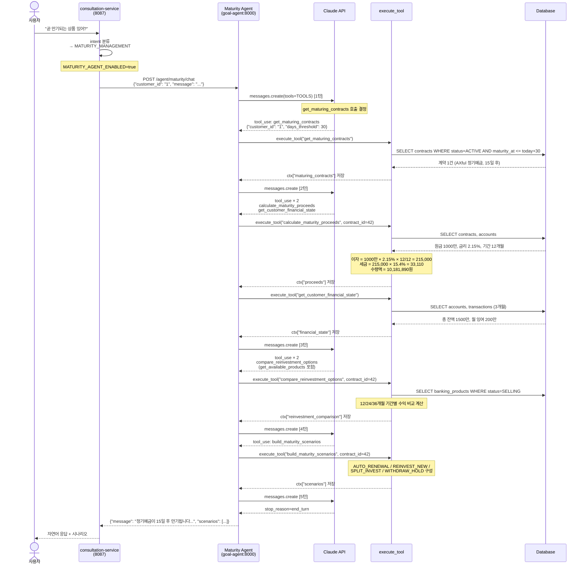
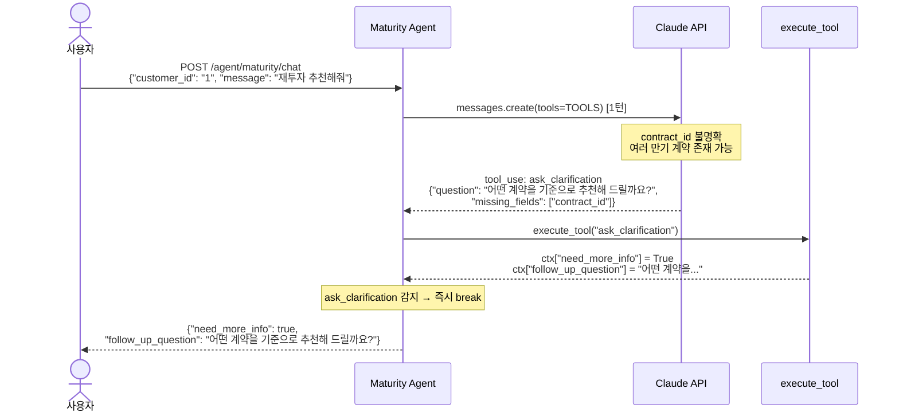
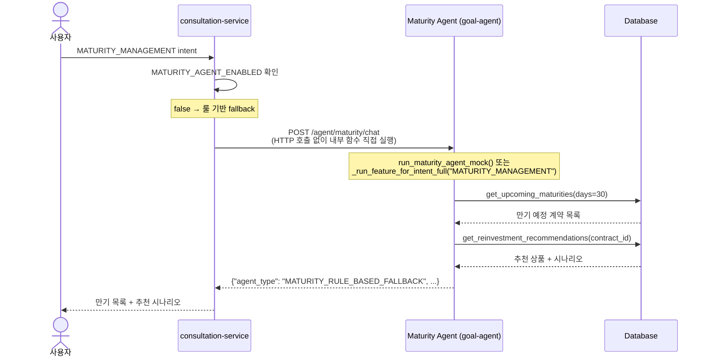

# 만기 알림 및 재투자 추천 에이전트 — 문서 패키지

---

## 목차

1. [PR 설명](#1-pr-설명)
2. [API 명세서](#2-api-명세서)
3. [Mermaid 시퀀스 다이어그램](#3-mermaid-시퀀스-다이어그램)
4. [면접 예상 질문 및 답변](#4-면접-예상-질문-및-답변)

---

# 1. PR 설명

## Summary

고객의 만기 예정 계약을 감지하고 예상 수령액·금융 상태를 분석하여 최적의 재투자 전략을 제안하는
**만기 알림 및 재투자 추천 에이전트**를 구현합니다.

`MATURITY_AGENT_ENABLED=true` 설정 시 Tool Calling 기반 에이전트(`/agent/maturity/chat`)가 활성화되며,
비활성화 상태에서는 룰 기반 fallback으로 동작합니다.

---

## Background

### 기존 만기 처리의 한계

기존 consultation-service는 MATURITY_SCHEDULE intent 진입 시 단순 DB 조회 결과를 테이블로 출력하는 수준이었습니다.

**문제점:**
- 만기일·잔액만 나열, 실제 "어떻게 할지" 의사결정 지원 없음
- 재투자 추천 상품 비교 기능 없음
- 예상 수령액(세후) 계산 없음
- 고객 금융 상태(잉여자금, 총 잔액) 미반영

### 개선 방향

Tool Calling Agent가 7단계 흐름으로 분석을 수행하고,
자연어로 만기 알림 + 재투자 전략을 제안합니다.

```
계약 조회 → 만기 예정 상품 감지 → 예상 수령액 계산
→ 고객 금융 상태 분석 → 현재 판매 상품 조회
→ 재투자 후보 비교 → 만기 후 시나리오 제안
```

**예시 응답:**
> "정기예금이 15일 후 만기됩니다. 예상 수령액은 1,012만원이며 현재 상황에서는 전액 재예치를 추천합니다."

---

## Changes

### 신규 파일

| 파일 | 역할 |
|------|------|
| `app/agent_maturity.py` | 룰 기반 만기 감지·재투자 추천 핵심 로직 |
| `app/agent_maturity_chat.py` | Tool Calling Agent 메인 구현 |

### 수정 파일

| 파일 | 변경 내용 |
|------|----------|
| `app/config.py` | `maturity_agent_enabled` 환경변수 필드 추가 |
| `app/main.py` | `POST /agent/maturity/chat` 엔드포인트 추가 |

### consultation-service 연동

| 파일 | 변경 내용 |
|------|----------|
| `services/consultation-service/app/services.py` | `MATURITY_MANAGEMENT` / `REINVESTMENT_RECOMMEND` intent → `_call_maturity_agent()` HTTP 호출 연동 |
| `docker-compose.yml` | `MATURITY_AGENT_ENABLED` 환경변수 추가 |

---

## Architecture

### 전체 구조

```
사용자 (자연어 메시지)
    ↓
POST /chatbot/consultations/{id}/messages  [consultation-service:8087]
    ↓
intent 분류 → MATURITY_MANAGEMENT or REINVESTMENT_RECOMMEND
    ↓
MATURITY_AGENT_ENABLED=true?
    ├─ YES → _call_maturity_agent()
    │         POST http://goal-agent:8000/agent/maturity/chat
    │             ↓
    │         run_maturity_agent()  [goal-agent:8000]
    │             ├── 1. Claude API 호출 (tools=TOOLS 전달)
    │             ├── 2. execute_tool() 실행 (DB 조회·계산)
    │             ├── 3. tool_result → 다음 턴 재진입
    │             └── 4. end_turn → 응답 조립
    │             ↓
    │         JSON 응답 반환 → consultation-service가 message 필드 추출
    │
    └─ NO  → _run_feature_for_intent_full("MATURITY_MANAGEMENT")
              (룰 기반 fallback: get_upcoming_maturities + get_reinvestment_recommendations)
```

### Tool 목록 (6개)

| 도구 | 역할 | 선행 조건 |
|------|------|----------|
| `ask_clarification` | contract_id 불명확 시 추가 질문 생성 | — |
| `get_maturing_contracts` | 고객의 만기 예정 계약 목록 조회 | — |
| `calculate_maturity_proceeds` | 만기 수령 예상액 계산 (원금+이자-세금) | `get_maturing_contracts` 이후 |
| `get_customer_financial_state` | 전체 계좌 잔액·월 잉여자금 조회 | — |
| `compare_reinvestment_options` | 기간별 재투자 예상 수익 비교 (12·24·36개월) | `calculate_maturity_proceeds` 이후 |
| `build_maturity_scenarios` | AUTO_RENEWAL / REINVEST_NEW / SPLIT_INVEST / WITHDRAW_HOLD 4가지 시나리오 구성 | `compare_reinvestment_options` 이후 |

### Claude의 역할

- 사용자 메시지에서 만기 조회 의도 및 contract_id 파악
- 정보 부족 시 `ask_clarification` 호출 결정
- 분석 흐름에서 어떤 도구를 어떤 순서로 호출할지 결정
- **수치 계산은 절대 하지 않음**

### Python의 역할

- 6개 도구 함수의 실제 구현 (DB 조회, Decimal 단리 계산)
- 만기 수령액 = 원금 + 이자 × (1 - 세율/100) — `ROUND_DOWN` 처리
- 재투자 옵션 기간별 비교 수익 계산
- 시나리오 4가지(AUTO_RENEWAL / REINVEST_NEW / SPLIT_INVEST / WITHDRAW_HOLD) 구성

### 룰 기반 핵심 로직 (`agent_maturity.py`)

```python
# 만기 감지
get_upcoming_maturities(db, days=30)
→ ACTIVE 계약 중 days 이내 만기 예정 목록 반환 (만기일 ASC 정렬)
→ 긴급도: URGENT(7일) / HIGH(14일) / MEDIUM(30일) / LOW

# 재투자 추천
get_reinvestment_recommendations(db, contract_id)
→ 가입 가능 상품 필터 (min/max_join_amount 체크)
→ 현재 금리 대비 금리 차이 · 세제혜택 · 자동갱신 점수화
→ 상위 5개 추천 + 4가지 시나리오 반환

# 예상 이자 (단리)
balance × rate / 100 × period_month / 12
```

### Agent Loop

```python
MAX_AGENT_ITERATIONS = 20

for iteration in range(MAX_AGENT_ITERATIONS):
    response = claude.messages.create(tools=TOOLS, ...)

    tool_use_blocks = [b for b in response.content if b.type == "tool_use"]

    if not tool_use_blocks:      # end_turn → 루프 종료
        break

    for block in tool_use_blocks:
        result = execute_tool(block.name, block.input, db, ctx)
        if block.name == "ask_clarification":
            break                # 즉시 종료

    if ctx.get("need_more_info"):
        break

    messages.append(tool_results)  # 다음 턴 재진입
else:
    ctx["warning"] = "최대 반복 횟수 초과"
```

---

# 2. API 명세서

## POST /agent/maturity/chat

### 개요

| 항목 | 내용 |
|------|------|
| URL | `POST /agent/maturity/chat` |
| 인증 | 없음 (내부 API, `X-Internal-Token` 선택적 사용) |
| Content-Type | `application/json` |
| 설명 | 자연어 메시지로 만기 조회를 입력받아 에이전트가 분석 후 재투자 전략 반환 |

---

### Request Body

| 필드 | 타입 | 필수 | 설명 |
|------|------|------|------|
| `customer_id` | string | 필수 | 고객 ID |
| `message` | string | 선택 | 자연어 메시지 (기본: "만기 예정 계약을 확인하고 재투자 추천을 해주세요.") |

```json
{
  "customer_id": "1",
  "message": "곧 만기되는 상품 있어?"
}
```

---

### Response

#### MATURITY_AGENT_ENABLED=true (Tool Calling Agent)

| 필드 | 타입 | 설명 |
|------|------|------|
| `agent_type` | string | `"MATURITY_AGENT"` 또는 `"MATURITY_RULE_BASED_FALLBACK"` |
| `need_more_info` | boolean | `true`이면 정보 부족, `follow_up_question` 참조 |
| `follow_up_question` | string \| null | need_more_info=true 시 추가 질문 |
| `message` | string \| null | 자연어 요약 응답 |
| `maturing_contracts` | array | 만기 예정 계약 목록 |
| `proceeds` | object \| null | 예상 수령액 계산 결과 |
| `financial_state` | object \| null | 고객 금융 상태 |
| `available_products` | array | 재투자 후보 상품 목록 |
| `reinvestment_comparison` | array | 기간별 재투자 수익 비교 |
| `scenarios` | array | 4가지 시나리오 |
| `agent_steps` | array | Tool 호출 로그 |
| `warning` | string \| null | 최대 반복 초과 시 경고 |

#### MATURITY_AGENT_ENABLED=false (룰 기반 Fallback)

| 필드 | 타입 | 설명 |
|------|------|------|
| `agent_type` | string | `"MATURITY_RULE_BASED_FALLBACK"` |
| `maturing_contracts` | array | 만기 예정 계약 목록 |
| `recommendations` | object | 재투자 추천 상품 + 시나리오 |
| `message` | string | 결과 없을 때 안내 메시지 |

---

### maturing_contracts 항목

| 필드 | 타입 | 설명 |
|------|------|------|
| `contract_id` | integer | 계약 ID |
| `contract_number` | string | 계약번호 |
| `customer_id` | string | 고객 ID |
| `product_name` | string | 상품명 |
| `product_type` | string | 상품 유형 |
| `final_interest_rate` | number | 적용 금리 (%) |
| `contract_period_month` | integer | 계약 기간 (개월) |
| `maturity_at` | string | 만기일 (YYYYMMDD) |
| `days_until_maturity` | integer | 만기까지 남은 일수 |
| `current_balance` | number | 현재 잔액 (원) |
| `is_auto_renewal` | boolean | 자동 갱신 여부 |
| `urgency` | string | `URGENT` / `HIGH` / `MEDIUM` / `LOW` |

**urgency 판정 기준:**

| 값 | 조건 |
|----|------|
| `URGENT` | 만기까지 7일 이하 |
| `HIGH` | 만기까지 14일 이하 |
| `MEDIUM` | 만기까지 30일 이하 |
| `LOW` | 30일 초과 |

---

### proceeds (예상 수령액)

| 필드 | 타입 | 설명 |
|------|------|------|
| `contract_id` | integer | 계약 ID |
| `principal` | number | 원금 (원) |
| `estimated_interest` | number | 예상 이자 (원, 단리 기준) |
| `tax_amount` | number | 세금 (원) |
| `tax_rate` | number | 적용 세율 (%, 기본 15.4%) |
| `net_proceeds` | number | 세후 수령액 (원) |
| `maturity_at` | string | 만기일 (YYYYMMDD) |
| `days_until_maturity` | integer | 만기까지 남은 일수 |
| `contract_period_month` | integer | 계약 기간 (개월) |
| `final_interest_rate` | number | 적용 금리 (%) |

**계산 공식 (단리):**
```
이자 = 원금 × 금리/100 × 계약기간(개월)/12
세금 = 이자 × 세율/100  (ROUND_DOWN)
세후 수령액 = 원금 + 이자 - 세금
```

---

### scenarios (4가지 시나리오)

| type | 설명 |
|------|------|
| `AUTO_RENEWAL` | 동일 상품 자동 갱신 |
| `REINVEST_NEW` | 추천 신상품으로 재투자 |
| `SPLIT_INVEST` | 일부 재투자 + 일부 출금 |
| `WITHDRAW_HOLD` | 전액 출금 후 보유 |

---

### 에러 응답

| HTTP 상태 | 조건 | 메시지 |
|-----------|------|--------|
| 400 | `customer_id` 누락 | `"customer_id is required"` |
| 500 | ANTHROPIC_API_KEY 미설정 (에이전트 모드) | `"Could not resolve authentication method"` |

---

### API 예시

#### 만기 예정 조회 (기본)

```bash
curl -X POST http://localhost:8000/agent/maturity/chat \
  -H "Content-Type: application/json" \
  -d '{"customer_id": "1", "message": "곧 만기되는 상품 있어?"}'
```

#### 룰 기반 fallback 응답 예시

```json
{
  "agent_type": "MATURITY_RULE_BASED_FALLBACK",
  "maturing_contracts": [
    {
      "contract_id": 42,
      "product_name": "AXful 정기예금",
      "days_until_maturity": 15,
      "current_balance": 10000000,
      "final_interest_rate": 2.15,
      "urgency": "HIGH",
      "maturity_at": "20260703"
    }
  ],
  "recommendations": {
    "contract_id": 42,
    "current_balance": 10000000,
    "current_rate": 2.15,
    "estimated_maturity_interest": 59583,
    "estimated_maturity_total": 10059583,
    "recommendations": [
      {
        "product_name": "AXful 수퍼정기예금(개인)",
        "base_interest_rate": 2.95,
        "rate_difference_vs_current": 0.8,
        "recommendation_reason": "현재 상품 대비 금리 +0.80% 우대 · 자동 갱신 지원",
        "recommendation_score": 10.0
      }
    ],
    "scenarios": [
      {
        "type": "AUTO_RENEWAL",
        "label": "자동 갱신",
        "expected_interest": 59583,
        "expected_total": 10059583,
        "description": "동일 조건으로 자동 갱신합니다."
      },
      {
        "type": "REINVEST_NEW",
        "label": "신상품 재투자",
        "expected_interest": 82083,
        "expected_total": 10082083,
        "gain": 22500,
        "description": "AXful 수퍼정기예금(개인)으로 재투자 시 22,500원 추가 수익"
      }
    ]
  }
}
```

---

# 3. Mermaid 시퀀스 다이어그램

## Case A — 만기 예정 조회 (정상 흐름)



---

## Case B — 정보 부족 (ask_clarification)



---

## Case C — MATURITY_AGENT_ENABLED=false (룰 기반 Fallback)



---

# 4. 면접 예상 질문 및 답변

---

**Q1. 만기 알림 에이전트를 왜 별도 서비스(goal-agent)로 분리했나요?**

A. consultation-service는 챗봇 대화 흐름과 intent 분류를 담당하는 서비스고, goal-agent는 복잡한 금융 분석 로직과 LLM 연동을 담당하는 서비스입니다. 두 역할을 분리한 이유는 세 가지입니다. 첫째, LLM 호출은 타임아웃이 길고 비용이 발생하므로 대화 서비스에 직접 두면 응답 지연이 전체 챗봇에 영향을 줍니다. 둘째, 만기 감지·재투자 추천 로직은 재사용 가능한 API로 노출하면 다른 서비스(알림 서비스, 배치 서버)에서도 호출할 수 있습니다. 셋째, `MATURITY_AGENT_ENABLED` 환경변수로 LLM 에이전트를 켜고 끌 수 있어 배포 유연성이 높습니다.

---

**Q2. MATURITY_AGENT_ENABLED 플래그를 사용한 이유는 무엇인가요?**

A. 두 가지 이유입니다. 첫째, Anthropic API는 유료이므로 개발·테스트 환경에서 비용 없이 동작하는 룰 기반 fallback이 필요합니다. 둘째, LLM 에이전트는 API 장애·지연 등 외부 의존성을 가집니다. 프로덕션에서 API가 다운되더라도 룰 기반 fallback으로 기본 만기 조회 기능은 유지되어야 합니다. 이 패턴은 Feature Flag 또는 Circuit Breaker와 유사한 개념입니다.

---

**Q3. 예상 수령액 계산에서 단리를 사용한 이유는 무엇인가요?**

A. 국내 정기예금·적금의 이자 계산 방식이 단리이기 때문입니다. 복리를 적용하면 실제 은행 계산값과 괴리가 생겨 고객에게 잘못된 금액을 안내하게 됩니다. 계산 공식은 `원금 × 금리/100 × 계약기간(개월)/12`이며, 모든 계산에 `Decimal` + `ROUND_DOWN`을 사용합니다. 고객에게 예상 수령액을 보수적으로 제시하기 위해 올림이 아닌 내림으로 처리합니다.

---

**Q4. urgency 4단계(URGENT/HIGH/MEDIUM/LOW)는 어떤 기준으로 나누었나요?**

A. 고객의 행동 가능 시간을 기준으로 설계했습니다. URGENT(7일 이하)는 즉각 처리가 필요한 상황으로 만기 당일까지 아무 조치를 취하지 않으면 자동 갱신 또는 원금 반환만 처리됩니다. HIGH(14일 이하)는 신상품 가입 절차를 진행하기에 충분한 최소 시간입니다. MEDIUM(30일 이하)은 여유 있게 상품을 비교하고 결정할 수 있는 구간입니다. LOW(30일 초과)는 지금 당장 조치가 불필요한 상태입니다. 이 기준은 뱅킹 서비스의 일반적인 알림 정책을 참고했습니다.

---

**Q5. 재투자 추천 점수(recommendation_score)는 어떻게 계산하나요?**

A. 세 가지 요소로 점수를 산정합니다.

```python
score = rate_diff * 10   # 금리 차이 × 가중치 10
if is_tax_benefit_available == "Y":
    score += 5           # 세제 혜택 가산점
if is_auto_renewal_available == "Y":
    score += 2           # 자동 갱신 편의성 가산점
```

현재 계약 금리 대비 높은 금리 상품에 가장 높은 점수를 부여하고, 세제 혜택과 자동 갱신 여부로 보조 점수를 가산합니다. 점수가 낮은 경우(현재 금리보다 낮은 상품)도 목록에 포함되어 고객이 비교할 수 있게 합니다. 상위 5개만 추천에 포함됩니다.

---

**Q6. Tool Calling Agent와 룰 기반의 실제 응답 차이는 무엇인가요?**

A. 룰 기반 fallback은 DB 데이터를 그대로 JSON으로 반환합니다. 고객이 자연어 메시지가 아닌 구조화된 데이터를 받게 됩니다. Tool Calling Agent는 Claude가 이 데이터를 받아 자연어 요약 메시지를 생성합니다.

- **룰 기반**: `maturing_contracts: [{...}], recommendations: {...}`
- **에이전트**: `message: "정기예금이 15일 후 만기됩니다. 예상 수령액은 1,012만원이며 현재 상황에서는 전액 재예치를 추천합니다."`

consultation-service는 두 경우 모두 `message` 필드를 추출하여 챗봇 응답으로 사용하며, Tool Calling Agent 응답에 `message` 필드가 없는 경우 `maturing_contracts` 데이터로 자체 요약 문구를 생성합니다.

---

**Q7. consultation-service가 goal-agent를 HTTP로 호출할 때 실패하면 어떻게 되나요?**

A. `_call_maturity_agent()` 메서드는 `try/except`로 감싸져 있습니다. HTTP 호출이 실패하면(타임아웃, 연결 오류, 5xx 등) 경고 로그를 출력하고 `_run_feature_for_intent_full("MATURITY_MANAGEMENT")`로 fallback합니다. 이 fallback은 consultation-service 내부 DB 조회로 처리되어 goal-agent 의존성 없이 기본 만기 조회 결과를 반환합니다. 타임아웃은 30초로 설정되어 있습니다.

---

**Q8. 4가지 시나리오(AUTO_RENEWAL/REINVEST_NEW/SPLIT_INVEST/WITHDRAW_HOLD)의 차이는 무엇인가요?**

A. 만기 후 고객이 선택할 수 있는 4가지 행동을 수치 기반으로 비교합니다.

- **AUTO_RENEWAL**: 동일 상품·조건으로 자동 갱신. 가장 간편하지만 더 좋은 상품이 출시됐을 경우 기회손실.
- **REINVEST_NEW**: 추천 점수 최상위 신상품으로 전액 재투자. 더 높은 금리를 적용받을 수 있음.
- **SPLIT_INVEST**: 수령액 일부는 새 상품에 재투자, 나머지는 출금 보유. 유동성과 수익성을 균형 있게 추구.
- **WITHDRAW_HOLD**: 전액 출금 후 보유. 단기 자금 필요 시 또는 더 나은 상품 출시를 기다릴 때 선택.

각 시나리오는 예상 이자, 예상 수령 총액, 현재 대비 추가 이익(`gain`)을 함께 제공합니다.

---

**Q9. 만기 감지가 고객별로 필터링되는 방식은 무엇인가요?**

A. `get_upcoming_maturities(db, days)` 함수는 전체 ACTIVE 계약 중 days 이내 만기 예정 계약을 조회합니다. agent_maturity_chat.py의 `_planner_get_maturing_contracts()`는 이 결과를 받아 `customer_id` 필드로 필터링합니다.

```python
all_maturities = get_upcoming_maturities(db, days=days)
return [c for c in all_maturities if str(c.get("customer_id")) == str(customer_id)]
```

Tool Calling Agent에서 Claude가 `get_maturing_contracts` 도구를 호출할 때 `customer_id`를 파라미터로 전달하므로, Claude가 다른 고객의 데이터에 접근하는 것은 불가능합니다.

---

**Q10. 현재 구현의 한계와 개선 방향은 무엇인가요?**

A. 세 가지 한계가 있습니다. 첫째, 단일 요청 내에서만 상태가 유지됩니다. "아까 말한 그 상품으로 재투자하고 싶어"같은 멀티턴 대화를 지원하려면 세션 기반 context 관리가 필요합니다. 둘째, 수익 비교가 단리 단순 계산으로만 이루어집니다. 실제 은행은 복리 상품, 우대금리 조건, 세금우대 한도 등이 복합적으로 적용되므로 더 정밀한 계산이 필요합니다. 셋째, 만기 알림이 요청 기반(pull)으로만 동작합니다. 실제 서비스라면 배치 스케줄러가 D-30, D-7, D-1에 푸시 알림을 보내는 구조가 필요합니다. 개선 방향으로는 Redis 기반 대화 세션 관리, Kafka 이벤트 발행을 통한 알림 연동, 실제 복리·우대금리 계산 모듈 추가가 있습니다.
